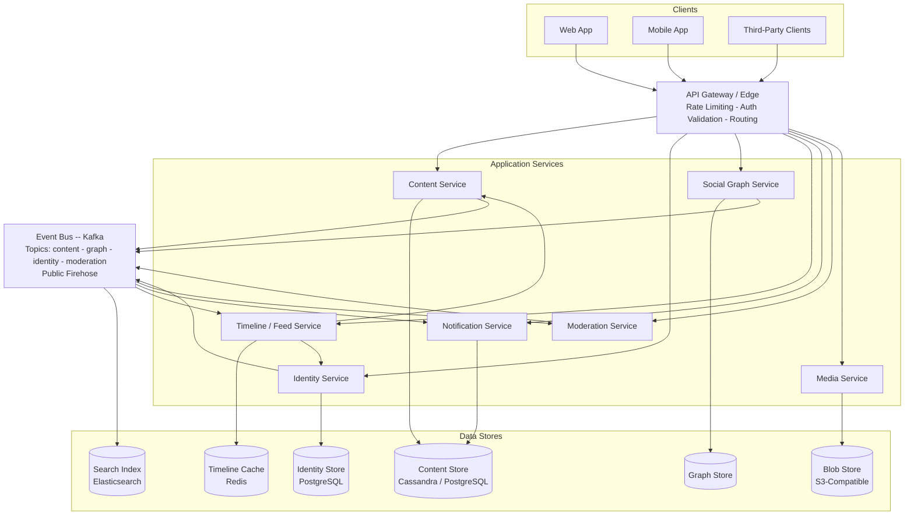
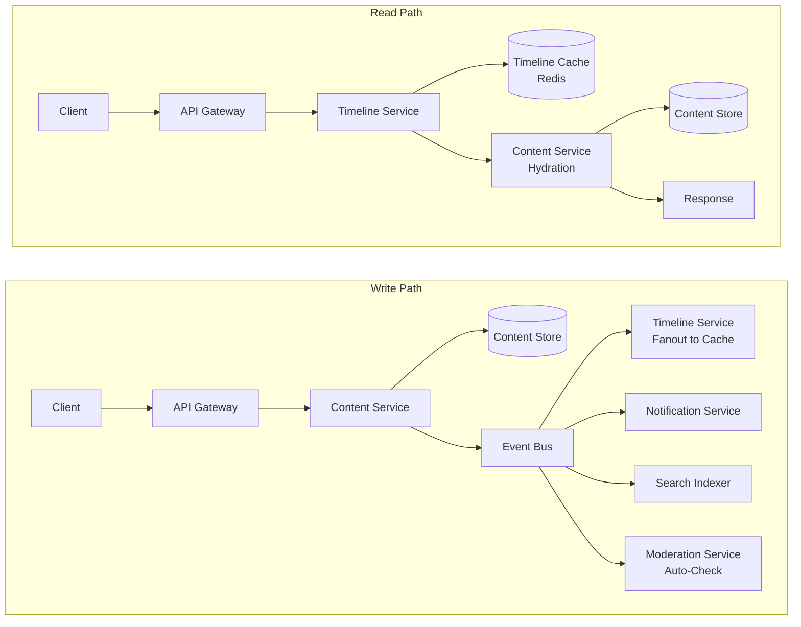
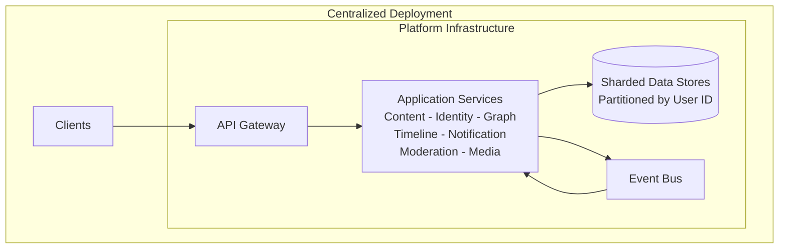
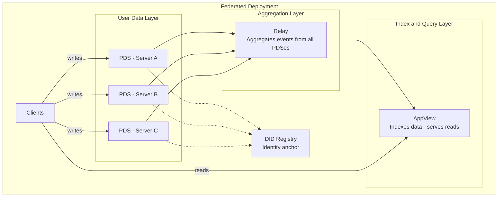

# Architecture Overview

This document describes the high-level architecture of a generic social media platform. The design synthesizes patterns from three production systems: **Bluesky** (AT Protocol), **Twitter/X**, and **Reddit**. It covers the system components, how they interact, deployment topology options, and core design principles.

Read this first. Everything else in the documentation assumes familiarity with the components and flows described here.

---

## Table of Contents

1. [System Components](#system-components)
2. [Component Interaction Map](#component-interaction-map)
3. [High-Level Component Architecture (Diagram)](#high-level-component-architecture)
4. [Write Path vs Read Path](#write-path-vs-read-path)
5. [Deployment Topology](#deployment-topology)
6. [Design Principles](#design-principles)

---

## System Components

### Client Layer

Web applications, mobile applications, and third-party API clients. All user interaction flows through the REST API. No client has direct database access. Clients authenticate via bearer tokens obtained from the Identity Service.

**Provenance:** Universal across all three platforms. Twitter and Reddit expose public REST APIs; Bluesky's XRPC is essentially HTTP + Lexicon schemas.

---

### API Gateway / Edge

The single entry point for all client requests. Responsibilities:

- **Rate limiting** -- per-user and per-IP throttling to prevent abuse
- **Request routing** -- dispatches requests to the correct backend service based on path and method
- **Auth token validation** -- verifies bearer tokens before forwarding requests; rejects expired or revoked tokens at the edge
- **TLS termination** -- handles encryption so backend services communicate in plaintext internally
- **Request logging** -- captures request metadata for observability

The gateway does not contain business logic. It is a pass-through with policy enforcement.

**Provenance:** Twitter's edge tier handles routing and rate limiting before requests reach application servers. Bluesky's XRPC routing layer dispatches to PDS or AppView endpoints. Reddit's web tier (originally r2, later node-based) serves a similar gatekeeper role.

---

### Content Service

The core write service for all user-generated content. Responsibilities:

- **CRUD operations** for posts and comments (create, read, update, delete)
- **Schema validation** -- ensures content conforms to the platform's record schema before persisting (e.g., character limits, required fields, valid embed references)
- **Snowflake ID generation** -- assigns globally unique, time-sortable identifiers to every new record
- **Primary write** -- persists the record to the Content Store
- **Event emission** -- after a successful write, publishes a content event (e.g., `post.created`, `post.deleted`) to the Event Bus for downstream consumers

The Content Service is the system of record for post and comment data. It does not handle timelines, notifications, or search indexing -- those are side effects handled by consumers of its events.

**Provenance:** Twitter's Tweet Service manages tweet storage and ID generation (Snowflake originated at Twitter). Bluesky's PDS performs repo operations (creating, updating, deleting records in the user's data repository). Reddit's Application Tier handles link and comment creation, validation, and storage.

---

### Identity Service

Manages user accounts and identity resolution. Responsibilities:

- **Account creation and authentication** -- registration, login, password management, session tokens
- **Handle resolution** -- maps human-readable usernames (handles) to internal user IDs
- **DID management** (federation mode) -- assigns and resolves Decentralized Identifiers so that user identity is portable across servers
- **Credential storage** -- hashed passwords, OAuth tokens, app passwords
- **Profile management** -- display name, bio, avatar reference, banner reference

In federated mode, the Identity Service also coordinates with a DID registry (e.g., PLC Directory) to anchor identity outside any single server.

**Provenance:** Bluesky's PDS identity layer + PLC Directory provide DID-based portable identity. Twitter's User Service handles accounts, profiles, and handle lookups. Reddit's Account Service manages user records and authentication.

---

### Social Graph Service

Manages the relationship graph between users. Responsibilities:

- **Relationship mutations** -- follow, unfollow, block, mute, list membership
- **Relationship queries** -- get followers of user X, get accounts user X follows, check if A follows B, get blocked accounts
- **Fan-out metadata** -- provides follower lists to the Timeline Service during write-path fanout

The graph is stored in a dedicated Graph Store optimized for adjacency queries (who follows whom). Relationship changes emit events to the Event Bus (e.g., `graph.follow`, `graph.block`).

**Provenance:** Twitter's Social Graph Service used FlockDB (a distributed graph database built on MySQL) to store and query follow relationships at scale. Bluesky stores graph records (follows, blocks, mutes) in the user's data repository; the AppView indexes them for query. Reddit manages subreddit subscriptions and user-to-user blocking similarly.

---

### Timeline / Feed Service

Assembles personalized feeds for users. Responsibilities:

- **Home timeline assembly** -- retrieves pre-computed post ID lists from the Timeline Cache and hydrates them into full post objects by calling the Content Service
- **Multiple feed types** -- home feed (posts from followed accounts), author feed (single user's posts), community/topic feed, custom or algorithmic feeds
- **Cursor-based pagination** -- returns pages of results with cursor tokens for efficient scrolling
- **Hydration** -- given a list of post IDs, fetches full post records (text, media refs, engagement counts, author info) from the Content Service and Identity Service

The Timeline Service is read-heavy. It does not write content -- it reads from caches populated by the fanout pipeline.

**Provenance:** Twitter's Timeline Service uses fanout-on-write to push tweet IDs into per-user Redis timelines; reads are fast cache lookups. Bluesky's AppView exposes feed generator endpoints that assemble feeds from indexed data. Reddit's listing builder constructs subreddit and home feeds from ranked post lists.

---

### Notification Service

Delivers notifications to users about relevant activity. Responsibilities:

- **Event consumption** -- listens to the Event Bus for events that produce notifications: likes, follows, replies, mentions, reposts, moderation actions
- **Notification storage** -- maintains a per-user notification list with read/unread state
- **Delivery channels** -- in-app notification list, push notifications (APNs, FCM), email digests
- **Deduplication and batching** -- collapses repeated events (e.g., "5 people liked your post") and batches email notifications

**Provenance:** Twitter's Notification Service processes engagement events and delivers multi-channel notifications. Bluesky's `app.bsky.notification` endpoints expose per-user notification lists. Reddit's notification system covers reply notifications, mentions, modmail, and chat.

---

### Event Bus

The asynchronous messaging backbone connecting all services. Responsibilities:

- **Event distribution** -- routes events from producer services to consumer services without coupling them
- **Topic-per-event-type** -- separate Kafka topics for content events, graph events, identity events, moderation events, etc.
- **Guaranteed delivery** -- at-least-once semantics with consumer offset tracking
- **Public firehose** -- exposes a streaming endpoint for external consumers (third-party developers, researchers, indexers)

The Event Bus enables the separation of the write path from side effects. When the Content Service creates a post, it publishes a single event. The Timeline Service, Notification Service, Search indexer, and Moderation Service each consume that event independently.

**Provenance:** Twitter uses Kafka extensively for internal event routing between services. Reddit uses Debezium CDC (change data capture) feeding into Kafka for propagating database changes to downstream consumers. Bluesky's Relay aggregates events from all PDSes into a firehose stream consumed by AppViews and other subscribers.

---

### Moderation Service

Enforces content policy and community standards. Responsibilities:

- **Content labeling** -- attaches labels to content (e.g., "nsfw", "spam", "misinformation") that clients use for filtering and warnings
- **User reporting** -- accepts reports from users, queues them for human review
- **Moderation queues** -- provides tooling for moderators to review flagged content and take action (warn, label, remove, suspend)
- **Automated filters** -- applies rules-based checks on new content (regex patterns, known-bad hashes, domain blocklists)

Labels are stored as independent entities, separate from the content they describe. This separation means moderation decisions can be changed without modifying content records.

**Provenance:** Bluesky's labeler system + Ozone moderation tool allow independent labeling services to operate outside the core platform. Reddit's AutoModerator applies regex-based rules per community, and human moderators manage community-specific queues. Twitter's Trust & Safety infrastructure combines automated detection with human review pipelines.

---

### Media Service

Handles binary media uploads and delivery. Responsibilities:

- **Blob upload** -- accepts image, video, and audio uploads; validates file type and size
- **Processing** -- resizes images (thumbnails, standard, full), transcodes video to streaming formats, strips EXIF metadata for privacy
- **CDN integration** -- stores processed blobs in S3-compatible object storage and serves them through a CDN for low-latency global delivery
- **Reference generation** -- returns a media reference (blob URI or CID) that the Content Service embeds in post records

The Media Service is stateless for processing; all persistent data lives in the Blob Store.

**Provenance:** Bluesky stores blobs in the user's PDS and serves them via CDN. Twitter's media upload API handles images, GIFs, and video with async processing pipelines. Reddit's image and video hosting (post-Imgur migration) handles upload, processing, and CDN delivery.

---

### Data Repository Layer

The persistence tier. Each data store is purpose-built for its access pattern:

| Store | Technology | Access Pattern | Used By |
|---|---|---|---|
| **Content Store** | Wide-column (Cassandra, ScyllaDB) or SQL (PostgreSQL) | Point reads by post ID, range scans by author + time | Content Service |
| **Timeline Cache** | Redis (sorted sets) | Fast ordered reads of post ID lists per user | Timeline Service |
| **Graph Store** | Graph-optimized storage (adjacency lists) or relational | Adjacency queries: followers of X, following of X | Social Graph Service |
| **Search Index** | Elasticsearch / OpenSearch | Full-text search, faceted queries | Search consumers |
| **Blob Store** | S3-compatible object storage | Large binary reads/writes by key | Media Service |
| **Identity Store** | Relational (PostgreSQL) | Account lookups by handle, DID, or internal ID | Identity Service |

In **federated mode**, each user's data resides in their chosen PDS (Personal Data Server). The user's PDS is authoritative for their content, identity, and graph records. Relays and AppViews index this data for query but do not own it.

In **centralized mode**, data is partitioned by user ID across shards within the platform's infrastructure. The platform owns all storage.

**Provenance:** Twitter shards across MySQL (via Gizzard) and Manhattan (key-value), with Redis for timeline caches and Elasticsearch for search. Bluesky stores per-user data in SQLite-backed repositories on each PDS, with the AppView maintaining a centralized index. Reddit uses PostgreSQL (originally) and Cassandra for different workloads, with Elasticsearch for search and S3 for media.

---

## Component Interaction Map

Services communicate through two mechanisms: synchronous RPC for direct request-response flows, and asynchronous events for decoupled side effects.

### Synchronous Communication (RPC)

All client-initiated operations follow the same pattern:

```
Client  -->  API Gateway  -->  Target Service  -->  Data Store
                                    |
                                    v
                              Response back up the chain
```

- **Used for:** Read queries (get post, get timeline, get profile) and write commands (create post, follow user, upload media)
- **Protocol:** HTTP/REST (or XRPC in Bluesky's terminology, which is HTTP with Lexicon schemas)
- **Latency requirement:** Synchronous calls must complete within hundreds of milliseconds; timeouts and circuit breakers protect against slow downstream services

### Asynchronous Communication (Events)

Side effects of writes are propagated through the Event Bus:

```
Content Service  --[post.created]-->  Event Bus  ---->  Timeline Service (fanout)
                                                 ---->  Notification Service (notify mentions)
                                                 ---->  Search Indexer (index content)
                                                 ---->  Moderation Service (auto-check)
```

- **Used for:** Timeline fanout, notification generation, search index updates, moderation checks, analytics, firehose streaming
- **Protocol:** Kafka topics with consumer groups
- **Delivery guarantee:** At-least-once (consumers must be idempotent)
- **Latency tolerance:** Seconds to minutes acceptable for eventual consistency

### The Write Path

A write operation (e.g., creating a post) is synchronous for the primary write and asynchronous for all side effects:

1. Client sends `POST /posts` to the API Gateway
2. Gateway validates auth token, routes to Content Service
3. Content Service validates the request, generates a Snowflake ID, writes to Content Store
4. Content Service returns success to the client (write is committed)
5. Content Service publishes `post.created` event to the Event Bus
6. Consumers process the event independently:
   - Timeline Service fans out the post ID to followers' timeline caches
   - Notification Service creates mention/reply notifications
   - Search Indexer adds the post to the search index
   - Moderation Service runs automated content checks

The client receives a response after step 4. Steps 5-6 happen in the background.

### The Read Path

A read operation (e.g., loading the home timeline) is fully synchronous:

1. Client sends `GET /timeline` to the API Gateway
2. Gateway validates auth token, routes to Timeline Service
3. Timeline Service reads post ID list from Timeline Cache (Redis)
4. Timeline Service calls Content Service to hydrate post IDs into full post objects
5. Content Service fetches records from Content Store, returns post data
6. Timeline Service may also call Identity Service for author profile data
7. Assembled timeline returned to client

No events are published during reads (except optional analytics/logging events).

---

## High-Level Component Architecture



**Reading the diagram:**

- Arrows from Clients to the Gateway represent all inbound HTTP requests
- Arrows from the Gateway to Application Services represent routed requests
- Arrows from Services to Data Stores represent direct persistence reads/writes
- Arrows from Services to the Event Bus represent event publishing (writes)
- Arrows from the Event Bus to Services represent event consumption (side effects)
- The Timeline Service has arrows to both Content Service and Identity Service because it hydrates cached post ID lists into full objects by calling those services

---

## Write Path vs Read Path



**Key difference:**

- The **write path** is synchronous only for the primary write (Content Service to Content Store). All downstream effects -- timeline fanout, notifications, search indexing, moderation checks -- happen asynchronously through the Event Bus. The client receives a response as soon as the primary write commits.
- The **read path** is fully synchronous. The Timeline Service reads cached post IDs from Redis, hydrates them by calling the Content Service, and returns the assembled result. No events are published.

This separation means write latency is bounded by a single database write, while read latency depends on cache hit rate and hydration speed. Downstream consistency (when a new post appears in followers' timelines) is eventual.

---

## Deployment Topology

The architecture supports two deployment modes. The service boundaries are identical in both -- what changes is ownership, data residency, and how services discover each other.

### Fully Centralized (Twitter, Reddit Model)

All services run within a single organization's infrastructure.

- One API Gateway, one set of application services, one set of data stores
- Horizontal scaling via sharding (partition data by user ID or content ID across database nodes)
- Service discovery via internal DNS or service mesh
- The organization controls all data, all moderation policy, all API access
- Users depend entirely on the platform operator



**Characteristics:**
- Single point of control and single point of failure (organizationally)
- Simplest to operate -- no cross-organization coordination
- Maximum consistency -- all data in one system
- No data portability -- users cannot take their data elsewhere without explicit export tools

### Federated (Bluesky AT Protocol Model)

Users choose which server (PDS) hosts their data. Multiple independent operators run infrastructure.

- Each **PDS** (Personal Data Server) stores its users' data repositories and handles writes
- A **Relay** aggregates events from all PDSes into a unified firehose
- An **AppView** consumes the firehose, builds indexes, and serves read queries
- The **DID Registry** (PLC Directory) anchors user identity outside any single server
- Users can migrate between PDSes without losing their identity or social graph



**Characteristics:**
- No single point of control -- multiple independent operators
- User data sovereignty -- users choose where their data lives and can migrate
- Higher operational complexity -- cross-server communication, consistency challenges
- Multiple AppViews can compete (different clients, different moderation policies, different feed algorithms)
- Write path: Client to user's PDS (direct). Read path: Client to AppView (which indexes data from the Relay)

### Mapping Between Modes

| Centralized Component | Federated Equivalent | Notes |
|---|---|---|
| API Gateway | PDS (for writes) + AppView (for reads) | Split by read/write path |
| Content Service | PDS repo operations | Each PDS handles its users' content |
| Identity Service | PDS identity + DID Registry | Identity anchored externally via DIDs |
| Social Graph Service | PDS graph records + AppView index | Graph records stored per-user, indexed centrally |
| Timeline Service | AppView feed endpoints | AppView builds feeds from aggregated data |
| Event Bus | Relay / Firehose | Relay aggregates all PDS event streams |
| Content Store (shared) | Per-PDS repositories (distributed) | Data ownership is per-user, not per-platform |

---

## Design Principles

### 1. Separate Write Path from Read Path

Writes go through the Content Service to the Content Store and Event Bus. Reads go through the Timeline Service to the Timeline Cache and hydration layer. These paths are optimized independently:

- Writes optimize for durability and correctness (strong consistency on the primary write)
- Reads optimize for speed (pre-computed caches, denormalized data, parallel hydration)

This separation means you can scale reads and writes independently, and a spike in read traffic does not affect write availability.

### 2. Eventual Consistency Where Acceptable

Not everything needs to be immediately consistent:

- **Strong consistency:** Content creation (a post must be durably stored before acknowledging success), identity operations (handle changes must be atomic), authentication (token validation must be real-time)
- **Eventual consistency:** Timeline fanout (a new post may take seconds to appear in all followers' timelines), engagement counters (like counts may lag), search indexing (new content may take seconds to become searchable), notifications (delivery delay is acceptable)

This distinction allows the system to remain available under load. Counters and timelines can be slightly stale without degrading user experience.

### 3. User Data Sovereignty

Users own their data records. The platform indexes and serves that data, but the canonical source of truth is the user's record set. This principle manifests differently by deployment mode:

- **Federated:** The user's PDS holds their authoritative data. AppViews are derivative indexes.
- **Centralized:** The platform stores the data on behalf of the user, but the data model still treats records as user-owned entities (enabling export, portability features, and the right to deletion).

### 4. Soft Deletes

Content is never physically removed on deletion. Instead, a tombstone record replaces the content:

- The original content is marked as deleted with a timestamp
- Downstream consumers process the deletion event (remove from timelines, search index, etc.)
- The tombstone remains in the Content Store for auditing, legal compliance, and consistency
- Physical purging, if needed, happens on a separate schedule (e.g., 30-day retention for compliance)

This approach prevents dangling references. A timeline that still has a cached post ID will discover the tombstone during hydration and skip it, rather than encountering a missing record error.

### 5. Idempotent Writes

Every write operation must produce the same result if executed multiple times with the same parameters:

- Post creation with the same client-generated request ID returns the existing post rather than creating a duplicate
- Follow operations are idempotent: following someone you already follow is a no-op, not an error
- Event consumers use offset tracking and deduplication to handle redelivered messages

Idempotency is critical because network failures, retries, and at-least-once event delivery are normal operating conditions, not edge cases.

### 6. Service Independence

Each service owns its data store and exposes a well-defined API. No service reads another service's database directly:

- The Timeline Service gets post data by calling the Content Service API, not by querying the Content Store
- The Notification Service gets user preferences by calling the Identity Service, not by reading the Identity Store
- The Event Bus is the only shared infrastructure, and it communicates through schema-versioned events

This allows services to be deployed, scaled, and updated independently. A Content Store migration does not require changes to the Timeline Service.

### 7. Schema-Driven Records

All content records conform to versioned schemas:

- Schemas define required fields, field types, valid embed types, and constraints
- The Content Service validates records against schemas before persisting
- Schema evolution uses backward-compatible changes (new optional fields, not removed required fields)
- In federated mode, schemas are published as Lexicons that all participants agree on

This ensures interoperability -- every client and service can parse every record because the schema is known.
