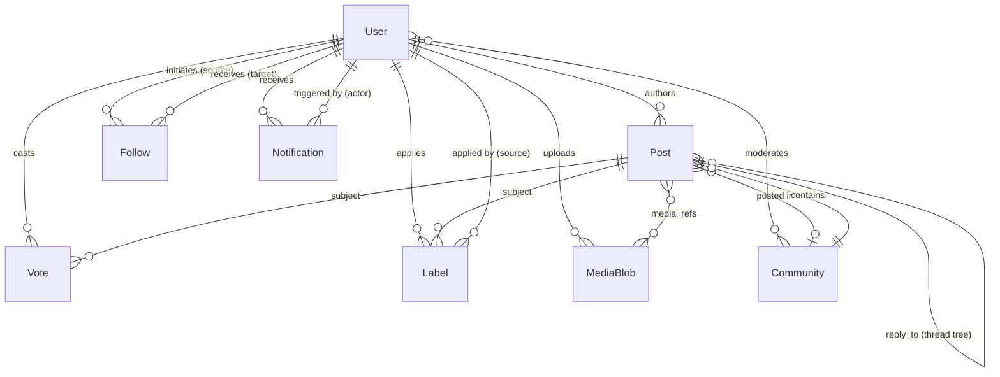

# 02 -- Data Models

This document defines the core data structures, identity schemes, and entity relationships for a generic social media platform. The design synthesizes patterns from three production systems: Bluesky (AT Protocol), Twitter/X, and Reddit. Where a concept originates from or is most clearly expressed in one of those systems, a parenthetical note attributes it.

---

## 1. Universal Record Abstraction

Every entity in the system -- user profiles, posts, votes, follows, labels -- is stored as a **typed record** wrapped in a common envelope. This idea draws from two sources:

- **Reddit's "Thing" model.** Everything in Reddit is a Thing. A Thing row has fixed columns (`id`, `ups`, `downs`, `deleted`, `spam`) plus an associated key-value `thing_data` table for flexible per-type fields. The uniform wrapper means the storage layer doesn't need to know what a Thing *is* to store, retrieve, or soft-delete it.
- **Bluesky's Record concept.** Every piece of user-generated data is a record with a `$type` field (a Namespaced Identifier like `app.bsky.feed.post`). Records live in collections within a user's personal data repository. The repository is a Merkle tree; every record gets a content-addressed hash (CID).

The generic platform uses a **Record Envelope** that wraps every entity:

```
+-----------------------------------+
|         Record Envelope           |
+-----------------------------------+
| id          Snowflake (int64)     |
| type        string (NSID)        |
| author_id   Snowflake (int64)     |
| created_at  ISO-8601 timestamp    |
| updated_at  ISO-8601 timestamp    |
| deleted     boolean               |
| metadata    map<string, any>      |
+-----------------------------------+
|     [Entity-Specific Fields]      |
+-----------------------------------+
```

| Envelope Field | Type | Description |
|---|---|---|
| `id` | `int64` (Snowflake) | Globally unique, time-sortable primary key. |
| `type` | `string` | Namespaced type identifier, e.g. `social.post`, `social.vote`. Determines which entity-specific fields are present. |
| `author_id` | `int64` (Snowflake) | The user who created this record. |
| `created_at` | `string` (ISO-8601) | Immutable creation timestamp. |
| `updated_at` | `string` (ISO-8601) | Last modification timestamp. Null if never edited. |
| `deleted` | `boolean` | Soft-delete flag. Deleted records are retained but hidden from normal queries. |
| `metadata` | `map<string, any>` | Open-ended key-value map for extensibility. Avoids schema migrations for optional or experimental fields. (Inspired by Reddit's ThingDB data table.) |

The envelope is **stable** -- its fields never change across versions. Entity-specific fields are versioned through the `type` string (see Section 5, Schema Evolution).

---

## 2. Core Entities

Each entity definition below shows the entity-specific fields (those inside the envelope's extension area). Every entity also carries the envelope fields from Section 1.

### 2.1 User / Actor

A registered identity on the platform.

| Field | Type | Constraints | Description |
|---|---|---|---|
| `handle` | `string` | Unique, mutable, 3-20 chars, `[a-zA-Z0-9_.-]` | The user-facing username. Can be changed. (Twitter: `@username`; Reddit: `u/username`; Bluesky: `handle` resolved via DNS or `.bsky.social` subdomain.) |
| `did` | `string` | Unique, immutable | Decentralized Identifier. Permanent identity anchor that survives handle changes. (From AT Protocol: `did:plc:...` or `did:web:...`.) |
| `display_name` | `string` | Max 64 chars | Human-readable name shown in UI. |
| `bio` | `string` | Max 300 chars | Free-text self-description. |
| `avatar_ref` | `string` (blob ref) | Nullable | Reference to a Media Blob for the profile image. |
| `banner_ref` | `string` (blob ref) | Nullable | Reference to a Media Blob for the profile banner. |
| `followers_count` | `int` | Denormalized | Cached follower count. Materialized from Follow records. |
| `following_count` | `int` | Denormalized | Cached following count. |
| `posts_count` | `int` | Denormalized | Cached post count. |

**Platform provenance:**
- Bluesky: DID + handle pair, profile stored as `app.bsky.actor.profile` record in user repository.
- Twitter: User object with numeric `id` and mutable `@username`.
- Reddit: Thing `t2`, username is permanent after creation.

### 2.2 Post / Status

A piece of content published to the platform. This is the primary content unit.

| Field | Type | Constraints | Description |
|---|---|---|---|
| `text` | `string` | Max 3000 chars | The post body. May contain mentions, links, and tags interpreted via facets. |
| `facets` | `array<Facet>` | Optional | Rich-text annotations: byte ranges mapped to features like mentions, links, or hashtags. (From AT Protocol's facet model -- text is plain, formatting is overlay.) |
| `media_refs` | `array<string>` | Max 4 | References to Media Blob records for attached images, video, etc. |
| `reply_to` | `string` (URI) | Nullable | URI of the parent post if this is a reply. Null for top-level posts. |
| `root_post_id` | `int64` (Snowflake) | Nullable | ID of the thread root. Enables efficient thread retrieval without walking the reply chain. |
| `community_id` | `int64` (Snowflake) | Nullable | If posted within a community/space. Null for posts on the global feed. |
| `language` | `string` | BCP-47 code | Content language tag, e.g. `en`, `ar`, `ja`. |
| `labels` | `array<string>` | Optional | Self-applied content labels (e.g. `nsfw`, `spoiler`). Third-party labels are separate Label entities. |
| `embed` | `Embed` | Nullable | Embedded content: a quoted post (URI + CID), an external link card (url, title, description, thumbnail), or embedded media. |

**Facet structure:**

| Field | Type | Description |
|---|---|---|
| `index.byte_start` | `int` | Start offset in UTF-8 byte string. |
| `index.byte_end` | `int` | End offset (exclusive). |
| `features` | `array<Feature>` | One or more of: `mention(did)`, `link(uri)`, `tag(name)`. |

**Embed variants:**

| Variant | Fields | Description |
|---|---|---|
| `quote` | `uri`, `cid` | Quote-post: references another post by URI with a content hash for integrity. |
| `external` | `uri`, `title`, `description`, `thumb_ref` | Link card for external URLs. |
| `media` | `media_refs[]` | Inline media (images/video) without text. |

**Platform provenance:**
- Bluesky: `app.bsky.feed.post` record. Facets handle rich text. Embeds are typed unions.
- Twitter: Tweet object. Entities (mentions, URLs, hashtags) are similar to facets.
- Reddit: Link post (URL) or self post (text body), Thing `t3`.

### 2.3 Comment / Reply

In this model, **comments are posts**. A reply is a Post record where `reply_to` is non-null. This is the unifying design choice:

- **Bluesky** already works this way -- replies are `app.bsky.feed.post` records with a `reply` field containing parent and root references.
- **Twitter** works this way -- a reply tweet is a tweet with `in_reply_to_status_id`.
- **Reddit** treats comments (`t1`) as a separate type from posts (`t3`). The generic model departs from Reddit here in favor of the unified approach.

Thread structure is derived from the `reply_to` chain. The `root_post_id` field on every reply enables fetching an entire thread without recursive parent lookups:

```
Post (root)                    root_post_id = null, reply_to = null
  +-- Reply A                  root_post_id = root.id, reply_to = root.uri
  |     +-- Reply A1           root_post_id = root.id, reply_to = A.uri
  |     +-- Reply A2           root_post_id = root.id, reply_to = A.uri
  +-- Reply B                  root_post_id = root.id, reply_to = root.uri
```

To reconstruct a thread: query all posts where `root_post_id = X`, then build the tree in memory using `reply_to` references.

### 2.4 Community / Space

An interest-based grouping that scopes content and moderation.

| Field | Type | Constraints | Description |
|---|---|---|---|
| `name` | `string` | Unique, immutable, 3-21 chars, `[a-zA-Z0-9_]` | Machine-readable identifier (Reddit: subreddit name). |
| `display_name` | `string` | Max 100 chars | Human-readable community title. |
| `description` | `string` | Max 1000 chars | Community purpose and topic description. |
| `rules` | `array<Rule>` | Max 15 | Community-specific rules. Each rule has a `title` (string) and `description` (string). |
| `creator_id` | `int64` (Snowflake) | Immutable | The user who created the community. |
| `moderator_ids` | `array<int64>` | Min 1 | Users with moderation authority. |
| `visibility` | `enum` | `public`, `private`, `restricted` | Access level. Public = anyone can view and post. Private = invite-only. Restricted = anyone can view, posting requires approval. |
| `member_count` | `int` | Denormalized | Cached member count. |
| `icon_ref` | `string` (blob ref) | Nullable | Community icon image. |

**Platform provenance:**
- Reddit: Subreddit, Thing `t5`. The most developed community model of the three.
- Bluesky: No direct equivalent. Custom feed generators and lists serve partial community functions.
- Twitter: Communities feature (limited rollout).

### 2.5 Vote / Reaction

A polymorphic interaction record covering likes, upvotes/downvotes, and reposts.

| Field | Type | Constraints | Description |
|---|---|---|---|
| `subject_uri` | `string` (URI) | Required | The record being reacted to (post, comment, etc.). |
| `subject_cid` | `string` (CID) | Optional | Content hash of the subject at reaction time. Enables integrity verification. (From AT Protocol strong references.) |
| `direction` | `enum` | `up`, `down`, `neutral` | Vote direction. Likes map to `up`. Downvotes map to `down`. Used for aggregate scoring. |
| `variant` | `enum` | `like`, `upvote`, `downvote`, `repost` | Semantic type of the reaction. |

**Interaction model comparison:**

| Behavior | Platform | Mapping |
|---|---|---|
| Like (binary) | Twitter, Bluesky | `variant=like`, `direction=up` |
| Upvote | Reddit | `variant=upvote`, `direction=up` |
| Downvote | Reddit | `variant=downvote`, `direction=down` |
| Repost / Retweet | All three | `variant=repost`, `direction=up` |

**Constraints:**
- A user may have at most **one** like or vote per `subject_uri`. Creating a new vote replaces the previous one.
- Reposts are separate -- a user can both like *and* repost the same subject.
- Vote scores on posts are computed as `sum(direction=up) - sum(direction=down)` and cached as denormalized counters.

**Platform provenance:**
- Bluesky: `app.bsky.feed.like` and `app.bsky.feed.repost` are separate record types. No downvote.
- Twitter: Favorite/Like object, Retweet object. No downvote.
- Reddit: Vote (up/down) applied to Things. Separate from any "share" mechanism.

### 2.6 Follow / Relationship

A directed edge in the social graph.

| Field | Type | Constraints | Description |
|---|---|---|---|
| `source_id` | `int64` (Snowflake) | Required | The user initiating the relationship (follower, blocker, muter). Same as `author_id` in the envelope. |
| `target_id` | `int64` (Snowflake) | Required | The user or community being followed/blocked/muted. |
| `variant` | `enum` | `follow`, `block`, `mute` | Relationship type. |

**Constraints:**
- `(source_id, target_id, variant)` is unique. A user cannot follow the same target twice.
- Blocks and mutes are invisible to the target (target cannot query who blocked them).
- Follows are public by default (follower lists are queryable). Blocks and mutes are private.

**Platform provenance:**
- Bluesky: `app.bsky.graph.follow`, `app.bsky.graph.block`, `app.bsky.graph.listblock` records.
- Twitter: Follow edge managed by Social Graph Service (FlockDB historically). Block/Mute as separate edge types.
- Reddit: Primarily community-level subscriptions rather than user-level follows. User follow was added later.

### 2.7 Notification

System-generated record delivered to a user in response to an event.

| Field | Type | Constraints | Description |
|---|---|---|---|
| `recipient_id` | `int64` (Snowflake) | Required, indexed | The user receiving the notification. |
| `actor_id` | `int64` (Snowflake) | Required | The user who triggered the event. |
| `reason` | `enum` | `like`, `repost`, `follow`, `reply`, `mention`, `quote`, `report`, `community_invite` | What happened. |
| `subject_uri` | `string` (URI) | Nullable | The record the notification is about (e.g. the post that was liked). Null for follow notifications. |
| `read` | `boolean` | Default `false` | Whether the recipient has seen this notification. |

**Generation rules:**
- A notification is created when the actor's action affects the recipient. The actor is never the recipient (no self-notifications).
- Notifications for deleted subjects are hidden but not removed.
- Bulk actions (e.g. 100 likes on the same post) may be collapsed in the presentation layer but stored individually.

**Platform provenance:**
- Bluesky: `app.bsky.notification.listNotifications` API returns notifications with `reason`, `author`, `record`, `isRead`.
- Twitter: Notification objects delivered via push and pull.
- Reddit: Inbox messages for replies/mentions; separate notification system for votes and follows.

### 2.8 Label / Tag

A moderation or classification annotation applied to any record.

| Field | Type | Constraints | Description |
|---|---|---|---|
| `source_id` | `int64` (Snowflake) | Required | Who applied the label: the author (self-label), a moderator, or an automated labeling service. |
| `subject_uri` | `string` (URI) | Required | The record or actor being labeled. |
| `value` | `string` | Required, from controlled vocabulary | The label name: `nsfw`, `spoiler`, `spam`, `gore`, `misleading`, `impersonation`, etc. |
| `negated` | `boolean` | Default `false` | If true, this label explicitly *removes* a previously applied label. Enables correction without deleting history. (From AT Protocol's negation model.) |

**Label sources:**
1. **Self-labels:** The content author marks their own post (e.g. `nsfw`). Stored in the post's `labels` array AND as a separate Label record for auditability.
2. **Moderator labels:** Applied by community moderators or platform staff.
3. **Service labels:** Applied by automated labeling services (e.g. image classification, spam detection).

**Platform provenance:**
- Bluesky: `com.atproto.label.defs#label`. Labeling is a first-class system with dedicated subscription APIs. Labels are separate from the content they describe, enabling third-party labeling services.
- Twitter: Content moderation labels (sensitive media, misleading information) applied by internal systems.
- Reddit: Flair (user/post), mod-applied tags, AutoModerator labels.

### 2.9 Media Blob

Binary content (images, video, audio) stored separately from records.

| Field | Type | Constraints | Description |
|---|---|---|---|
| `uploader_id` | `int64` (Snowflake) | Required | Same as `author_id` in envelope. |
| `mime_type` | `string` | Required | IANA media type: `image/jpeg`, `image/png`, `video/mp4`, etc. |
| `size_bytes` | `int64` | Max 50MB (images), 100MB (video) | File size. |
| `hash` | `string` | Required, unique | Content-addressable hash (SHA-256 or CID). Enables deduplication and integrity checks. |
| `alt_text` | `string` | Max 2000 chars, nullable | Accessibility description. |
| `width` | `int` | Nullable | Image/video width in pixels. |
| `height` | `int` | Nullable | Image/video height in pixels. |
| `duration_ms` | `int` | Nullable | Video/audio duration in milliseconds. |
| `thumbnail_ref` | `string` (blob ref) | Nullable | Reference to a smaller preview blob (for video). |

**Storage model:**
- Media Blobs are stored in object storage (S3-compatible), not in the primary database.
- The Media Blob record in the database is metadata only; it contains the `hash` used to locate the binary in object storage.
- Posts reference blobs via `media_refs[]`, which are blob record IDs or CID strings.
- Blobs are immutable. Editing a post's media means creating new blobs and updating references.

**Platform provenance:**
- Bluesky: Blobs uploaded via `com.atproto.repo.uploadBlob`, referenced by CID in records.
- Twitter: Media upload API, media objects with `media_id_string`.
- Reddit: Image/video hosting via `i.redd.it` and `v.redd.it`.

---

## 3. ID Generation Strategy

The platform uses two identification schemes: **Snowflake IDs** for internal primary keys and **Platform URIs** for cross-entity and external references.

### 3.1 Snowflake IDs

Derived from Twitter's Snowflake system. A 64-bit integer with embedded structure:

```
 63                                                              0
 +---+------------------------------------------+----------+------------+
 | 0 |          41-bit timestamp (ms)            | 10-bit   | 12-bit     |
 |   |     (milliseconds since custom epoch)     | worker   | sequence   |
 +---+------------------------------------------+----------+------------+
   1                    41                           10          12
```

| Component | Bits | Range | Purpose |
|---|---|---|---|
| Sign bit | 1 | Always 0 | Keeps IDs positive in signed int64. |
| Timestamp | 41 | ~69 years from epoch | Milliseconds since platform epoch (e.g. 2024-01-01T00:00:00Z). Makes IDs roughly time-sorted. |
| Worker ID | 10 | 0-1023 | Identifies the generating node. Supports up to 1024 concurrent ID generators. |
| Sequence | 12 | 0-4095 | Per-millisecond counter. Supports 4096 IDs per millisecond per worker. |

**Properties:**
- **Time-sortable.** `ORDER BY id` approximates `ORDER BY created_at` without an index on the timestamp column.
- **Distributed.** Each worker generates IDs independently. No central coordinator.
- **Compact.** 8 bytes, fits in a database bigint and a JavaScript `BigInt`.
- **Throughput.** 1024 workers x 4096 IDs/ms = ~4 billion IDs per second theoretical max.

### 3.2 Platform URIs

For cross-entity references (reply targets, vote subjects, label subjects), the platform uses structured URIs:

```
platform://[author_id]/[collection]/[record_id]
```

**Examples:**
```
platform://847291638401/social.post/847291638529
platform://847291638401/social.vote/847291638530
platform://847291638401/social.actor.profile/847291638401
```

| Component | Description |
|---|---|
| `platform://` | Scheme identifier. |
| `author_id` | Snowflake ID of the record's author. Enables routing to the correct user repository or shard. |
| `collection` | Namespaced type identifier matching the record's `type` field. |
| `record_id` | Snowflake ID of the specific record. |

**Comparison with source platforms:**

| Platform | URI Format | Example |
|---|---|---|
| AT Protocol (Bluesky) | `at://did:plc:xyz/app.bsky.feed.post/3k4duaz5vfs2b` | DID authority, NSID collection, TID record key |
| Twitter | Numeric IDs only (no URI scheme) | `1234567890` |
| Reddit | `t3_abc123` (type prefix + base36 ID) | Type-prefixed, base36-encoded sequential IDs |
| Generic platform | `platform://author_id/collection/record_id` | Snowflake authority, NSID collection, Snowflake record key |

### 3.3 Strong References

For immutable references (e.g. a quote-post embedding another post), the platform pairs a URI with a **content hash** (CID):

```json
{
  "uri": "platform://847291638401/social.post/847291638529",
  "cid": "bafyreie5cvv4h45feadgeuwhbcutmh6t7ceseocckahdoe6uat64zmz454"
}
```

This guarantees the referenced record hasn't been modified since the reference was created. If the content changes, the CID won't match, and the reference can be flagged as stale. (Directly from AT Protocol's strong reference model.)

---

## 4. Relationships and References

### 4.1 Entity-Relationship Diagram



### 4.2 Reference Patterns

The platform uses three reference patterns, chosen based on the strength of coupling needed:

**1. Foreign Key References (strong, internal)**

Direct Snowflake ID references between tightly coupled entities. Enforced by the database.

| Source | Field | Target |
|---|---|---|
| `Post.author_id` | `->` | `User.id` |
| `Post.community_id` | `->` | `Community.id` |
| `Post.root_post_id` | `->` | `Post.id` |
| `Follow.source_id` | `->` | `User.id` |
| `Follow.target_id` | `->` | `User.id` |
| `Notification.recipient_id` | `->` | `User.id` |
| `Notification.actor_id` | `->` | `User.id` |
| `Community.creator_id` | `->` | `User.id` |

**2. URI References (flexible, cross-entity)**

Platform URI strings used where the target type varies or where the reference may cross system boundaries.

| Source | Field | Target Types |
|---|---|---|
| `Post.reply_to` | URI | `Post` (always, but resolved by URI for flexibility) |
| `Vote.subject_uri` | URI | `Post`, `Comment` (any votable record) |
| `Label.subject_uri` | URI | `Post`, `User`, `Community` (any labelable record) |
| `Notification.subject_uri` | URI | `Post`, `Vote`, `Follow` (varies by notification reason) |

URI references enable **polymorphic relationships** without union foreign keys or join tables.

**3. Strong References (immutable, content-addressed)**

URI + CID pairs for references that must survive content edits.

| Source | Field | Use Case |
|---|---|---|
| `Post.embed.quote.uri + cid` | Strong ref | Quoted post must be verifiable as unchanged. |
| `Vote.subject_uri + subject_cid` | Strong ref | Optional integrity check for votes. |

### 4.3 Self-Referential Structures

**Thread trees** are the primary self-referential structure. Posts reference other posts via `reply_to`, forming an n-ary tree rooted at a top-level post.

```
                     Post (root)
                    /           \
              Reply A           Reply B
             /       \               \
        Reply A1   Reply A2       Reply B1
```

**Query patterns:**
- *Get full thread:* `SELECT * FROM posts WHERE root_post_id = :root_id ORDER BY created_at`
- *Get direct replies:* `SELECT * FROM posts WHERE reply_to = :post_uri ORDER BY created_at`
- *Get reply depth:* Requires recursive traversal or a denormalized `depth` field.

**Follow graph** is another self-referential structure -- a directed graph on the User entity. Follow, block, and mute edges all connect users to users.

---

## 5. Schema Evolution

The record envelope is designed to be **permanently stable**. Evolution happens in two layers:

### 5.1 Envelope Stability

The seven envelope fields (`id`, `type`, `author_id`, `created_at`, `updated_at`, `deleted`, `metadata`) are frozen. New envelope-level fields are never added. Cross-cutting concerns go into `metadata` as convention-based keys (e.g. `metadata.version`, `metadata.source_app`).

### 5.2 Entity Schema Versioning

Entity-specific fields evolve through the `type` identifier:

| Strategy | Mechanism | Trade-off |
|---|---|---|
| **Additive fields** (preferred) | Add optional fields to existing type. Old readers ignore unknown fields. | No breaking change. Requires consumers to handle missing fields. |
| **New type version** | Publish a new NSID: `social.post` becomes `social.post.v2`. | Clean separation. Requires migration path for old records. (From AT Protocol Lexicon model: published schemas are immutable.) |
| **Flexible metadata** | Store experimental fields in `metadata` map. Promote to first-class fields if they prove stable. | Fast iteration. Trades type safety for flexibility. (From Reddit's ThingDB pattern.) |

**Platform provenance for versioning approaches:**
- **Bluesky (Lexicon):** Schemas defined in Lexicon language. Once published, a Lexicon is immutable. Non-breaking changes (adding optional fields) are allowed. Breaking changes require a new NSID.
- **Twitter (API versioning):** v1.1 to v2 migration with deprecation periods. Entity shapes change between versions.
- **Reddit (schemaless KV):** ThingDB stores key-value pairs per Thing. Schema is implicit in application code. Maximum flexibility, minimum safety.

### 5.3 Migration Strategy

When a new entity version is introduced:

1. **Dual-write period.** New records are written in the new format. Old records remain in the old format.
2. **Backfill.** A background job migrates old records to the new schema. The `type` field is updated.
3. **Read compatibility.** API readers accept both old and new `type` values during migration. Missing fields default to null/empty.
4. **Cutover.** Once backfill is complete, the old type is deprecated. Writers reject the old format.

---

## Appendix A: Complete Entity Field Reference

For quick lookup, this table lists every entity-specific field across all entity types. Envelope fields (`id`, `type`, `author_id`, `created_at`, `updated_at`, `deleted`, `metadata`) are omitted -- they exist on every record.

| Entity | Field | Type | Nullable | Notes |
|---|---|---|---|---|
| User | `handle` | string | No | Unique, mutable |
| User | `did` | string | No | Unique, immutable |
| User | `display_name` | string | Yes | |
| User | `bio` | string | Yes | Max 300 chars |
| User | `avatar_ref` | string | Yes | Blob reference |
| User | `banner_ref` | string | Yes | Blob reference |
| User | `followers_count` | int | No | Denormalized |
| User | `following_count` | int | No | Denormalized |
| User | `posts_count` | int | No | Denormalized |
| Post | `text` | string | No | Max 3000 chars |
| Post | `facets` | array | Yes | Rich-text annotations |
| Post | `media_refs` | array | Yes | Max 4 blob refs |
| Post | `reply_to` | string (URI) | Yes | Parent post |
| Post | `root_post_id` | int64 | Yes | Thread root |
| Post | `community_id` | int64 | Yes | Scoping community |
| Post | `language` | string | No | BCP-47 |
| Post | `labels` | array | Yes | Self-applied labels |
| Post | `embed` | object | Yes | Quote, link card, or media |
| Community | `name` | string | No | Unique, immutable |
| Community | `display_name` | string | No | |
| Community | `description` | string | Yes | Max 1000 chars |
| Community | `rules` | array | Yes | Max 15 rules |
| Community | `creator_id` | int64 | No | Immutable |
| Community | `moderator_ids` | array | No | Min 1 |
| Community | `visibility` | enum | No | public/private/restricted |
| Community | `member_count` | int | No | Denormalized |
| Community | `icon_ref` | string | Yes | Blob reference |
| Vote | `subject_uri` | string (URI) | No | Target record |
| Vote | `subject_cid` | string | Yes | Content hash |
| Vote | `direction` | enum | No | up/down/neutral |
| Vote | `variant` | enum | No | like/upvote/downvote/repost |
| Follow | `source_id` | int64 | No | Follower |
| Follow | `target_id` | int64 | No | Followee |
| Follow | `variant` | enum | No | follow/block/mute |
| Notification | `recipient_id` | int64 | No | Indexed |
| Notification | `actor_id` | int64 | No | |
| Notification | `reason` | enum | No | Event type |
| Notification | `subject_uri` | string (URI) | Yes | |
| Notification | `read` | boolean | No | Default false |
| Label | `source_id` | int64 | No | Labeler |
| Label | `subject_uri` | string (URI) | No | Labeled record |
| Label | `value` | string | No | From controlled vocabulary |
| Label | `negated` | boolean | No | Default false |
| MediaBlob | `uploader_id` | int64 | No | |
| MediaBlob | `mime_type` | string | No | IANA media type |
| MediaBlob | `size_bytes` | int64 | No | |
| MediaBlob | `hash` | string | No | Unique, content-addressed |
| MediaBlob | `alt_text` | string | Yes | Accessibility |
| MediaBlob | `width` | int | Yes | Pixels |
| MediaBlob | `height` | int | Yes | Pixels |
| MediaBlob | `duration_ms` | int | Yes | Video/audio only |
| MediaBlob | `thumbnail_ref` | string | Yes | Video preview blob |
