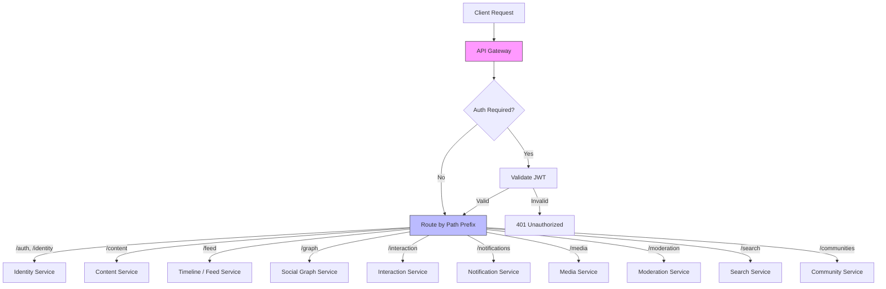

# API Endpoint Catalog

This document defines every public API endpoint for the generic social media platform. Endpoints are grouped by domain, with request/response shapes, authentication requirements, and cross-references to [Operation Flows](./04-operation-flows.md).

## API Design Conventions

### Base URL and Versioning

All endpoints are served under a versioned base path:

```
https://api.platform.example/v1/
```

### Naming Conventions

| Convention | Pattern | Example |
|------------|---------|---------|
| Resource collections | Plural nouns | `/content/posts`, `/graph/followers` |
| Single resource | Collection + ID | `/content/posts/:id` |
| Actions on resources | Verb sub-paths | `/content/posts/:id/comments` |
| Domain grouping | Prefix by service | `/content/`, `/graph/`, `/feed/` |

The endpoint naming draws from REST conventions (Twitter v2, Reddit API) while the domain grouping borrows from Bluesky's XRPC namespace pattern (`com.atproto.repo.*` → `/content/*`).

### Authentication

All endpoints except handle resolution and public content reads require authentication.

```
Authorization: Bearer <access_token>
```

Tokens are JWTs issued by the Identity Service. See [Identity and Auth](./07-identity-and-auth.md) for token lifecycle.

### Pagination

All list endpoints use **cursor-based pagination** (all three platforms converge on this pattern):

```json
// Request
GET /feed/timeline?cursor=abc123&limit=25

// Response
{
  "data": [...],
  "cursor": "def456",
  "has_more": true
}
```

| Parameter | Type | Default | Description |
|-----------|------|---------|-------------|
| `cursor` | string | `null` | Opaque cursor from previous response |
| `limit` | integer | 25 | Items per page (max 100) |

### Error Response Format

```json
{
  "error": {
    "code": "InvalidRequest",
    "message": "Post text exceeds maximum length",
    "details": {
      "field": "text",
      "max_length": 3000,
      "actual_length": 3500
    }
  }
}
```

Standard error codes: `InvalidRequest`, `Unauthorized`, `Forbidden`, `NotFound`, `RateLimited`, `InternalError`.

### Rate Limiting

Rate limits are returned in response headers:

```
X-RateLimit-Limit: 300
X-RateLimit-Remaining: 298
X-RateLimit-Reset: 1709312400
```

| Tier | Requests/min | Typical use |
|------|-------------|-------------|
| Standard | 300 | Authenticated user |
| Elevated | 1000 | Approved third-party apps |
| Firehose | Unlimited | Event stream subscribers |

---

## Identity and Auth Endpoints

| Method | Path | Auth | Description | Flow Ref |
|--------|------|------|-------------|----------|
| POST | `/auth/session` | No | Create session (login) | [Login](./04-operation-flows.md#user-login--session-management) |
| DELETE | `/auth/session` | Yes | Destroy session (logout) | — |
| POST | `/auth/token/refresh` | No* | Refresh access token | [Login](./04-operation-flows.md#user-login--session-management) |
| POST | `/identity/account` | No | Create account (register) | [Registration](./04-operation-flows.md#user-registration) |
| DELETE | `/identity/account` | Yes | Delete account | — |
| GET | `/identity/resolve/:handle` | No | Resolve handle to user ID | — |
| PUT | `/identity/handle` | Yes | Update own handle | — |
| GET | `/identity/users/:id` | No | Get user profile | — |
| GET | `/identity/users/:id/profile` | No | Get detailed profile | — |
| PUT | `/identity/profile` | Yes | Update own profile | — |

*Refresh token sent in request body, not auth header.

### `POST /auth/session` — Create Session

```json
// Request
{
  "identifier": "alice.example.com",
  "password": "s3cur3p4ss"
}

// Response 200
{
  "access_token": "eyJhbGciOiJFUzI1NiIs...",
  "refresh_token": "rt_a1b2c3d4e5f6...",
  "user_id": "1234567890123456",
  "handle": "alice.example.com",
  "did": "did:plc:u5cwb2mwiv2bfq53cjufe6yn"
}
```

### `POST /identity/account` — Create Account

```json
// Request
{
  "handle": "alice",
  "email": "alice@example.com",
  "password": "s3cur3p4ss",
  "invite_code": "inv-abc123"
}

// Response 201
{
  "user_id": "1234567890123456",
  "handle": "alice.platform.example",
  "access_token": "eyJhbGciOiJFUzI1NiIs...",
  "refresh_token": "rt_a1b2c3d4e5f6..."
}
```

### `GET /identity/resolve/:handle` — Resolve Handle

```json
// GET /identity/resolve/alice.example.com

// Response 200
{
  "user_id": "1234567890123456",
  "did": "did:plc:u5cwb2mwiv2bfq53cjufe6yn",
  "handle": "alice.example.com"
}
```

---

## Content Endpoints

| Method | Path | Auth | Description | Flow Ref |
|--------|------|------|-------------|----------|
| POST | `/content/posts` | Yes | Create a post | [Create Post](./04-operation-flows.md#creating-a-post) |
| GET | `/content/posts/:id` | No | Get post by ID | — |
| DELETE | `/content/posts/:id` | Yes | Delete own post | [Delete Post](./04-operation-flows.md#deleting-a-post) |
| GET | `/content/posts/:id/thread` | No | Get full thread | — |
| POST | `/content/posts/:id/comments` | Yes | Create comment/reply | [Create Comment](./04-operation-flows.md#creating-a-comment--reply) |
| GET | `/content/posts/:id/comments` | No | List comments | — |

### `POST /content/posts` — Create Post

```json
// Request
{
  "text": "Hello world! Check out @bob's post",
  "media_refs": ["media_9876543210"],
  "reply_to": null,
  "community_id": null,
  "language": "en",
  "labels": [],
  "facets": [
    {
      "index": { "start": 25, "end": 29 },
      "features": [{ "type": "mention", "user_id": "1234567890123457" }]
    }
  ],
  "embed": null
}

// Response 201
{
  "id": "1234567890123458",
  "uri": "platform://1234567890123456/posts/1234567890123458",
  "author_id": "1234567890123456",
  "text": "Hello world! Check out @bob's post",
  "created_at": "2026-03-01T12:00:00Z"
}
```

The `facets` array (from Bluesky) provides structured rich-text annotations — mentions, links, hashtags — as byte-range references into the text rather than inline markup.

### `GET /content/posts/:id/thread` — Get Thread

Returns the full thread context: the target post, its parent chain up to the root, and all replies.

```json
// Response 200
{
  "post": { ... },
  "parent_chain": [ ... ],
  "replies": [
    {
      "post": { ... },
      "replies": [ ... ]
    }
  ]
}
```

The thread is returned as a nested tree. Internally, comments are stored flat with `reply_to` references (cf. Reddit's flat storage with tree reconstruction on read). The server assembles the tree before responding.

### `GET /content/posts/:id/comments` — List Comments

Flat, paginated list with sorting options. Clients can reconstruct trees client-side if needed.

```json
// GET /content/posts/:id/comments?sort=hot&limit=25&cursor=abc

// Response 200
{
  "data": [
    {
      "id": "1234567890123459",
      "author_id": "1234567890123457",
      "text": "Great post!",
      "reply_to": "1234567890123458",
      "vote_count": 42,
      "reply_count": 3,
      "created_at": "2026-03-01T12:05:00Z"
    }
  ],
  "cursor": "def456",
  "has_more": true
}
```

Sort options: `hot`, `new`, `top`, `controversial` (cf. Reddit sort modes).

---

## Feed / Timeline Endpoints

| Method | Path | Auth | Description | Flow Ref |
|--------|------|------|-------------|----------|
| GET | `/feed/timeline` | Yes | Home timeline | [Read Timeline](./04-operation-flows.md#reading-the-home-timeline) |
| GET | `/feed/author/:userId` | No | Author's post feed | — |
| GET | `/feed/community/:communityId` | No | Community feed | — |
| GET | `/feed/custom/:feedId` | No | Custom/algorithmic feed | — |

### `GET /feed/timeline` — Home Timeline

Returns the authenticated user's personalized home timeline (posts from followed accounts).

```json
// GET /feed/timeline?cursor=abc123&limit=25

// Response 200
{
  "data": [
    {
      "post": {
        "id": "1234567890123458",
        "author": {
          "id": "1234567890123456",
          "handle": "alice.example.com",
          "display_name": "Alice"
        },
        "text": "Hello world!",
        "media": [],
        "vote_count": 15,
        "reply_count": 3,
        "repost_count": 2,
        "viewer_state": {
          "liked": true,
          "reposted": false
        },
        "labels": [],
        "created_at": "2026-03-01T12:00:00Z"
      },
      "reason": null
    },
    {
      "post": { ... },
      "reason": {
        "type": "repost",
        "by": { "id": "...", "handle": "bob.example.com" }
      }
    }
  ],
  "cursor": "def456",
  "has_more": true
}
```

Each feed item includes:
- The full hydrated post (with embedded author profile, vote/reply/repost counts, and the authenticated user's interaction state)
- A `reason` field explaining why it appeared (e.g., repost by someone the user follows)

The timeline is assembled from pre-computed timeline cache (post IDs in Redis), then each post is hydrated from the Content Service. See [Operation Flows](./04-operation-flows.md#reading-the-home-timeline).

### `GET /feed/custom/:feedId` — Custom Feed

Custom feeds are provided by external Feed Generator services (cf. Bluesky feed generators). The platform proxies the request:

1. Platform calls the Feed Generator's `GET /feed/skeleton` endpoint
2. Feed Generator returns a list of post IDs (the "skeleton")
3. Platform hydrates each post ID into a full post object
4. Returns the hydrated feed to the client

```json
// Response 200 (same shape as /feed/timeline)
{
  "data": [ ... ],
  "cursor": "...",
  "has_more": true
}
```

---

## Social Graph Endpoints

| Method | Path | Auth | Description | Flow Ref |
|--------|------|------|-------------|----------|
| POST | `/graph/follow` | Yes | Follow a user | [Follow](./04-operation-flows.md#following-a-user) |
| DELETE | `/graph/follow/:userId` | Yes | Unfollow | — |
| POST | `/graph/block` | Yes | Block a user | — |
| DELETE | `/graph/block/:userId` | Yes | Unblock | — |
| POST | `/graph/mute` | Yes | Mute a user | — |
| DELETE | `/graph/mute/:userId` | Yes | Unmute | — |
| GET | `/graph/followers/:userId` | No | List followers | — |
| GET | `/graph/following/:userId` | No | List following | — |
| GET | `/graph/relationship` | Yes | Check relationship between users | — |

### `POST /graph/follow` — Follow User

```json
// Request
{
  "target_id": "1234567890123457"
}

// Response 201
{
  "id": "1234567890123460",
  "source_id": "1234567890123456",
  "target_id": "1234567890123457",
  "type": "follow",
  "created_at": "2026-03-01T12:10:00Z"
}
```

Side effects (async via Event Bus): the Timeline Service backfills recent posts from the followed user into the follower's timeline cache.

### `GET /graph/followers/:userId` — List Followers

```json
// GET /graph/followers/1234567890123456?cursor=abc&limit=25

// Response 200
{
  "data": [
    {
      "user": {
        "id": "1234567890123457",
        "handle": "bob.example.com",
        "display_name": "Bob"
      },
      "followed_at": "2026-02-15T08:30:00Z"
    }
  ],
  "cursor": "def456",
  "has_more": true
}
```

### `GET /graph/relationship` — Check Relationship

```json
// GET /graph/relationship?source=123&target=456

// Response 200
{
  "following": true,
  "followed_by": false,
  "blocking": false,
  "blocked_by": false,
  "muting": false
}
```

---

## Interaction Endpoints

| Method | Path | Auth | Description | Flow Ref |
|--------|------|------|-------------|----------|
| POST | `/interaction/like` | Yes | Like a post | [Like/Vote](./04-operation-flows.md#liking--voting-on-a-post) |
| DELETE | `/interaction/like/:postId` | Yes | Unlike | — |
| POST | `/interaction/vote` | Yes | Upvote/downvote | [Like/Vote](./04-operation-flows.md#liking--voting-on-a-post) |
| POST | `/interaction/repost` | Yes | Repost/retweet | — |
| DELETE | `/interaction/repost/:postId` | Yes | Undo repost | — |

### `POST /interaction/like` — Like Post

```json
// Request
{
  "subject_uri": "platform://1234567890123456/posts/1234567890123458"
}

// Response 201
{
  "id": "1234567890123461",
  "author_id": "1234567890123456",
  "subject_uri": "platform://1234567890123456/posts/1234567890123458",
  "type": "like",
  "created_at": "2026-03-01T12:15:00Z"
}
```

Idempotent: liking an already-liked post returns the existing like record. The Interaction Service writes the like record and emits a `like.created` event. See [Operation Flows](./04-operation-flows.md#liking--voting-on-a-post).

### `POST /interaction/vote` — Cast Vote

Reddit-style directional voting:

```json
// Request
{
  "subject_uri": "platform://1234567890123456/posts/1234567890123458",
  "direction": 1
}

// Response 200
{
  "id": "1234567890123462",
  "author_id": "1234567890123456",
  "subject_uri": "platform://1234567890123456/posts/1234567890123458",
  "direction": 1,
  "created_at": "2026-03-01T12:16:00Z"
}
```

`direction`: `1` (upvote), `-1` (downvote), `0` (remove vote). Voting is idempotent — a duplicate vote in the same direction is a no-op. Changing direction updates the existing record.

### `POST /interaction/repost` — Repost

```json
// Request
{
  "subject_uri": "platform://1234567890123456/posts/1234567890123458"
}

// Response 201
{
  "id": "1234567890123463",
  "author_id": "1234567890123456",
  "subject_uri": "platform://1234567890123456/posts/1234567890123458",
  "type": "repost",
  "created_at": "2026-03-01T12:17:00Z"
}
```

A repost creates a record that appears in the reposter's author feed and fans out to the reposter's followers' timelines with `reason: { type: "repost" }`.

---

## Notification Endpoints

| Method | Path | Auth | Description | Flow Ref |
|--------|------|------|-------------|----------|
| GET | `/notifications` | Yes | List notifications | — |
| POST | `/notifications/read` | Yes | Mark as read | — |
| GET | `/notifications/unread-count` | Yes | Unread count | — |

### `GET /notifications` — List Notifications

```json
// GET /notifications?cursor=abc&limit=25

// Response 200
{
  "data": [
    {
      "id": "1234567890123464",
      "type": "like",
      "actor": {
        "id": "1234567890123457",
        "handle": "bob.example.com",
        "display_name": "Bob"
      },
      "subject_uri": "platform://1234567890123456/posts/1234567890123458",
      "read": false,
      "created_at": "2026-03-01T12:15:00Z"
    },
    {
      "id": "1234567890123465",
      "type": "follow",
      "actor": { ... },
      "subject_uri": null,
      "read": false,
      "created_at": "2026-03-01T12:10:00Z"
    }
  ],
  "cursor": "def456",
  "has_more": true
}
```

Notification types: `like`, `vote`, `repost`, `reply`, `mention`, `follow`, `report_resolved`.

### `POST /notifications/read` — Mark Read

```json
// Request
{
  "seen_at": "2026-03-01T12:20:00Z"
}
```

Marks all notifications up to `seen_at` as read (cf. Bluesky's `app.bsky.notification.updateSeen`).

---

## Media Endpoints

| Method | Path | Auth | Description | Flow Ref |
|--------|------|------|-------------|----------|
| POST | `/media/upload` | Yes | Upload blob | — |
| GET | `/media/:id` | No | Get media | — |

### `POST /media/upload` — Upload Media

Multipart form upload:

```
POST /media/upload
Content-Type: multipart/form-data

file: <binary>
alt_text: "A photo of a sunset"
```

```json
// Response 201
{
  "id": "media_9876543210",
  "mime_type": "image/jpeg",
  "size_bytes": 245760,
  "hash": "bafyreib6bxg7gxzpyf4v6wr52nf5q...",
  "dimensions": { "width": 1920, "height": 1080 },
  "alt_text": "A photo of a sunset",
  "url": "https://cdn.platform.example/media/media_9876543210"
}
```

The returned `id` is used in post creation as a `media_refs` entry. Media is stored in object storage (S3-compatible) and served via CDN with automatic resizing/thumbnailing.

Limits: max file size 10 MB for images, 100 MB for video. Supported formats: JPEG, PNG, GIF, WebP, MP4, WebM.

---

## Moderation Endpoints

| Method | Path | Auth | Description | Flow Ref |
|--------|------|------|-------------|----------|
| POST | `/moderation/report` | Yes | Report content/user | [Report](./04-operation-flows.md#reporting-content) |
| POST | `/moderation/label` | Yes* | Apply label | — |
| DELETE | `/moderation/label/:id` | Yes* | Remove label | — |
| GET | `/moderation/queue` | Yes* | Moderation queue | — |
| POST | `/moderation/action` | Yes* | Take moderation action | — |

*Requires moderator or admin role.

### `POST /moderation/report` — Report Content

```json
// Request
{
  "subject_uri": "platform://1234567890123457/posts/1234567890123458",
  "reason": "spam",
  "description": "This is a spam bot promoting crypto scams"
}

// Response 201
{
  "id": "1234567890123466",
  "status": "pending",
  "created_at": "2026-03-01T12:25:00Z"
}
```

Reason codes: `spam`, `harassment`, `hate_speech`, `violence`, `sexual_content`, `misinformation`, `impersonation`, `other`.

### `POST /moderation/label` — Apply Label (Moderator)

```json
// Request
{
  "subject_uri": "platform://1234567890123457/posts/1234567890123458",
  "value": "content-warning",
  "negated": false
}

// Response 201
{
  "id": "1234567890123467",
  "source_id": "1234567890123456",
  "subject_uri": "platform://1234567890123457/posts/1234567890123458",
  "value": "content-warning",
  "negated": false,
  "created_at": "2026-03-01T12:30:00Z"
}
```

Labels are independent entities applied on top of content (cf. Bluesky's labeler architecture). `negated: true` removes a previously applied label.

---

## Search Endpoints

| Method | Path | Auth | Description |
|--------|------|------|-------------|
| GET | `/search/posts` | No | Full-text post search |
| GET | `/search/users` | No | User search by handle/name |

### `GET /search/posts` — Search Posts

```json
// GET /search/posts?q=hello+world&sort=relevance&limit=25

// Response 200
{
  "data": [
    {
      "id": "1234567890123458",
      "author": { ... },
      "text": "Hello world!",
      "vote_count": 15,
      "created_at": "2026-03-01T12:00:00Z",
      "highlight": "<mark>Hello world</mark>!"
    }
  ],
  "cursor": "...",
  "has_more": true
}
```

Sort options: `relevance`, `recent`, `top`. Search is powered by the Search Index (Elasticsearch) which is kept in sync via the Event Bus.

---

## Community Endpoints

| Method | Path | Auth | Description |
|--------|------|------|-------------|
| POST | `/communities` | Yes | Create community |
| GET | `/communities/:id` | No | Get community info |
| PUT | `/communities/:id` | Yes* | Update community |
| POST | `/communities/:id/join` | Yes | Join community |
| DELETE | `/communities/:id/join` | Yes | Leave community |
| GET | `/communities/:id/members` | No | List members |
| GET | `/communities/:id/rules` | No | Get community rules |

*Requires community moderator/creator role.

### `POST /communities` — Create Community

```json
// Request
{
  "name": "tech-discussion",
  "display_name": "Tech Discussion",
  "description": "A place for technology discussions",
  "visibility": "public",
  "rules": [
    { "title": "Be respectful", "description": "..." },
    { "title": "Stay on topic", "description": "..." }
  ]
}

// Response 201
{
  "id": "1234567890123468",
  "name": "tech-discussion",
  "display_name": "Tech Discussion",
  "member_count": 1,
  "created_at": "2026-03-01T13:00:00Z"
}
```

Communities are the generic equivalent of Reddit subreddits, Twitter Communities, and Bluesky custom feed scopes. Posts can be scoped to a community via the `community_id` field.

---

## API Gateway Request Routing



---

## Endpoint Summary Table

| Domain | Endpoints | Auth Mix | Primary DB |
|--------|-----------|----------|------------|
| Identity/Auth | 10 | Mostly public | Identity DB |
| Content | 6 | Mixed | Content Store |
| Feed/Timeline | 4 | Mixed | Timeline Cache + Content Store |
| Social Graph | 10 | Mixed | Graph Store |
| Interactions | 5 | All authenticated | Interaction Store |
| Notifications | 3 | All authenticated | Notification Store |
| Media | 2 | Mixed | Blob Store (S3) |
| Moderation | 5 | Mostly moderator | Moderation DB |
| Search | 2 | Public | Search Index |
| Communities | 7 | Mixed | Community Store |
| **Total** | **54** | — | — |
