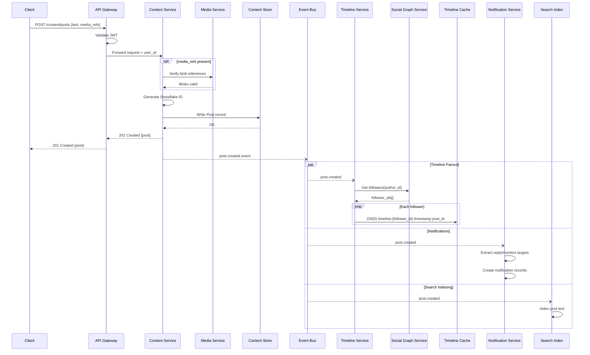
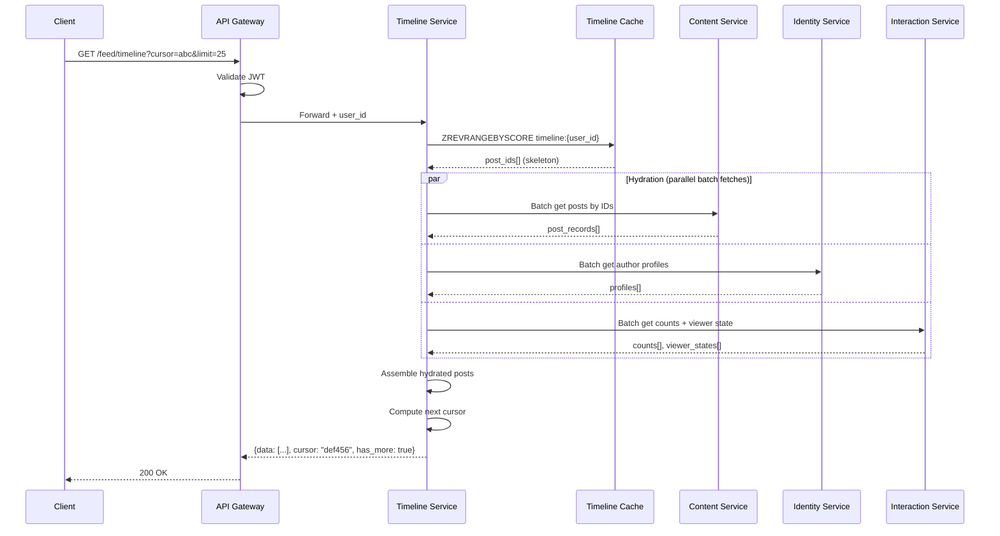
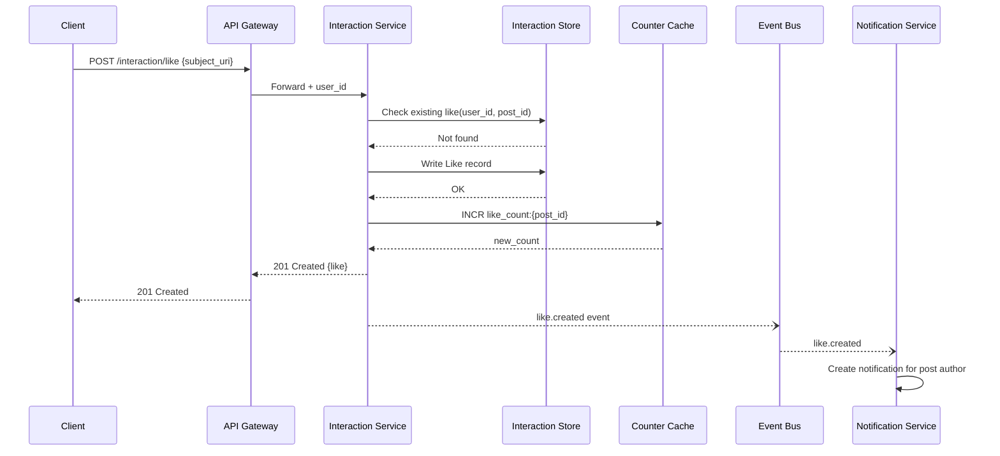
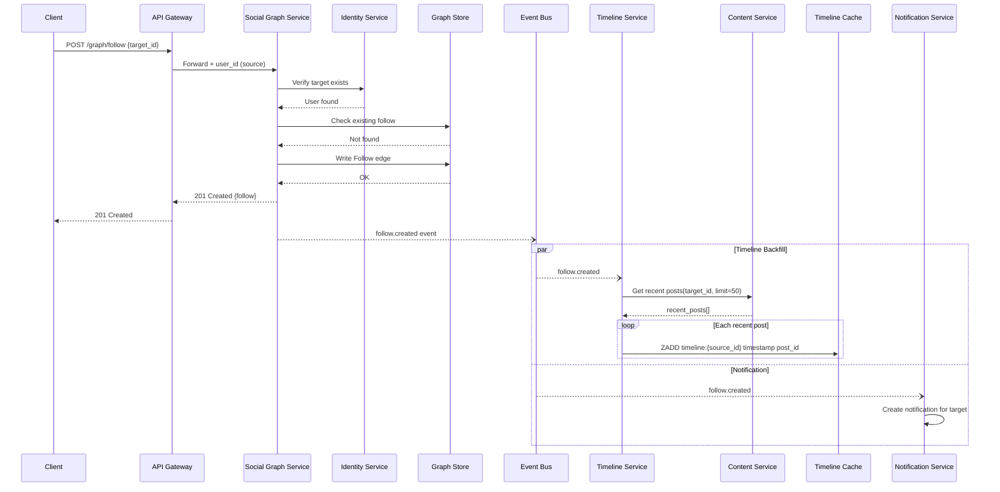
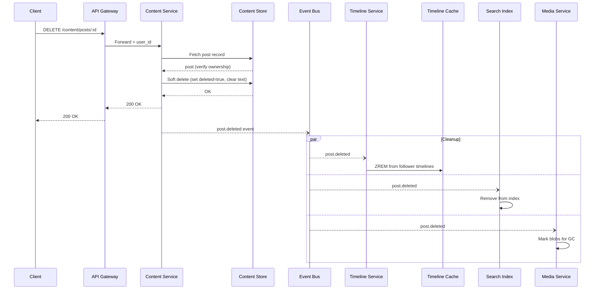
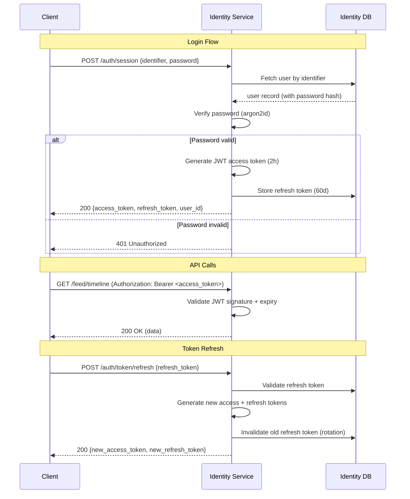

# Operation Flows

This is the core document of the architecture reference. It traces every major user operation step-by-step through all service layers, showing exactly what gets written to which store, what events are emitted, and what side effects occur.

Each flow references endpoints from the [API Catalog](./03-api-endpoint-catalog.md), entities from [Data Models](./02-data-models.md), and services from the [Architecture Overview](./01-architecture-overview.md).

---

## 1. Creating a Post

**Endpoint:** `POST /content/posts`

### Step-by-Step

| Step | Component | Action |
|------|-----------|--------|
| 1 | **Client** | Sends `POST /content/posts` with text, media_refs, reply_to, facets, embed |
| 2 | **API Gateway** | Validates JWT access token, extracts user_id from claims |
| 3 | **API Gateway** | Routes to Content Service |
| 4 | **Content Service** | Validates request body against Post schema (text length, facet ranges, media ref existence) |
| 5 | **Content Service** | If `media_refs` present, calls Media Service to verify blobs exist and belong to the user |
| 6 | **Content Service** | If `reply_to` set, fetches parent post to validate it exists and is not deleted |
| 7 | **Content Service** | Generates Snowflake ID for the new post |
| 8 | **Content Service** | Constructs Post record with envelope fields (id, type, author_id, created_at) |
| 9 | **Content Service** | Writes record to **Content Store** (primary write, synchronous) |
| 10 | **Content Service** | Returns `201 Created` with post record to client (response sent here — side effects are async) |
| 11 | **Content Service** | Emits `post.created` event to **Event Bus** with full post payload |
| 12 | **Timeline Service** | Consumes `post.created` event |
| 13 | **Timeline Service** | Queries Social Graph Service for author's follower list |
| 14 | **Timeline Service** | For each follower: inserts `(post_id, timestamp)` into follower's **Timeline Cache** (Redis sorted set) |
| 15 | **Timeline Service** | For high-follower accounts (>100K): skips fanout, post merged on read instead (celebrity problem mitigation) |
| 16 | **Notification Service** | Consumes `post.created` event |
| 17 | **Notification Service** | If reply: creates notification for parent post author (type: `reply`) |
| 18 | **Notification Service** | If mentions in facets: creates notification for each mentioned user (type: `mention`) |
| 19 | **Search Index** | Consumes `post.created` event, indexes post text for full-text search |

### Key Design Choices

- **Response before side effects**: The client gets `201` as soon as the primary write succeeds (step 10). Timeline fanout, notifications, and search indexing happen asynchronously. This means there's a brief delay before the post appears in followers' timelines.
- **Fanout-on-write** (from Twitter): Pre-computing timelines at write time makes reads fast (just fetch from Redis). The trade-off is high write amplification for popular accounts.
- **Celebrity problem** (from Twitter): Accounts with very large follower counts skip fanout. Their posts are merged into timelines at read time to avoid millions of Redis writes per post.

### Sequence Diagram



---

## 2. Reading the Home Timeline

**Endpoint:** `GET /feed/timeline?cursor=...&limit=25`

### Step-by-Step

| Step | Component | Action |
|------|-----------|--------|
| 1 | **Client** | Sends `GET /feed/timeline?cursor=abc&limit=25` |
| 2 | **API Gateway** | Validates JWT, extracts user_id |
| 3 | **API Gateway** | Routes to Timeline Service |
| 4 | **Timeline Service** | Reads from **Timeline Cache** (Redis): `ZREVRANGEBYSCORE timeline:{user_id} cursor_score -inf LIMIT 0 25` |
| 5 | **Timeline Service** | Gets list of post_ids (the "skeleton") |
| 6 | **Timeline Service** | If user follows any celebrity accounts: queries Content Store for their recent posts and merges into skeleton by timestamp |
| 7 | **Timeline Service** | **Hydration phase** begins — for each post_id in the skeleton: |
| 8 | **Content Service** | Batch-fetches post records from Content Store (multiget by IDs) |
| 9 | **Identity Service** | Batch-fetches author profiles for all unique author_ids in the posts |
| 10 | **Interaction Service** | Batch-fetches vote/like counts for each post |
| 11 | **Interaction Service** | Fetches viewer's interaction state: has the requesting user liked/reposted each post? |
| 12 | **Moderation Service** | Fetches labels for each post |
| 13 | **Timeline Service** | Assembles hydrated response: each post includes author profile, counts, viewer state, labels |
| 14 | **Timeline Service** | Computes next cursor from last item's score |
| 15 | **Timeline Service** | Returns paginated response to client |

### Key Design Choices

- **Skeleton + hydration** (from Twitter/Bluesky): The timeline cache stores only post IDs, not full posts. This keeps the cache small and fast. Full post data is fetched on demand during hydration.
- **Batch fetches**: Steps 8-12 are parallelized — Content, Identity, Interaction, and Moderation services are queried concurrently with batch/multiget operations.
- **Inactive user fallback**: If a user hasn't been active for >30 days, their timeline cache may have been evicted. In this case, the Timeline Service reconstructs it on-the-fly by querying the Social Graph for follows and fetching recent posts from each followed author.

### Sequence Diagram



---

## 3. Liking / Voting on a Post

**Endpoints:** `POST /interaction/like` or `POST /interaction/vote`

### Step-by-Step (Like)

| Step | Component | Action |
|------|-----------|--------|
| 1 | **Client** | Sends `POST /interaction/like` with `{ subject_uri }` |
| 2 | **API Gateway** | Validates JWT, extracts user_id |
| 3 | **Interaction Service** | Parses subject_uri to extract target post_id and author_id |
| 4 | **Interaction Service** | Checks for existing like by this user on this post (idempotency check) |
| 5 | **Interaction Service** | If already liked: returns existing record (no duplicate) |
| 6 | **Interaction Service** | Generates Snowflake ID for like record |
| 7 | **Interaction Service** | Writes Like record to **Interaction Store** (keyed on `user_id + post_id`) |
| 8 | **Interaction Service** | Increments like counter in **Counter Cache** (Redis `INCR`) |
| 9 | **Interaction Service** | Returns `201 Created` with like record |
| 10 | **Interaction Service** | Emits `like.created` event to Event Bus |
| 11 | **Notification Service** | Consumes event, creates notification for post author (type: `like`) |
| 12 | **Counter Sync Worker** | Periodically flushes counter cache to durable Interaction Store |

### Step-by-Step (Vote — Reddit-style)

| Step | Component | Action |
|------|-----------|--------|
| 1 | **Client** | Sends `POST /interaction/vote` with `{ subject_uri, direction: 1 }` |
| 2 | **API Gateway** | Validates JWT |
| 3 | **Interaction Service** | Checks for existing vote by this user on this post |
| 4 | **Interaction Service** | If existing vote in same direction: no-op, return existing |
| 5 | **Interaction Service** | If existing vote in opposite direction: update direction, adjust counters (decrement old, increment new — net delta of 2) |
| 6 | **Interaction Service** | If no existing vote: create new vote record, increment counter |
| 7 | **Interaction Service** | Updates counters in Counter Cache |
| 8 | **Interaction Service** | Returns vote record |
| 9 | **Interaction Service** | Emits `vote.cast` event |
| 10 | **Notification Service** | Optionally notifies post author (platforms differ — Reddit doesn't notify on every vote) |

### Key Design Choices

- **Idempotent writes**: Liking an already-liked post is a no-op, not an error. The natural key `(user_id, post_id)` prevents duplicates.
- **Counter cache** (from Twitter/Reddit): Real-time counts maintained in Redis for fast reads. Durably persisted asynchronously. Counters may be slightly stale but reads are fast.
- **Vote fuzzing** (from Reddit): Displayed vote counts can be fuzzed (noise added) to prevent bots from knowing if their votes counted.

### Sequence Diagram



---

## 4. Following a User

**Endpoint:** `POST /graph/follow`

### Step-by-Step

| Step | Component | Action |
|------|-----------|--------|
| 1 | **Client** | Sends `POST /graph/follow` with `{ target_id }` |
| 2 | **API Gateway** | Validates JWT, extracts user_id (source) |
| 3 | **Social Graph Service** | Validates target_id exists (queries Identity Service) |
| 4 | **Social Graph Service** | Checks if source is blocked by target (if blocked, returns error) |
| 5 | **Social Graph Service** | Checks for existing follow relationship (idempotency) |
| 6 | **Social Graph Service** | Writes Follow record to **Graph Store**: directed edge `source_id → target_id` |
| 7 | **Social Graph Service** | Increments follower/following counters in Counter Cache |
| 8 | **Social Graph Service** | Returns `201 Created` with follow record |
| 9 | **Social Graph Service** | Emits `follow.created` event to Event Bus |
| 10 | **Timeline Service** | Consumes `follow.created` event |
| 11 | **Timeline Service** | **Backfill**: Fetches the N most recent posts from the newly followed user |
| 12 | **Timeline Service** | Inserts these post_ids into the follower's Timeline Cache (so the followed user's content immediately appears) |
| 13 | **Notification Service** | Consumes event, creates notification for target user (type: `follow`) |

### Key Design Choices

- **Backfill on follow** (from Twitter): When you follow someone, their recent posts are retroactively inserted into your timeline cache. Without this, you'd see no content from them until they post something new.
- **Block check**: A user cannot follow someone who has blocked them. This is checked before creating the follow edge.
- **Directed graph**: Follows are one-directional (A follows B doesn't mean B follows A). This matches all three platforms (Twitter, Bluesky, Reddit subscriptions).

### Sequence Diagram



---

## 5. Creating a Comment / Reply

**Endpoint:** `POST /content/posts/:id/comments`

This flow is essentially the same as [Creating a Post](#1-creating-a-post) with these differences:

| Aspect | Post | Comment/Reply |
|--------|------|---------------|
| `reply_to` field | `null` | Set to parent post/comment ID |
| `root_post_id` field | `null` | Set to the thread root post ID |
| Thread counter | — | Parent post's `reply_count` incremented |
| Notifications | Only if mentions present | Notifies parent author + thread participants |
| Timeline fanout | Fans out to all followers | May or may not fan out (platform-specific) |

### Additional Steps (beyond Create Post flow)

| Step | Component | Action |
|------|-----------|--------|
| A | **Content Service** | Resolves `reply_to` to get the parent post. If the parent is itself a reply, walks up to find `root_post_id` |
| B | **Content Service** | Validates the thread depth limit (prevents infinitely deep nesting) |
| C | **Interaction Service** | Increments `reply_count` counter for the parent post |
| D | **Notification Service** | Notifies: (1) parent post author, (2) root post author (if different), (3) mentioned users |

### Thread Structure

Comments are stored flat in the database with `reply_to` references. The thread tree is assembled on read:

```
Root Post (reply_to: null, root_post_id: null)
├── Comment A (reply_to: Root, root_post_id: Root)
│   ├── Comment C (reply_to: A, root_post_id: Root)
│   └── Comment D (reply_to: A, root_post_id: Root)
└── Comment B (reply_to: Root, root_post_id: Root)
    └── Comment E (reply_to: B, root_post_id: Root)
```

To fetch a full thread: query all records where `root_post_id = <root>`, then reconstruct the tree in memory using `reply_to` pointers. (cf. Reddit's flat storage with tree reconstruction)

---

## 6. Deleting a Post

**Endpoint:** `DELETE /content/posts/:id`

### Step-by-Step

| Step | Component | Action |
|------|-----------|--------|
| 1 | **Client** | Sends `DELETE /content/posts/:id` |
| 2 | **API Gateway** | Validates JWT, extracts user_id |
| 3 | **Content Service** | Fetches post record, verifies `author_id == user_id` (ownership check) |
| 4 | **Content Service** | **Soft delete**: sets `deleted = true`, clears text/media fields, retains tombstone (id, author_id, created_at, deleted_at) |
| 5 | **Content Service** | Updates record in Content Store |
| 6 | **Content Service** | Returns `200 OK` |
| 7 | **Content Service** | Emits `post.deleted` event to Event Bus |
| 8 | **Timeline Service** | Consumes event, removes post_id from all timeline caches (`ZREM timeline:* post_id`) |
| 9 | **Search Index** | Consumes event, removes post from search index |
| 10 | **Interaction Service** | Consumes event, marks associated likes/votes as orphaned (or deletes them) |
| 11 | **Media Service** | If post had media: marks blobs for garbage collection (not immediately deleted — other posts may reference same blob via CID) |

### Key Design Choices

- **Soft delete, not hard delete** (all three platforms): The record is tombstoned — it retains its ID and basic metadata so that references to it from other records (replies, quotes) can show "this content was deleted" instead of 404.
- **Cascading cleanup**: Likes, votes, and search entries are cleaned up asynchronously. Replies to a deleted post are NOT deleted — they remain visible (Reddit and Bluesky behavior). The parent reference shows "[deleted]".
- **Media garbage collection**: Blobs are reference-counted. A blob is only purged when no records reference it.

### Sequence Diagram



---

## 7. User Registration

**Endpoint:** `POST /identity/account`

### Step-by-Step

| Step | Component | Action |
|------|-----------|--------|
| 1 | **Client** | Sends `POST /identity/account` with `{ handle, email, password, invite_code? }` |
| 2 | **API Gateway** | Routes to Identity Service (no auth required) |
| 3 | **Identity Service** | Validates invite code (if invites required) |
| 4 | **Identity Service** | Validates handle: format check, uniqueness check against Identity DB |
| 5 | **Identity Service** | Validates email format, checks not already registered |
| 6 | **Identity Service** | Hashes password (argon2id) |
| 7 | **Identity Service** | Generates Snowflake ID for user |
| 8 | **Identity Service** | In federated mode: generates DID (did:plc) and signing keypair |
| 9 | **Identity Service** | Creates User record in **Identity DB** |
| 10 | **Identity Service** | Creates initial empty Profile record |
| 11 | **Identity Service** | Generates JWT access token + refresh token (auto-login) |
| 12 | **Identity Service** | Returns `201 Created` with user_id, handle, tokens |
| 13 | **Identity Service** | Emits `user.created` event to Event Bus |
| 14 | **Timeline Service** | Consumes event, initializes empty Timeline Cache entry for user |
| 15 | **Social Graph Service** | Consumes event, initializes empty graph node for user |

### Key Design Choices

- **Auto-login**: Registration immediately returns session tokens, avoiding a separate login step.
- **Handle validation**: Handles must match `[a-zA-Z0-9._-]+` pattern, be unique, and not be on a reserved list. In Bluesky, handles are domain-based (alice.bsky.social or alice.custom-domain.com).
- **Invite codes** (from Bluesky): Optional gating mechanism for controlled growth.

---

## 8. User Login / Session Management

**Endpoint:** `POST /auth/session`

### Step-by-Step

| Step | Component | Action |
|------|-----------|--------|
| 1 | **Client** | Sends `POST /auth/session` with `{ identifier, password }` |
| 2 | **Identity Service** | Resolves identifier: if handle → look up user by handle; if email → look up by email |
| 3 | **Identity Service** | Fetches stored password hash from Identity DB |
| 4 | **Identity Service** | Verifies password against hash (argon2id verify) |
| 5 | **Identity Service** | If invalid: returns `401 Unauthorized` (with rate limiting on failures) |
| 6 | **Identity Service** | Generates JWT access token (2h expiry, claims: sub, iss, aud, exp, iat, scope) |
| 7 | **Identity Service** | Generates opaque refresh token (60d expiry), stores in session table |
| 8 | **Identity Service** | Returns `200 OK` with tokens, user_id, handle |

### Token Refresh Flow

| Step | Component | Action |
|------|-----------|--------|
| 1 | **Client** | Access token expired. Sends `POST /auth/token/refresh` with `{ refresh_token }` |
| 2 | **Identity Service** | Looks up refresh token in session table |
| 3 | **Identity Service** | Validates: not expired, not revoked |
| 4 | **Identity Service** | Generates new access token + new refresh token |
| 5 | **Identity Service** | **Rotation**: invalidates old refresh token (single-use) |
| 6 | **Identity Service** | Returns new token pair |

### Sequence Diagram



---

## 9. Reporting Content

**Endpoint:** `POST /moderation/report`

### Step-by-Step

| Step | Component | Action |
|------|-----------|--------|
| 1 | **Client** | Sends `POST /moderation/report` with `{ subject_uri, reason, description }` |
| 2 | **API Gateway** | Validates JWT (reporter must be authenticated) |
| 3 | **Moderation Service** | Validates subject_uri points to a real post/user |
| 4 | **Moderation Service** | Validates reason code is valid |
| 5 | **Moderation Service** | Creates Report record in **Moderation DB** with status `pending` |
| 6 | **Moderation Service** | Returns `201 Created` with report ID and status |
| 7 | **Moderation Service** | Emits `report.created` event to Event Bus |
| 8 | **Moderation Service** | Report enters the moderation queue, prioritized by severity and report volume |

### Moderator Review Flow (subsequent)

| Step | Component | Action |
|------|-----------|--------|
| 9 | **Moderator** | Fetches queue via `GET /moderation/queue` |
| 10 | **Moderator** | Reviews report, inspects subject content |
| 11 | **Moderator** | Takes action via `POST /moderation/action`: label, hide, delete, warn, suspend |
| 12 | **Moderation Service** | Executes action: applies label, or soft-deletes content, or suspends account |
| 13 | **Moderation Service** | If content deleted: emits `post.deleted` event (triggers cleanup from [Delete Post flow](#6-deleting-a-post)) |
| 14 | **Moderation Service** | If label applied: emits `label.applied` event |
| 15 | **Moderation Service** | Updates report status to `resolved` with action taken |
| 16 | **Notification Service** | Optionally notifies the reporter that their report was resolved |

---

## Flow Summary Matrix

This table shows which services and stores are involved in each operation:

| Operation | Content Svc | Identity Svc | Graph Svc | Timeline Svc | Interaction Svc | Notification Svc | Moderation Svc | Media Svc |
|-----------|:-----------:|:------------:|:---------:|:------------:|:---------------:|:-----------------:|:--------------:|:---------:|
| Create Post | Write | — | Read | Write (async) | — | Write (async) | — | Read |
| Read Timeline | Read | Read | — | Read | Read | — | Read | — |
| Like/Vote | — | — | — | — | Write | Write (async) | — | — |
| Follow | — | Read | Write | Write (async) | — | Write (async) | — | — |
| Comment | Write | — | — | Write (async) | Write (async) | Write (async) | — | — |
| Delete Post | Write | — | — | Write (async) | Write (async) | — | — | Write (async) |
| Register | — | Write | Init (async) | Init (async) | — | — | — | — |
| Login | — | Read/Write | — | — | — | — | — | — |
| Report | — | — | — | — | — | Write (async) | Write | — |

**Legend**: Write = synchronous write in the critical path. Read = synchronous read. Write (async) = asynchronous via Event Bus. Init (async) = initialization side effect.
