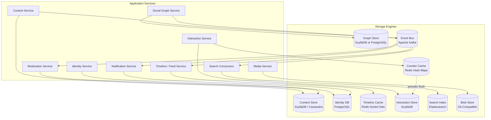
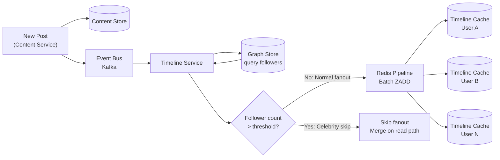
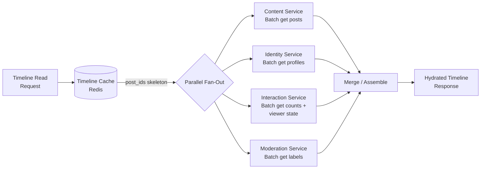

# Database Patterns

This document defines the storage engine choices, partitioning strategies, read/write patterns, caching layers, data lifecycle policies, and replication model for the platform. Every storage decision is traced to a specific access pattern requirement and attributed to production precedent from Bluesky, Twitter/X, or Reddit.

This is the companion document to [Data Models](./02-data-models.md) (which defines *what* is stored) and [Operation Flows](./04-operation-flows.md) (which defines *how* data flows through the system). This document focuses on *where* and *how* data is physically stored, partitioned, cached, and replicated.

---

## Table of Contents

1. [Storage Engine Selection](#1-storage-engine-selection)
2. [Partitioning Strategies](#2-partitioning-strategies)
3. [Write Patterns](#3-write-patterns)
4. [Read Patterns](#4-read-patterns)
5. [Caching Strategy](#5-caching-strategy)
6. [Data Lifecycle](#6-data-lifecycle)
7. [Schema Examples](#7-schema-examples)
8. [Replication and Consistency](#8-replication-and-consistency)

---

## 1. Storage Engine Selection

Each data store is selected to match the dominant access pattern of the data it holds. The wrong engine choice means fighting the storage layer on every query. The right choice means the most common operation is the cheapest one.

### Storage Engine Map

| Purpose | Storage Engine | Provenance |
|---------|---------------|------------|
| Content Store (posts, comments) | Wide-column store (ScyllaDB/Cassandra) | Bluesky AppView (ScyllaDB), Reddit (Cassandra) |
| Identity DB (accounts, credentials) | Relational (PostgreSQL) | Reddit (PostgreSQL), strong consistency needed |
| Timeline Cache | Redis sorted sets | Twitter (Redis timeline cache) |
| Social Graph | Adjacency list in wide-column or graph DB | Twitter (FlockDB), Bluesky (graph records in PDS) |
| Interaction Store (likes, votes) | Wide-column with counter support | Twitter (Manhattan), Reddit (PostgreSQL) |
| Search Index | Elasticsearch | All three use search infrastructure |
| Blob/Media Store | Object storage (S3-compatible) + CDN | All three |
| Event Bus | Apache Kafka | Twitter (Kafka), Reddit (Kafka via Debezium) |
| User Repository (federated mode) | SQLite per-user | Bluesky PDS |

### Why Each Engine Was Chosen

**Content Store -- Wide-Column (ScyllaDB/Cassandra)**

The Content Store handles posts and comments. The dominant access patterns are:

- Point reads by post ID (timeline hydration -- the most frequent operation)
- Range scans by author + time (author feeds)
- Range scans by community + time (community feeds)
- Bulk writes at high throughput (post creation, timeline fanout metadata)

Wide-column stores are optimized for exactly these patterns. Data is stored in sorted order within partitions, making range scans sequential reads rather than random I/O. Point reads by primary key are O(1) lookups. Write throughput scales linearly with cluster size because each node handles its own partition range independently.

Relational databases can serve these patterns, but they require careful index management and struggle with the write throughput required during peak posting activity. Wide-column stores accept writes at memory speed (to the commit log) and compact in the background.

cf. Bluesky's AppView uses ScyllaDB for indexing post data from the firehose. Reddit migrated from PostgreSQL to Cassandra for their highest-volume data stores to handle scale.

**Identity DB -- Relational (PostgreSQL)**

The Identity DB stores user accounts, credentials, handles, and session data. The dominant access patterns are:

- Exact lookups by handle, email, or user ID (login, handle resolution)
- Uniqueness enforcement (no two users can have the same handle or email)
- Transactional updates (handle changes must atomically release the old handle and claim the new one)
- Low write volume, high read volume (accounts are created once, read constantly)

PostgreSQL is the correct choice because identity data requires strong consistency guarantees that wide-column stores do not provide natively. A handle uniqueness violation is an unrecoverable data corruption -- if two users share a handle, mentions and lookups become ambiguous. PostgreSQL's UNIQUE constraints, serializable transactions, and ACID guarantees make this impossible.

The write volume for identity operations (account creation, handle changes, password resets) is orders of magnitude lower than content writes. PostgreSQL handles this volume easily on a single primary with read replicas.

cf. Reddit uses PostgreSQL for user accounts. Twitter's User Service backed by MySQL (relational) for similar consistency requirements.

**Timeline Cache -- Redis Sorted Sets**

The Timeline Cache stores pre-computed timeline data: ordered lists of post IDs per user. The dominant access patterns are:

- Append a post ID to N users' timelines (fanout-on-write)
- Retrieve the top K post IDs for a user, ordered by timestamp (timeline read)
- Remove a post ID from all timelines (post deletion)
- TTL-based eviction for inactive users

Redis sorted sets are purpose-built for this workload. `ZADD` appends a member with a score (the timestamp) in O(log N). `ZREVRANGEBYSCORE` retrieves the top K items in O(log N + K). The entire timeline for an active user fits in a few kilobytes (just post IDs, not full posts), so millions of user timelines fit in memory.

No durable database is needed for timeline data because timelines are derived data -- they can be reconstructed from the social graph and Content Store at any time. Redis is used as a materialized view cache, not as a source of truth.

cf. Twitter's timeline infrastructure uses Redis clusters to store per-user tweet ID lists. Each tweet fanout writes to follower timelines in Redis.

**Social Graph -- Adjacency List in Wide-Column or Graph DB**

The Social Graph stores follow, block, and mute relationships between users. The dominant access patterns are:

- Get all accounts user X follows (following list, used for timeline fanout)
- Get all followers of user X (follower list, used for fanout targeting)
- Check if user A follows/blocks user B (relationship check, used for access control)
- Add/remove a directed edge (follow/unfollow)

These are classic adjacency-list operations. A wide-column store partitioned by source user gives O(1) lookups for "who does X follow?" and efficient range scans for the full following list. The reverse index (partitioned by target user) provides "who follows X?" queries.

A dedicated graph database (like FlockDB) offers optimized traversal, but the platform's graph queries are almost entirely single-hop (direct neighbors), not multi-hop traversals. Wide-column stores handle single-hop adjacency queries efficiently and avoid introducing another specialized database technology.

cf. Twitter built FlockDB specifically for social graph operations -- it stores edges in MySQL with a graph query layer on top. Bluesky stores follow records in each user's PDS repository; the AppView indexes them into adjacency lists for query.

**Interaction Store -- Wide-Column with Counter Support**

The Interaction Store holds likes, votes, and reposts. The dominant access patterns are:

- Check if user X has liked/voted on post Y (idempotency check, occurs on every interaction)
- Increment/decrement a counter for a post (like count, vote score)
- Get all likes/votes for a post (moderation, analytics)
- Get all interactions by a user (user profile, "liked posts" feed)

The idempotency check requires a fast lookup by the composite key `(user_id, post_id, type)`. Wide-column stores make this a single-partition point read. Counter operations (increment/decrement) are supported natively by Cassandra's counter columns or handled through the Counter Cache (Redis) with periodic flush.

cf. Twitter's Manhattan key-value store handles interaction data at scale. Reddit originally stored votes in PostgreSQL but faces ongoing scaling challenges with vote-heavy workloads.

**Search Index -- Elasticsearch**

The Search Index provides full-text search over post content and user profiles. The dominant access patterns are:

- Full-text search with relevance ranking
- Filtered queries (by author, community, date range, language)
- Near-real-time indexing of new content (seconds, not minutes)

Elasticsearch is an inverted index optimized for exactly these queries. No relational or wide-column store can match its full-text search performance without bolting on external indexing. Elasticsearch also provides built-in relevance scoring, faceted search, and aggregation.

The Search Index is a secondary index -- it is populated asynchronously from `post.created` and `post.deleted` events on the Event Bus. It is never the source of truth. If the index is lost, it can be rebuilt from the Content Store.

cf. All three platforms use dedicated search infrastructure. Twitter uses a custom search index (Earlybird). Reddit uses Elasticsearch (via Cloudsearch, later OpenSearch). Bluesky's AppView uses search indexing for post and actor search.

**Blob/Media Store -- Object Storage (S3-Compatible) + CDN**

Media files (images, videos, audio) are stored in object storage and served through a content delivery network. The dominant access patterns are:

- Write-once, read-many (media is immutable after upload)
- High bandwidth reads, globally distributed (users everywhere load images and video)
- Content-addressable keys (hash-based deduplication)

Object storage (S3, MinIO, or equivalent) is the only cost-effective option for terabytes to petabytes of binary data. It provides 11 nines of durability, unlimited capacity, and pay-per-use pricing. The CDN layer (CloudFront, Fastly, or equivalent) caches media at edge locations worldwide, reducing latency and origin load.

Media metadata (dimensions, MIME type, alt text) is stored in the Content Store or Identity DB as part of the referencing record. The Blob Store holds only the binary content, keyed by content hash (CID or SHA-256).

cf. Bluesky stores blobs in user PDS instances and serves via CDN. Twitter and Reddit both use S3-compatible storage with CDN delivery for media.

**Event Bus -- Apache Kafka**

The Event Bus connects all services asynchronously. The dominant access patterns are:

- High-throughput, ordered event streams (millions of events per second at peak)
- Consumer groups with independent offset tracking (each service reads at its own pace)
- Event replay (new consumers can catch up by reading from an earlier offset)
- Topic-per-event-type partitioning

Kafka is the industry standard for this workload. Its log-based architecture provides ordered, durable event streams with configurable retention. Consumer groups enable each downstream service (Timeline, Notification, Search, Moderation) to process events independently without coordination. Event replay is critical for rebuilding derived data stores (e.g., re-indexing search after a schema change).

cf. Twitter uses Kafka extensively for internal event routing. Reddit uses Debezium CDC (change data capture) feeding into Kafka to propagate database changes to downstream consumers.

**User Repository (Federated Mode) -- SQLite Per-User**

In federated mode, each user's data repository is stored as a signed Merkle tree in a SQLite database on their PDS (Personal Data Server). The dominant access patterns are:

- All operations are scoped to a single user (the repository owner)
- Sequential writes (one user writes at a time to their own repo)
- Full export (CAR file for migration or backup)
- Merkle proof generation (cryptographic verification of record integrity)

SQLite is ideal for per-user repositories because it is a single-file embedded database with zero administration overhead. Each PDS can host thousands of user repositories as individual SQLite files. The single-writer model of SQLite matches the single-owner model of user repositories perfectly. Full export is a file copy.

cf. Bluesky PDS uses SQLite to store each user's data repository. This is specific to the federated deployment mode; centralized mode uses the shared storage engines described above.

---

## 2. Partitioning Strategies

Partitioning determines how data is distributed across nodes. The partition key controls which node handles a given read or write. A well-chosen partition key collocates data that is accessed together and distributes load evenly across the cluster.

### Content Store Partitioning

**Partition key:** `post_id` (Snowflake ID)

Snowflake IDs embed a millisecond-precision timestamp in the high bits, which means they are roughly time-ordered. This provides two properties:

1. **Even distribution.** Because IDs are generated across multiple workers with sequence counters, the lower bits provide enough entropy to distribute evenly across partitions, even within the same millisecond.
2. **Time-range scans.** Because the high bits encode time, a range scan on post_id is implicitly a time-range scan. Querying "all posts created between T1 and T2" translates to a range of Snowflake IDs, which maps to a contiguous range of partitions.

**Secondary indexes** provide access by author and community:

- `(author_id, created_at DESC)` -- for author feeds. All posts by one author are colocated by this index, enabling efficient pagination.
- `(community_id, created_at DESC)` -- for community feeds. All posts in one community are colocated.
- `(root_post_id, created_at ASC)` -- for thread assembly. All replies to a root post are colocated and sorted chronologically.

### Timeline Cache Partitioning

**Partition key:** `user_id`

Each user's timeline is an independent data structure (a Redis sorted set). There is no cross-user query that spans multiple timelines. Partitioning by user_id means:

- A timeline read touches exactly one partition (one Redis key)
- Timeline fanout writes are independent across users (highly parallelizable)
- Cache eviction is per-user (inactive user timelines expire independently)

Redis Cluster handles this automatically -- each key (timeline:{user_id}) hashes to a specific slot, which maps to a specific node.

### Social Graph Partitioning

**Partition key:** `source_id` (the follower)

The most frequent graph query is "who does user X follow?" -- this drives timeline fanout. Partitioning by source_id colocates all of a user's outgoing edges (follows, blocks, mutes) on one partition, making this query a single-partition scan.

The reverse query ("who follows user X?") requires a secondary index partitioned by `target_id`. This index is maintained in parallel and supports follower list queries and follower count computation.

### Interaction Store Partitioning

**Partition key:** `post_id`

All interactions (likes, votes, reposts) for a single post are colocated on the same partition. This makes two critical operations efficient:

- **Aggregation:** Computing the total like count or vote score for a post reads from one partition.
- **Idempotency check:** Checking whether user X has already liked post Y requires looking up `(user_id, post_id)` within a single partition.

A secondary index on `(author_id, created_at DESC)` supports the "liked posts" feed (all posts a user has liked, sorted by when they liked them).

### Hot Partition Mitigation: The Celebrity Problem

When one user has millions of followers, a new post from that user triggers millions of timeline cache writes. This creates two problems:

1. **Write amplification:** A single post creates N write operations (one per follower). For an account with 10 million followers, this is 10 million Redis writes.
2. **Hot partition in the graph:** Querying the follower list for a celebrity account returns millions of rows, dominating the partition.

**Mitigation strategy (from Twitter):**

- **Threshold-based fanout skip.** Accounts with follower counts above a configurable threshold (e.g., 100,000) are classified as "celebrity" accounts. Posts from these accounts are NOT fanned out to individual timeline caches.
- **Merge on read.** When a user's timeline is read, the Timeline Service checks whether the user follows any celebrity accounts. If so, it queries the Content Store for those celebrities' recent posts and merges them into the timeline by timestamp, interleaving them with the pre-computed timeline entries.
- **Separate hot partition pool.** Celebrity account data (follower lists, recent posts) is stored in a dedicated Redis cluster with higher throughput allocation. This prevents celebrity-related load from degrading performance for normal accounts.

```
Normal account (10K followers):
    New post → Fanout to 10K timeline caches (fast, acceptable)

Celebrity account (5M followers):
    New post → Write to Content Store only (no fanout)
    Followers read timeline → Merge celebrity posts on read path
```

The trade-off is that celebrity posts appear in follower timelines with slightly higher read latency (one additional Content Store query) instead of near-zero latency from a pre-computed cache hit. In practice, this latency penalty is negligible because the Content Cache holds celebrity posts with high hit rates (heavily accessed content stays hot).

cf. Twitter introduced this optimization to handle accounts with tens of millions of followers. Lady Gaga following Justin Bieber was the canonical example cited in Twitter engineering talks.

---

## 3. Write Patterns

### Write-Ahead Logging (WAL)

All durable stores (PostgreSQL, ScyllaDB/Cassandra, Kafka) use write-ahead logging for crash recovery. A write is first appended to a sequential log on disk, then acknowledged to the client, then applied to the in-memory data structures. If the process crashes between the log write and the data structure update, the WAL is replayed on restart to recover the committed state.

This is not a design choice -- it is a property of the storage engines selected. It is noted here because it underlies the durability guarantee: once a write is acknowledged, it will survive a crash.

### Idempotent Writes

Every write operation is designed to produce the same result when executed multiple times with the same input. This is critical because network failures, client retries, and Kafka's at-least-once delivery all cause duplicate write attempts.

**Implementation strategy: natural keys.**

Each interaction type has a natural uniqueness constraint:

| Record Type | Natural Key | Effect of Duplicate Write |
|-------------|-------------|---------------------------|
| Like | `(author_id, post_id, type='like')` | Returns existing record (no-op) |
| Vote | `(author_id, post_id, type='vote')` | Updates direction if changed, no-op if same |
| Follow | `(source_id, target_id, type='follow')` | Returns existing record (no-op) |
| Repost | `(author_id, post_id, type='repost')` | Returns existing record (no-op) |
| Post | `(id)` -- Snowflake ID | Client-supplied request ID prevents duplicate creation |

Where possible, writes use PUT semantics (upsert). An upsert attempts to insert a record; if the natural key already exists, it updates the existing record or returns it unchanged. This eliminates the need for separate "check if exists, then insert" round-trips and avoids race conditions.

For post creation, the client includes a request-level idempotency key (a UUID generated client-side). The Content Service checks for an existing post with this idempotency key before creating a new record. If found, it returns the existing post.

### Eventual Consistency for Counters

Engagement counters (like count, vote score, reply count, repost count) are maintained in Redis for fast reads and flushed to the durable Interaction Store periodically. This means counters may be slightly stale -- a post might show 41 likes when the true count is 42.

**Why this is acceptable:**

- Users do not notice single-digit counter discrepancies.
- Displaying a counter that is 5 seconds behind the true value has no functional impact.
- The alternative (synchronous counter update in the durable store on every like) would make like operations slower and create write contention on popular posts.

**Flush cadence:** Every 5 minutes, a background worker reads dirty counter values from Redis and writes them to the Interaction Store. If Redis fails, counters can be recalculated from the Interaction Store (count of interaction records per post).

### Strong Consistency for Content Creation

Post writes are synchronous to the Content Store primary before the client receives a `201 Created` response. The Content Service does not acknowledge success until the primary database has committed the write.

This guarantee ensures that a user never receives a "post created" confirmation for a post that was lost. The trade-off is slightly higher write latency (one synchronous disk write per post), but this is acceptable because post creation is far less frequent than post reading.

### Strong Consistency for Identity

Account creation, handle changes, and credential updates use PostgreSQL transactions with uniqueness constraints. These operations are serialized through the primary database instance to prevent:

- Two users registering the same handle simultaneously
- A handle change colliding with a new registration for the same handle
- Duplicate email addresses

The Identity DB is the only store in the system that uses serializable isolation for any operation. The write volume is low enough (account operations are infrequent relative to content operations) that this serialization does not create a bottleneck.

### Batched Writes

Timeline fanout -- the process of writing a post ID to N followers' timeline caches -- is the system's highest-volume write operation. Individual Redis writes would create N network round-trips. Instead, the Timeline Service batches writes using Redis pipelines:

```
PIPELINE {
    ZADD timeline:user_1 timestamp post_id
    ZADD timeline:user_2 timestamp post_id
    ZADD timeline:user_3 timestamp post_id
    ...
    ZADD timeline:user_1000 timestamp post_id
}
EXEC
```

A pipeline groups up to 1000 `ZADD` commands into a single network round-trip. For an account with 50,000 followers, this reduces the fanout from 50,000 round-trips to 50 pipeline batches. The pipeline is also partitioned by Redis node -- all keys on the same node are batched together.

---

## 4. Read Patterns

### Read-Through Cache

The Content Store uses a read-through cache pattern for individual post lookups:

1. Client requests post by ID
2. Content Service checks the Content Cache (an LRU cache in front of the Content Store)
3. **Cache hit:** Return cached post immediately
4. **Cache miss:** Fetch from primary Content Store, populate cache, return post

This pattern keeps hot content (recently created or heavily viewed posts) in memory without explicit cache warming. Cold content (old posts that nobody is viewing) naturally evicts from the cache, saving memory for actively accessed data.

The Content Cache is a separate caching layer from the Timeline Cache. The Timeline Cache stores *which* post IDs belong in a user's timeline. The Content Cache stores *the content of individual posts*. A timeline read first hits the Timeline Cache for IDs, then hits the Content Cache for post data.

### Hydration Pattern

Hydration is the process of converting a list of post IDs (the "skeleton") into fully rendered post objects with all associated data. This is the primary read pattern for timeline assembly.

**Origin:** The term "hydration" comes from Twitter's timeline architecture, where the skeleton (bare post IDs from Redis) is "hydrated" by filling in content, author info, engagement counts, and moderation labels from multiple backend services.

**The hydration pipeline:**

1. **Skeleton retrieval.** The Timeline Service reads post IDs from the Timeline Cache (Redis sorted set). This returns an ordered list of 25-50 post IDs -- nothing more.

2. **Parallel fan-out.** The Timeline Service dispatches batch requests to multiple services concurrently:
   - Content Service: fetch post records (text, media refs, embed data) for all post IDs
   - Identity Service: fetch author profiles (handle, display name, avatar) for all unique author IDs in the posts
   - Interaction Service: fetch engagement counts (likes, votes, replies, reposts) and the requesting user's interaction state (has this user liked each post?)
   - Moderation Service: fetch labels for each post

3. **Merge.** The Timeline Service assembles the responses into hydrated post objects, combining content + author + counts + labels into the response format defined in the [API Catalog](./03-api-endpoint-catalog.md).

All four fan-out requests are independent -- they can execute in parallel, bounded by the slowest responder. This is why the architecture uses a microservice split per data domain rather than a monolithic database: each service can scale its read capacity independently.

### Denormalization

Certain frequently accessed values are stored redundantly to avoid joins or cross-service calls:

| Denormalized Value | Stored On | Maintained By | Consistency |
|-------------------|-----------|---------------|-------------|
| `followers_count` | User record | Graph Service (counter increment on follow/unfollow) | Eventual (seconds) |
| `following_count` | User record | Graph Service | Eventual (seconds) |
| `posts_count` | User record | Content Service (counter increment on post create/delete) | Eventual (seconds) |
| `like_count` | Post record | Counter Cache flush | Eventual (minutes) |
| `vote_score` | Post record | Counter Cache flush | Eventual (minutes) |
| `reply_count` | Post record | Counter Cache flush | Eventual (minutes) |
| `repost_count` | Post record | Counter Cache flush | Eventual (minutes) |
| Author profile in timeline response | Timeline API response | Hydration at read time | Fresh on every read |

Denormalized counters on user and post records avoid expensive COUNT queries. The counters are maintained incrementally -- each follow event increments the counter rather than recounting all follows.

Author profile data is denormalized at read time during hydration, NOT stored denormalized in the post record. This means profile changes (display name, avatar) are reflected immediately in timeline reads without backfilling millions of post records.

### Multiget

All stores support batch lookups by a list of IDs. The hydration pipeline never fetches posts one-at-a-time -- it sends a single request with 25-50 post IDs and receives all results in one response.

**Implementation varies by store:**

| Store | Multiget Implementation |
|-------|------------------------|
| Content Store (ScyllaDB) | `SELECT * FROM posts WHERE id IN (?, ?, ?, ...)` |
| Identity DB (PostgreSQL) | `SELECT * FROM users WHERE user_id = ANY($1::bigint[])` |
| Counter Cache (Redis) | Pipeline of `HGETALL counters:{post_id}` commands |
| Search Index (Elasticsearch) | `GET /_mget` multi-get API |

Multiget reduces network round-trips from O(N) to O(1), where N is the number of items. For a 25-item timeline page, this means 4 network calls (one per service) instead of 100+ individual lookups.

---

## 5. Caching Strategy

### Cache Topology

```mermaid
graph TD
    subgraph Application Services
        TS[Timeline Service]
        CS[Content Service]
        IS[Identity Service]
        INS[Interaction Service]
    end

    subgraph Cache Layer -- Redis Cluster
        TC["Timeline Cache<br/>Sorted sets: timeline:{user_id}<br/>Score = timestamp, Value = post_id"]
        CC["Counter Cache<br/>Hash maps: counters:{post_id}<br/>Fields: like_count, vote_score, reply_count, repost_count"]
    end

    subgraph Cache Layer -- Application LRU
        ContentLRU["Content Cache (LRU)<br/>Key = post_id, Value = post record<br/>Hot posts cached in-process"]
        ProfileLRU["Profile Cache (LRU)<br/>Key = user_id, Value = profile<br/>1-hour TTL"]
    end

    subgraph Durable Storage
        CDB[(Content Store<br/>ScyllaDB)]
        IDB[(Identity DB<br/>PostgreSQL)]
        INTDB[(Interaction Store)]
    end

    TS --> TC
    CS --> ContentLRU --> CDB
    IS --> ProfileLRU --> IDB
    INS --> CC

    CC -.->|flush every 5min| INTDB
```

### Timeline Cache (Redis)

**Data structure:** Sorted sets keyed by `timeline:{user_id}`.

- **Score:** Unix timestamp (milliseconds) of the post's creation time
- **Value:** Post ID (Snowflake ID as string)

**Operations:**

| Operation | Command | When |
|-----------|---------|------|
| Add post to timeline | `ZADD timeline:{user_id} {timestamp} {post_id}` | Fanout-on-write |
| Read timeline page | `ZREVRANGEBYSCORE timeline:{user_id} {cursor} -inf LIMIT 0 25` | Timeline read |
| Remove post | `ZREM timeline:{user_id} {post_id}` | Post deletion |
| Trim to max length | `ZREMRANGEBYRANK timeline:{user_id} 0 -{max_size}` | After ZADD (keep latest 800) |

**Capacity sizing:**

- Each timeline entry is approximately 20 bytes (8-byte score + 8-byte post ID + overhead)
- 800 entries per timeline (max retained) = ~16 KB per user
- 10 million active users = ~160 GB of timeline data
- Fits comfortably in a Redis cluster with replication

**TTL:** Timeline keys expire after 30 days of inactivity (no reads or writes). When an inactive user returns, their timeline is reconstructed on-the-fly by querying the Social Graph for follows and fetching recent posts from each followed account.

### Content Cache (Application LRU)

An in-process LRU (Least Recently Used) cache in the Content Service that holds recently accessed post records.

| Property | Value |
|----------|-------|
| Cache type | In-process LRU (per Content Service instance) |
| Key | Post ID |
| Value | Full post record (serialized) |
| TTL | 5 minutes for hot posts |
| Max size | 100,000 entries per instance (~200 MB) |
| Eviction | LRU (least recently used evicted first) |

Hot posts (trending content, celebrity posts, viral threads) achieve near-100% cache hit rates because many users read the same post within a short window. Cold posts (old, rarely accessed content) are fetched from the Content Store on demand and may or may not be retained in the cache depending on access frequency.

**Cache invalidation:** When a post is deleted or edited, the Content Service invalidates the cache entry immediately (local invalidation). Cross-instance invalidation is handled via a `post.updated` or `post.deleted` event on the Event Bus that all Content Service instances consume.

### Counter Cache (Redis)

**Data structure:** Hash maps keyed by `counters:{post_id}`.

| Field | Type | Description |
|-------|------|-------------|
| `like_count` | integer | Total likes |
| `vote_score` | integer | Upvotes minus downvotes |
| `reply_count` | integer | Direct replies |
| `repost_count` | integer | Reposts/retweets |

**Operations:**

| Operation | Command | When |
|-----------|---------|------|
| Read counters | `HGETALL counters:{post_id}` | Timeline hydration, post detail view |
| Increment like | `HINCRBY counters:{post_id} like_count 1` | Like created |
| Decrement like | `HINCRBY counters:{post_id} like_count -1` | Like removed |
| Adjust vote | `HINCRBY counters:{post_id} vote_score {delta}` | Vote cast or changed |
| Increment reply | `HINCRBY counters:{post_id} reply_count 1` | Reply created |

**Flush to durable store:** A background worker runs every 5 minutes:

1. Scans Redis for dirty counter keys (keys modified since last flush)
2. Reads current values from Redis
3. Writes them to the Interaction Store (durable)
4. Marks keys as clean

If Redis fails between flushes, at most 5 minutes of counter updates are lost. Counters can be recalculated by counting interaction records in the Interaction Store (expensive but accurate).

### Profile Cache

User profiles are cached with a 1-hour TTL to reduce load on the Identity DB.

| Property | Value |
|----------|-------|
| Cache type | In-process LRU or shared Redis |
| Key | User ID |
| Value | Profile fields (handle, display name, avatar ref, bio, follower/following counts) |
| TTL | 1 hour |
| Invalidation | Immediate on `profile.updated` event |

Profile data changes infrequently (users rarely update their display name or avatar), so a 1-hour TTL provides excellent hit rates. When a profile is updated, the Identity Service emits a `profile.updated` event that all caching layers consume to invalidate stale entries.

### Cache Invalidation Strategy

Cache invalidation follows an event-driven model:

| Event | Cache Action |
|-------|-------------|
| `post.created` | Add to Timeline Cache (fanout), no Content Cache action (not cached yet) |
| `post.deleted` | Remove from Timeline Cache (`ZREM`), invalidate Content Cache entry |
| `post.updated` | Invalidate Content Cache entry |
| `profile.updated` | Invalidate Profile Cache entry |
| `like.created` / `like.deleted` | Increment/decrement Counter Cache |
| `vote.cast` | Adjust Counter Cache vote_score |
| `handle.changed` | Invalidate handle resolution cache |

Counter Cache updates are write-through: the counter is updated in Redis at the same time the interaction is written to the durable store. There is no cache miss scenario for counters -- if a counter key does not exist in Redis, it is initialized from the Interaction Store and cached.

cf. Reddit uses 54 Memcache instances (3.3 TB total) with separate cache pools organized by workload type (page caching, object caching, session caching). Twitter runs Redis clusters with 3-way replication per datacenter for timeline caches.

---

## 6. Data Lifecycle

### Soft Deletes with Tombstones

All three source platforms (Bluesky, Twitter, Reddit) use soft deletes. When a user deletes a post, the record is not physically removed. Instead, the content fields are cleared and the record is marked as deleted.

**Tombstone record (what remains after deletion):**

| Field | Retained | Cleared |
|-------|----------|---------|
| `id` | Yes | -- |
| `type` | Yes | -- |
| `author_id` | Yes | -- |
| `created_at` | Yes | -- |
| `deleted_at` | Yes (set to deletion time) | -- |
| `deleted` | Yes (set to `true`) | -- |
| `text` | -- | Cleared (set to null) |
| `facets` | -- | Cleared |
| `media_refs` | -- | Cleared |
| `embed` | -- | Cleared |
| `labels` | -- | Cleared |

**Why tombstones instead of hard deletes:**

1. **Referential integrity.** Other records (replies, quotes, timeline entries) reference the deleted post by ID. A hard delete would cause dangling references. With a tombstone, hydration discovers the tombstone and renders "[deleted]" instead of a missing-record error.
2. **Replication consistency.** In federated mode, other servers need to learn that content was deleted. The tombstone propagates through the event stream as a `post.deleted` event. Without the tombstone, remote servers would not know to remove their cached copies.
3. **Audit trail.** Tombstones provide a record of what was deleted and when, supporting compliance and legal requirements.

### Archive Tier

Posts older than a configurable threshold (e.g., 2 years) are candidates for archival:

1. **Migration to cold storage.** Archived posts are written to S3-compatible object storage (or S3 Glacier for cost reduction). The original record in the Content Store is replaced with a stub containing only the envelope fields plus a pointer to the archive location.
2. **Queryable but slower.** Archived posts are still accessible via the API, but read latency increases from milliseconds (Content Store) to seconds (cold storage retrieval).
3. **Not in caches.** Archived posts are excluded from the Content Cache and Timeline Cache. They appear only in direct lookups (by post ID) and search results (the Search Index retains archived content).
4. **Archive migration runs as a background job** during low-traffic windows. It processes posts in time-sorted batches, oldest first.

### GDPR / Data Deletion

Full account deletion (GDPR Article 17, "right to erasure") goes beyond soft-delete tombstones. It requires removing all personal data from all stores:

| Store | Deletion Action |
|-------|----------------|
| Identity DB | Hard-delete user record, credential records, session records |
| Content Store | Hard-delete all posts and comments by this user (not just tombstone) |
| Interaction Store | Hard-delete all likes, votes, reposts by this user |
| Social Graph | Hard-delete all follow, block, mute edges involving this user |
| Timeline Cache | Remove this user's timeline; remove this user's posts from all other timelines |
| Search Index | Remove all indexed posts by this user |
| Counter Cache | Recalculate counters for affected posts (subtract this user's contributions) |
| Blob Store | Delete all media blobs uploaded by this user (reference-counted; only delete if no other records reference the blob) |
| Event Bus | Produce `user.purged` event for any stores not covered above |

**Reference counting for media blobs.** Two users may upload identical images (same content hash). The Blob Store maintains a reference count per blob. A blob is only physically deleted when its reference count drops to zero. GDPR deletion decrements the reference count for all blobs uploaded by the deleted user.

**Execution timeline:** GDPR deletion is processed within 30 days of the request, per regulatory requirements. The deletion cascades through all stores asynchronously, driven by a `user.purge_requested` event. A purge completion record is written when all stores have confirmed deletion.

### Tombstone Retention

Tombstones for deleted content (not full account purges) are retained for 90 days after deletion. This retention period serves two purposes:

1. **Replication convergence.** In federated mode, remote servers may be offline or lagging. The tombstone must remain available in the event stream long enough for all subscribers to process it. 90 days provides a generous window.
2. **Abuse prevention.** If a user posts abusive content and immediately deletes it, the tombstone (with its metadata -- author, timestamp, deletion time) provides an audit trail for moderation review.

After 90 days, tombstones are eligible for physical deletion by a background cleanup job.

---

## 7. Schema Examples

These schemas are pseudocode DDL representing the logical structure of each store. The actual implementation varies by storage engine (CQL for ScyllaDB, SQL for PostgreSQL, key-value for Redis).

### Content Store (Wide-Column Representation)

```sql
-- Primary content table: posts and comments
-- Storage engine: ScyllaDB / Cassandra
-- Partition key: id (Snowflake ID)

CREATE TABLE posts (
    id              BIGINT PRIMARY KEY,         -- Snowflake ID (time-sortable)
    author_id       BIGINT NOT NULL,
    type            TEXT NOT NULL,               -- 'post' or 'comment'
    text            TEXT,
    reply_to        BIGINT,                      -- NULL for top-level posts
    root_post_id    BIGINT,                      -- NULL for top-level posts
    community_id    BIGINT,
    language        TEXT,                         -- BCP-47 code
    facets          JSONB,                        -- Rich-text annotations
    embed           JSONB,                        -- Quoted post, link card, or media
    media_refs      TEXT[],                       -- References to blob store
    labels          TEXT[],                       -- Self-applied content labels
    deleted         BOOLEAN DEFAULT FALSE,
    created_at      TIMESTAMP NOT NULL,
    updated_at      TIMESTAMP
);

-- Author feed: "show me all posts by user X, newest first"
CREATE INDEX idx_posts_author ON posts (author_id, created_at DESC);

-- Community feed: "show me all posts in community Y, newest first"
CREATE INDEX idx_posts_community ON posts (community_id, created_at DESC);

-- Thread assembly: "show me all replies to root post Z, oldest first"
CREATE INDEX idx_posts_root ON posts (root_post_id, created_at ASC);
```

The `id` column serves double duty: it is both the primary key for point lookups and a time-sortable value for chronological queries. The Snowflake ID's embedded timestamp means `ORDER BY id DESC` produces chronological ordering without a separate timestamp index.

### Identity DB (Relational)

```sql
-- User accounts: the source of truth for identity
-- Storage engine: PostgreSQL
-- Strong consistency required for all operations

CREATE TABLE users (
    user_id         BIGINT PRIMARY KEY,
    handle          VARCHAR(32) NOT NULL UNIQUE,
    email           VARCHAR(255) NOT NULL UNIQUE,
    password_hash   TEXT NOT NULL,               -- argon2id hash
    did             VARCHAR(255) UNIQUE,         -- Federated mode only
    display_name    VARCHAR(64),
    bio             VARCHAR(300),
    avatar_ref      TEXT,                         -- Blob store reference
    banner_ref      TEXT,
    followers_count INTEGER DEFAULT 0,
    following_count INTEGER DEFAULT 0,
    posts_count     INTEGER DEFAULT 0,
    created_at      TIMESTAMPTZ NOT NULL DEFAULT now(),
    deleted_at      TIMESTAMPTZ                  -- Soft delete
);

-- Case-insensitive handle lookup
CREATE UNIQUE INDEX idx_users_handle_lower ON users (lower(handle))
    WHERE deleted_at IS NULL;

-- Email lookup (login)
CREATE UNIQUE INDEX idx_users_email ON users (email)
    WHERE deleted_at IS NULL;

-- DID resolution (federated mode)
CREATE UNIQUE INDEX idx_users_did ON users (did)
    WHERE did IS NOT NULL AND deleted_at IS NULL;
```

The `WHERE deleted_at IS NULL` partial indexes ensure that deleted accounts do not block new registrations with the same handle or email, while preventing active account collisions.

### Social Graph

```sql
-- Directed relationships between users
-- Storage engine: ScyllaDB or PostgreSQL
-- Partition key: source_id

CREATE TABLE follows (
    id              BIGINT PRIMARY KEY,         -- Snowflake ID
    source_id       BIGINT NOT NULL,            -- Follower / blocker / muter
    target_id       BIGINT NOT NULL,            -- Followee / blocked / muted
    type            TEXT NOT NULL,               -- 'follow', 'block', 'mute'
    created_at      TIMESTAMP NOT NULL,
    UNIQUE (source_id, target_id, type)         -- Idempotency constraint
);

-- "Who does user X follow?" (drives timeline fanout)
CREATE INDEX idx_follows_source ON follows (source_id, type);

-- "Who follows user X?" (follower list, count)
CREATE INDEX idx_follows_target ON follows (target_id, type);
```

The unique constraint on `(source_id, target_id, type)` prevents duplicate relationships and enables idempotent follow/unfollow operations. An upsert on this key is a no-op if the relationship already exists.

### Interactions (Likes, Votes)

```sql
-- User interactions with content
-- Storage engine: ScyllaDB / Cassandra
-- Partition key: post_id (for aggregation) + secondary index on author_id

CREATE TABLE interactions (
    id              BIGINT PRIMARY KEY,         -- Snowflake ID
    author_id       BIGINT NOT NULL,            -- User who interacted
    post_id         BIGINT NOT NULL,            -- Target post
    type            TEXT NOT NULL,               -- 'like', 'upvote', 'downvote', 'repost'
    direction       SMALLINT DEFAULT 0,          -- 1 (up), -1 (down), 0 (neutral)
    created_at      TIMESTAMP NOT NULL,
    UNIQUE (author_id, post_id, type)           -- Idempotency key
);
```

The unique constraint on `(author_id, post_id, type)` is the idempotency key. A user cannot like the same post twice. Attempting to insert a duplicate returns the existing record. For votes, an upsert updates the `direction` field if it has changed.

### Timeline Cache (Redis)

```
-- Per-user timeline as a sorted set
-- Each entry: score = timestamp, value = post_id

-- Add a post to a user's timeline (fanout-on-write)
ZADD timeline:{user_id} {timestamp_score} {post_id}

-- Read the 25 most recent posts (timeline page)
ZREVRANGEBYSCORE timeline:{user_id} +inf -inf LIMIT 0 25

-- Read next page using cursor (previous page's last timestamp)
ZREVRANGEBYSCORE timeline:{user_id} ({cursor_score} -inf LIMIT 0 25

-- Remove a deleted post from a user's timeline
ZREM timeline:{user_id} {post_id}

-- Trim timeline to maximum 800 entries (prevent unbounded growth)
ZREMRANGEBYRANK timeline:{user_id} 0 -801
```

The parenthesis before `{cursor_score}` in the pagination query means "exclusive" -- it starts just below the previous page's last score, preventing duplicate entries across pages.

### Counter Cache (Redis)

```
-- Per-post engagement counters as a hash map
-- All counters for a post are colocated in one key

-- Set initial counters
HSET counters:{post_id} like_count 42 vote_score 15 reply_count 3 repost_count 7

-- Increment like count (atomic)
HINCRBY counters:{post_id} like_count 1

-- Decrement like count (unlike)
HINCRBY counters:{post_id} like_count -1

-- Adjust vote score (upvote after previous downvote: delta = +2)
HINCRBY counters:{post_id} vote_score 2

-- Read all counters for a post (hydration)
HGETALL counters:{post_id}
```

All four counters for a post are fields in a single hash map. This means reading all counters for a post is a single `HGETALL` command -- one round-trip regardless of how many counter types exist.

---

## 8. Replication and Consistency

### Primary-Replica Topology

All durable stores use a primary-replica replication topology:

- **One primary** handles all writes and serves reads that require strong consistency
- **Multiple replicas** handle read traffic and provide redundancy

```mermaid
graph TD
    subgraph PostgreSQL -- Identity DB
        PG_P[(Primary<br/>Writes + strong reads)]
        PG_R1[(Replica 1<br/>Read traffic)]
        PG_R2[(Replica 2<br/>Read traffic)]
        PG_P -->|streaming replication| PG_R1
        PG_P -->|streaming replication| PG_R2
    end

    subgraph ScyllaDB -- Content Store
        SC_N1[(Node 1)]
        SC_N2[(Node 2)]
        SC_N3[(Node 3)]
        SC_N1 <-->|peer replication<br/>RF=3| SC_N2
        SC_N2 <-->|peer replication<br/>RF=3| SC_N3
        SC_N3 <-->|peer replication<br/>RF=3| SC_N1
    end

    subgraph Redis Cluster -- Caches
        R_P1[(Primary 1<br/>Slots 0-5460)]
        R_P2[(Primary 2<br/>Slots 5461-10922)]
        R_P3[(Primary 3<br/>Slots 10923-16383)]
        R_R1[(Replica 1)]
        R_R2[(Replica 2)]
        R_R3[(Replica 3)]
        R_P1 -->|replication| R_R1
        R_P2 -->|replication| R_R2
        R_P3 -->|replication| R_R3
    end
```

PostgreSQL uses primary-replica streaming replication. ScyllaDB uses peer-to-peer replication with a configurable replication factor (RF=3 means each piece of data is stored on 3 nodes). Redis Cluster shards by hash slot with one replica per primary.

### Replication Lag

| Topology | Typical Lag | Maximum Observed |
|----------|-------------|------------------|
| Intra-datacenter (same region) | <10 ms | <100 ms |
| Cross-datacenter (same continent) | 50-100 ms | <500 ms |
| Cross-continent | 100-300 ms | <1 second |

Replication lag determines how quickly a write on the primary becomes visible on replicas. For most read operations, this lag is invisible to users. The one exception is the "read-after-write" problem described below.

### Read-After-Write Consistency

**The problem:** A user creates a post. The write goes to the primary. The user immediately refreshes their feed. The read is routed to a replica. If the replica hasn't received the write yet, the user cannot see their own post. This is confusing and feels like a bug.

**The solution:** Route the author's reads to the primary for a short window after a write.

| Approach | Implementation | Used When |
|----------|---------------|-----------|
| Session affinity | After a write, tag the user's session with a "read-from-primary" flag for 5 seconds | Content creation, profile updates |
| Causal consistency | Include a write timestamp/version in the response; subsequent reads include this as a minimum-version requirement | Identity changes (handle updates) |
| Primary reads always | All reads for a specific service always go to primary | Identity DB (low read volume, high consistency need) |

For the Content Store, session affinity is sufficient: the user's own reads are routed to the primary for 5 seconds after a write, then resume reading from replicas. Other users reading the same content from replicas will see it within the normal replication lag window (typically <100 ms).

For the Identity DB, all reads go to the primary. The Identity DB's read volume is low enough that a single primary handles both reads and writes without contention.

### Consistency Guarantees by Data Type

| Data Type | Write Consistency | Read Consistency | Acceptable Staleness |
|-----------|-------------------|------------------|---------------------|
| Post content | Strong (sync write to primary) | Eventual (replicas) | <100 ms |
| User identity | Strong (PostgreSQL transaction) | Strong (primary reads) | None |
| Social graph edges | Strong (sync write) | Eventual (replicas) | <100 ms |
| Timeline cache entries | Eventual (async fanout) | Eventual (Redis) | Seconds |
| Engagement counters | Eventual (Redis → durable flush) | Eventual (Redis) | Minutes |
| Search index entries | Eventual (async from Event Bus) | Eventual | Seconds |
| Notifications | Eventual (async from Event Bus) | Eventual | Seconds |

**Rule of thumb:** If incorrect data causes functional breakage (duplicate handles, lost posts, phantom authentication), strong consistency is required. If slightly stale data causes only cosmetic inaccuracy (counter lag, delayed notifications), eventual consistency is acceptable and enables higher throughput.

### ScyllaDB Consistency Levels

For the Content Store and Interaction Store (ScyllaDB/Cassandra), consistency is configurable per query:

| Consistency Level | Meaning | Used For |
|-------------------|---------|----------|
| `QUORUM` | Majority of replicas must acknowledge | Post creation (writes), author feed reads |
| `LOCAL_QUORUM` | Majority within the local datacenter | Most reads (fast, avoids cross-DC latency) |
| `ONE` | Any single replica | Timeline hydration bulk reads (speed over freshness) |
| `LOCAL_CAS` | Lightweight transaction within local DC | Not currently used; available for future needs |

Writes use `QUORUM` to ensure durability across multiple replicas before acknowledging. Reads use `LOCAL_QUORUM` for a balance of consistency and speed, falling back to `ONE` for high-throughput bulk reads where staleness is acceptable.

cf. Twitter's Manhattan key-value store provides eventual consistency by default, with `LOCAL_CAS` (local compare-and-swap) and `GLOBAL_CAS` modes available when strong consistency is required for specific operations.

---

## Diagrams

### Storage Topology



### Timeline Fanout Write Pattern



### Hydration Read Pattern


