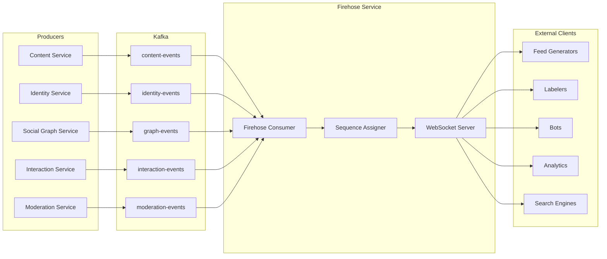
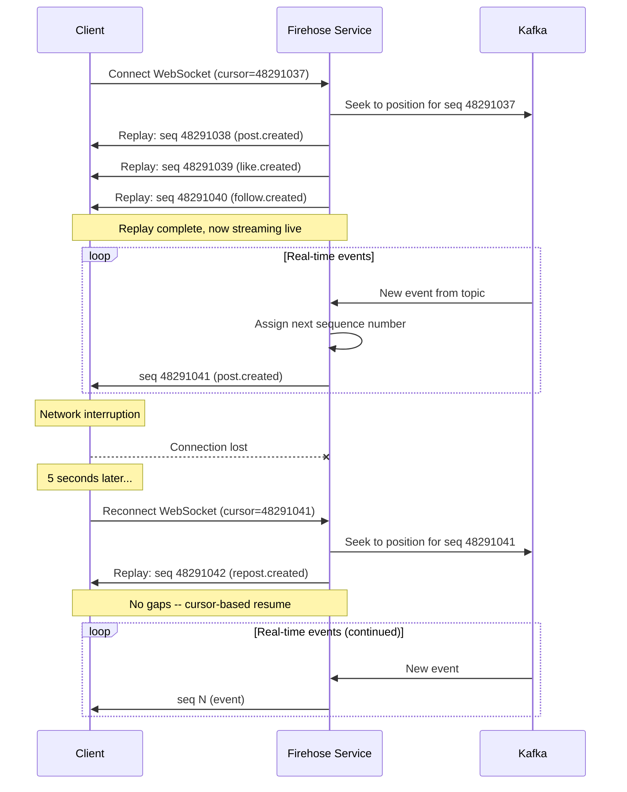
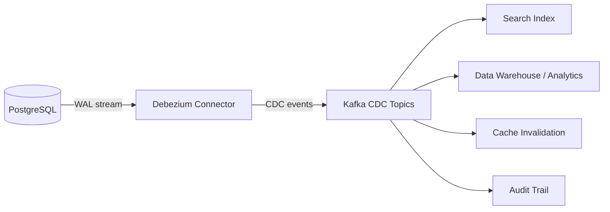
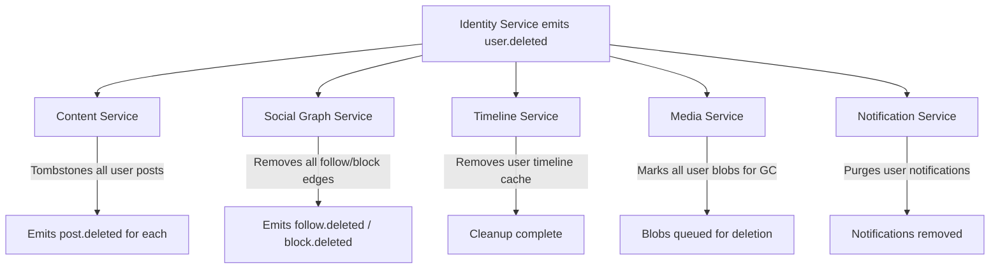
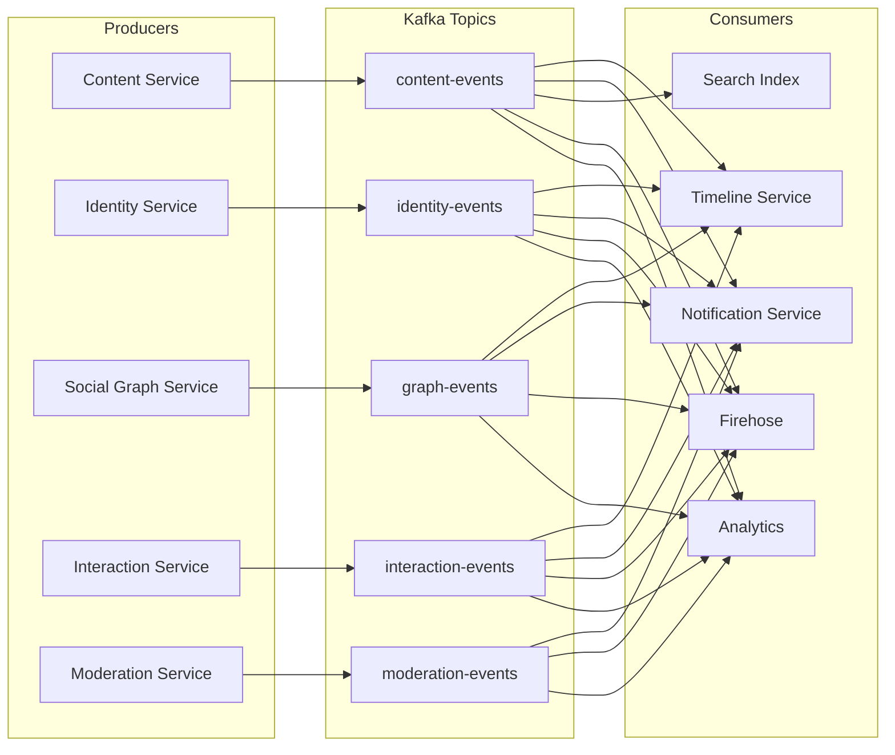

# Event Systems

This document describes the event-driven architecture and real-time streaming infrastructure for a generic social media platform. Events are the primary mechanism by which services communicate asynchronously -- when a user creates a post, the Content Service writes the record and emits an event; downstream services (Timeline, Notification, Search) each react independently by consuming that event. This decoupling is what makes the system scalable and extensible.

The design synthesizes patterns from three production systems: **Bluesky** (AT Protocol firehose and JetStream), **Twitter/X** (Kafka-based event bus and fanout), and **Reddit** (Kafka event pipeline and Debezium-based CDC). Where a concept originates from or is most clearly expressed in one of those systems, a parenthetical note attributes it.

This document references services from the [Architecture Overview](./01-architecture-overview.md), entities from [Data Models](./02-data-models.md), endpoints from the [API Catalog](./03-api-endpoint-catalog.md), and operation flows from [Operation Flows](./04-operation-flows.md).

---

## Table of Contents

1. [Event Bus Architecture](#1-event-bus-architecture)
2. [Event Catalog](#2-event-catalog)
3. [Firehose / Real-Time Stream](#3-firehose--real-time-stream)
4. [Change Data Capture (CDC)](#4-change-data-capture-cdc)
5. [Event Processing Patterns](#5-event-processing-patterns)
6. [Ordering Guarantees](#6-ordering-guarantees)

---

## 1. Event Bus Architecture

Apache Kafka serves as the central event backbone. Every service-to-service asynchronous communication flows through Kafka topics. Synchronous communication (e.g., Content Service calling Media Service to verify blob references) uses direct RPC; everything else is event-driven.

**Provenance:** Twitter migrated from a custom pub/sub system to Kafka for internal event distribution. Reddit uses Kafka as the backbone for its event pipeline, feeding downstream consumers like search, recommendations, and analytics. Bluesky's AT Protocol defines an event stream at the protocol level (the firehose), which in a production deployment would be backed by a durable log like Kafka.

### Topic Design

One Kafka topic per entity domain. This keeps events semantically grouped while allowing independent scaling of each topic.

| Topic | Entity Domain | Example Event Types | Partition Key |
|---|---|---|---|
| `content-events` | Posts, comments | `post.created`, `post.updated`, `post.deleted` | `post_id` |
| `interaction-events` | Likes, votes, reposts | `like.created`, `like.deleted`, `vote.cast`, `repost.created`, `repost.deleted` | `subject_uri` |
| `graph-events` | Follows, blocks, mutes | `follow.created`, `follow.deleted`, `block.created`, `block.deleted` | `source_id` |
| `identity-events` | Users, profiles | `user.created`, `user.updated`, `user.deleted` | `user_id` |
| `moderation-events` | Reports, labels | `report.created`, `label.applied`, `label.removed` | `subject_uri` |

### Partitioning Strategy

Events are partitioned by the entity they describe. All events about a single post go to the same partition; all events about a single user go to the same partition. This guarantees ordering within an entity -- a consumer will always see `post.created` before `post.updated` for the same post.

The partition key is the entity's Snowflake ID, hashed to determine the partition number. With 64 partitions per topic (a reasonable default for a mid-scale deployment), this distributes load evenly across brokers.

### Consumer Groups

Each consuming service registers its own Kafka consumer group. This means:

- The **Timeline Service** has consumer group `timeline-service-cg` and processes events at its own pace
- The **Notification Service** has consumer group `notification-service-cg` and processes events independently
- The **Search Index** has consumer group `search-index-cg`
- Adding a new consumer (e.g., an analytics pipeline) does not affect existing consumers

Within a consumer group, Kafka assigns partitions to group members, so multiple instances of the Timeline Service can share the load of processing `content-events`.

### Delivery Semantics

The platform uses **at-least-once delivery**. Kafka consumers commit offsets after processing each batch. If a consumer crashes before committing, it will re-process some events on restart. This means all consumers must be **idempotent** -- processing the same event twice must produce the same result as processing it once.

Idempotency strategies:
- **Upsert operations** -- use the event's entity ID as the key, so a duplicate write simply overwrites with the same data
- **Deduplication table** -- maintain a set of recently processed `event_id` values and skip duplicates
- **Conditional writes** -- only apply the event if the entity's `updated_at` is older than the event's timestamp

### Retention

Kafka topics retain events for **7 days**. This allows:
- A crashed consumer to replay up to 7 days of missed events on recovery
- A newly deployed service to backfill from recent history
- Debugging and auditing of recent event flow

For longer retention, events are archived to object storage (S3-compatible) via a dedicated archival consumer.

---

## 2. Event Catalog

Every event in the system conforms to a common envelope, then carries a type-specific payload. The envelope structure:

```json
{
  "event_id": "evt_<unique-id>",
  "type": "<domain>.<action>",
  "timestamp": "<ISO-8601>",
  "producer": "<service-name>",
  "payload": { }
}
```

| Envelope Field | Type | Description |
|---|---|---|
| `event_id` | `string` | Globally unique event identifier. Used for deduplication. Format: `evt_` prefix + 20-char random alphanumeric. |
| `type` | `string` | Dotted event type. First segment is the entity, second is the action. |
| `timestamp` | `string` (ISO-8601) | When the event was produced. |
| `producer` | `string` | The service that emitted the event. |
| `payload` | `object` | Type-specific data. Varies per event type. |

---

### 2.1 Content Events

Topic: `content-events`

#### `post.created`

Emitted when a user publishes a new post. Contains the full post record so consumers do not need to call back to the Content Service.

| Field | Value |
|---|---|
| **Producer** | Content Service |
| **Consumers** | Timeline Service (fanout to follower timelines), Notification Service (mention/reply notifications), Search Index (index post text), Firehose (stream to external clients) |
| **Partition Key** | `payload.id` (the post's Snowflake ID) |

```json
{
  "event_id": "evt_a1b2c3d4e5f6g7h8i9j0",
  "type": "post.created",
  "timestamp": "2026-03-01T12:00:00Z",
  "producer": "content-service",
  "payload": {
    "id": "1234567890123458",
    "type": "social.post",
    "author_id": "1234567890123456",
    "created_at": "2026-03-01T12:00:00Z",
    "updated_at": null,
    "deleted": false,
    "text": "Hello world! Check out @alice's new project.",
    "facets": [
      {
        "index": { "byte_start": 25, "byte_end": 31 },
        "features": [
          { "type": "mention", "did": "did:plc:alice123" }
        ]
      }
    ],
    "media_refs": [],
    "reply_to": null,
    "embed": null,
    "thread_root": null,
    "lang": "en",
    "labels": []
  }
}
```

#### `post.updated`

Emitted when a post is edited. Contains the full updated record.

| Field | Value |
|---|---|
| **Producer** | Content Service |
| **Consumers** | Search Index (re-index text), Timeline Cache (update cached post data), Firehose |
| **Partition Key** | `payload.id` |

```json
{
  "event_id": "evt_b2c3d4e5f6g7h8i9j0k1",
  "type": "post.updated",
  "timestamp": "2026-03-01T12:05:00Z",
  "producer": "content-service",
  "payload": {
    "id": "1234567890123458",
    "type": "social.post",
    "author_id": "1234567890123456",
    "created_at": "2026-03-01T12:00:00Z",
    "updated_at": "2026-03-01T12:05:00Z",
    "deleted": false,
    "text": "Hello world! Check out @alice's new project. (edited for clarity)",
    "facets": [
      {
        "index": { "byte_start": 25, "byte_end": 31 },
        "features": [
          { "type": "mention", "did": "did:plc:alice123" }
        ]
      }
    ],
    "media_refs": [],
    "reply_to": null,
    "embed": null,
    "thread_root": null,
    "lang": "en",
    "labels": []
  }
}
```

#### `post.deleted`

Emitted when a post is deleted (soft-delete). Contains minimal data -- just enough for consumers to remove or tombstone the post in their stores.

| Field | Value |
|---|---|
| **Producer** | Content Service |
| **Consumers** | Timeline Service (remove from follower timelines), Search Index (remove from index), Media Service (mark attached blobs for garbage collection), Interaction Service (orphan cleanup -- remove likes/votes on deleted post), Firehose |
| **Partition Key** | `payload.post_id` |

```json
{
  "event_id": "evt_c3d4e5f6g7h8i9j0k1l2",
  "type": "post.deleted",
  "timestamp": "2026-03-01T13:00:00Z",
  "producer": "content-service",
  "payload": {
    "post_id": "1234567890123458",
    "author_id": "1234567890123456",
    "media_refs": ["blob_98765"],
    "had_replies": true
  }
}
```

---

### 2.2 Interaction Events

Topic: `interaction-events`

#### `like.created`

Emitted when a user likes a post.

| Field | Value |
|---|---|
| **Producer** | Interaction Service |
| **Consumers** | Notification Service (notify post author), Firehose |
| **Partition Key** | `payload.subject_uri` |

```json
{
  "event_id": "evt_d4e5f6g7h8i9j0k1l2m3",
  "type": "like.created",
  "timestamp": "2026-03-01T12:10:00Z",
  "producer": "interaction-service",
  "payload": {
    "id": "1234567890123500",
    "type": "social.like",
    "author_id": "1234567890123457",
    "subject_uri": "social://1234567890123456/post/1234567890123458",
    "subject_author_id": "1234567890123456",
    "created_at": "2026-03-01T12:10:00Z"
  }
}
```

#### `like.deleted`

Emitted when a user unlikes a post.

| Field | Value |
|---|---|
| **Producer** | Interaction Service |
| **Consumers** | Notification Service (cancel notification if still unread), Firehose |
| **Partition Key** | `payload.subject_uri` |

```json
{
  "event_id": "evt_e5f6g7h8i9j0k1l2m3n4",
  "type": "like.deleted",
  "timestamp": "2026-03-01T12:15:00Z",
  "producer": "interaction-service",
  "payload": {
    "like_id": "1234567890123500",
    "subject_uri": "social://1234567890123456/post/1234567890123458",
    "subject_author_id": "1234567890123456",
    "author_id": "1234567890123457"
  }
}
```

#### `vote.cast`

Emitted when a user upvotes or downvotes a post. Votes are idempotent -- casting the same vote twice has no effect; casting the opposite vote flips the direction.

| Field | Value |
|---|---|
| **Producer** | Interaction Service |
| **Consumers** | Notification Service (optional -- some platforms notify on upvotes), Firehose |
| **Partition Key** | `payload.subject_uri` |

```json
{
  "event_id": "evt_f6g7h8i9j0k1l2m3n4o5",
  "type": "vote.cast",
  "timestamp": "2026-03-01T12:20:00Z",
  "producer": "interaction-service",
  "payload": {
    "id": "1234567890123510",
    "type": "social.vote",
    "author_id": "1234567890123457",
    "subject_uri": "social://1234567890123456/post/1234567890123458",
    "subject_author_id": "1234567890123456",
    "direction": "up",
    "previous_direction": null,
    "created_at": "2026-03-01T12:20:00Z"
  }
}
```

**Provenance:** Reddit's vote system is the canonical example. Votes affect content ranking (hot sort, Wilson score). Twitter/X does not have downvotes. Bluesky does not have votes.

#### `repost.created`

Emitted when a user reposts (retweets/boosts) another user's post.

| Field | Value |
|---|---|
| **Producer** | Interaction Service |
| **Consumers** | Timeline Service (fanout repost to reposter's followers), Notification Service (notify original author), Firehose |
| **Partition Key** | `payload.subject_uri` |

```json
{
  "event_id": "evt_g7h8i9j0k1l2m3n4o5p6",
  "type": "repost.created",
  "timestamp": "2026-03-01T12:30:00Z",
  "producer": "interaction-service",
  "payload": {
    "id": "1234567890123520",
    "type": "social.repost",
    "author_id": "1234567890123457",
    "subject_uri": "social://1234567890123456/post/1234567890123458",
    "subject_author_id": "1234567890123456",
    "created_at": "2026-03-01T12:30:00Z"
  }
}
```

#### `repost.deleted`

Emitted when a user removes their repost.

| Field | Value |
|---|---|
| **Producer** | Interaction Service |
| **Consumers** | Timeline Service (remove repost from followers' timelines), Firehose |
| **Partition Key** | `payload.subject_uri` |

```json
{
  "event_id": "evt_h8i9j0k1l2m3n4o5p6q7",
  "type": "repost.deleted",
  "timestamp": "2026-03-01T12:35:00Z",
  "producer": "interaction-service",
  "payload": {
    "repost_id": "1234567890123520",
    "subject_uri": "social://1234567890123456/post/1234567890123458",
    "author_id": "1234567890123457"
  }
}
```

---

### 2.3 Graph Events

Topic: `graph-events`

#### `follow.created`

Emitted when a user follows another user.

| Field | Value |
|---|---|
| **Producer** | Social Graph Service |
| **Consumers** | Timeline Service (optionally backfill recent posts from followed user into follower's timeline), Notification Service (notify followed user), Firehose |
| **Partition Key** | `payload.source_id` |

```json
{
  "event_id": "evt_i9j0k1l2m3n4o5p6q7r8",
  "type": "follow.created",
  "timestamp": "2026-03-01T14:00:00Z",
  "producer": "social-graph-service",
  "payload": {
    "id": "1234567890123600",
    "type": "social.follow",
    "source_id": "1234567890123457",
    "target_id": "1234567890123456",
    "created_at": "2026-03-01T14:00:00Z"
  }
}
```

#### `follow.deleted`

Emitted when a user unfollows another user.

| Field | Value |
|---|---|
| **Producer** | Social Graph Service |
| **Consumers** | Timeline Service (optional -- can remove followed user's posts from timeline or let them age out), Firehose |
| **Partition Key** | `payload.source_id` |

```json
{
  "event_id": "evt_j0k1l2m3n4o5p6q7r8s9",
  "type": "follow.deleted",
  "timestamp": "2026-03-01T14:30:00Z",
  "producer": "social-graph-service",
  "payload": {
    "follow_id": "1234567890123600",
    "source_id": "1234567890123457",
    "target_id": "1234567890123456"
  }
}
```

#### `block.created`

Emitted when a user blocks another user. Blocks have wider side effects than unfollows -- the blocked user's content must be filtered from the blocker's timeline, and notifications from the blocked user must be suppressed.

| Field | Value |
|---|---|
| **Producer** | Social Graph Service |
| **Consumers** | Timeline Service (filter blocked user's posts), Notification Service (suppress notifications from blocked user), Firehose |
| **Partition Key** | `payload.source_id` |

```json
{
  "event_id": "evt_k1l2m3n4o5p6q7r8s9t0",
  "type": "block.created",
  "timestamp": "2026-03-01T15:00:00Z",
  "producer": "social-graph-service",
  "payload": {
    "id": "1234567890123700",
    "type": "social.block",
    "source_id": "1234567890123457",
    "target_id": "1234567890123459",
    "created_at": "2026-03-01T15:00:00Z"
  }
}
```

#### `block.deleted`

Emitted when a user unblocks another user.

| Field | Value |
|---|---|
| **Producer** | Social Graph Service |
| **Consumers** | Firehose |
| **Partition Key** | `payload.source_id` |

```json
{
  "event_id": "evt_l2m3n4o5p6q7r8s9t0u1",
  "type": "block.deleted",
  "timestamp": "2026-03-01T15:30:00Z",
  "producer": "social-graph-service",
  "payload": {
    "block_id": "1234567890123700",
    "source_id": "1234567890123457",
    "target_id": "1234567890123459"
  }
}
```

---

### 2.4 Identity Events

Topic: `identity-events`

#### `user.created`

Emitted when a new user registers on the platform.

| Field | Value |
|---|---|
| **Producer** | Identity Service |
| **Consumers** | Timeline Service (initialize empty timeline cache), Social Graph Service (initialize graph node), Firehose |
| **Partition Key** | `payload.id` |

```json
{
  "event_id": "evt_m3n4o5p6q7r8s9t0u1v2",
  "type": "user.created",
  "timestamp": "2026-03-01T10:00:00Z",
  "producer": "identity-service",
  "payload": {
    "id": "1234567890123456",
    "type": "social.user",
    "handle": "bob",
    "did": "did:plc:bob456def",
    "display_name": "Bob",
    "bio": "",
    "avatar_ref": null,
    "banner_ref": null,
    "created_at": "2026-03-01T10:00:00Z"
  }
}
```

#### `user.updated`

Emitted when a user updates their profile (display name, bio, avatar, handle change).

| Field | Value |
|---|---|
| **Producer** | Identity Service |
| **Consumers** | Profile cache invalidation (any service caching user profiles must refresh), Firehose |
| **Partition Key** | `payload.id` |

```json
{
  "event_id": "evt_n4o5p6q7r8s9t0u1v2w3",
  "type": "user.updated",
  "timestamp": "2026-03-01T11:00:00Z",
  "producer": "identity-service",
  "payload": {
    "id": "1234567890123456",
    "updated_fields": ["display_name", "bio"],
    "display_name": "Bob Builder",
    "bio": "Building things on the internet.",
    "updated_at": "2026-03-01T11:00:00Z"
  }
}
```

#### `user.deleted`

Emitted when a user deletes their account. This triggers a cascade across all services.

| Field | Value |
|---|---|
| **Producer** | Identity Service |
| **Consumers** | Content Service (tombstone all user posts), Social Graph Service (remove all edges), Timeline Service (remove user timeline cache), Media Service (mark all user blobs for GC), Notification Service (purge user notifications), Firehose |
| **Partition Key** | `payload.user_id` |

```json
{
  "event_id": "evt_o5p6q7r8s9t0u1v2w3x4",
  "type": "user.deleted",
  "timestamp": "2026-03-01T16:00:00Z",
  "producer": "identity-service",
  "payload": {
    "user_id": "1234567890123456",
    "handle": "bob",
    "did": "did:plc:bob456def",
    "deletion_type": "user_requested",
    "grace_period_ends": "2026-03-31T16:00:00Z"
  }
}
```

The `grace_period_ends` field allows a 30-day recovery window. During the grace period, the account is deactivated but not purged. After the grace period, a scheduled job emits a `user.purged` event that triggers permanent data removal.

---

### 2.5 Moderation Events

Topic: `moderation-events`

#### `report.created`

Emitted when a user reports content or another user.

| Field | Value |
|---|---|
| **Producer** | Moderation Service |
| **Consumers** | Moderation queue (internal dashboard for human review), Firehose (optional -- may be excluded from public firehose for privacy) |
| **Partition Key** | `payload.subject_uri` |

```json
{
  "event_id": "evt_p6q7r8s9t0u1v2w3x4y5",
  "type": "report.created",
  "timestamp": "2026-03-01T17:00:00Z",
  "producer": "moderation-service",
  "payload": {
    "id": "1234567890123800",
    "type": "social.report",
    "reporter_id": "1234567890123457",
    "subject_uri": "social://1234567890123459/post/1234567890123460",
    "subject_author_id": "1234567890123459",
    "reason": "spam",
    "comment": "This account is posting repeated promotional content.",
    "created_at": "2026-03-01T17:00:00Z"
  }
}
```

#### `label.applied`

Emitted when a moderation label is applied to content or a user. Labels are metadata annotations that inform how content should be displayed (or hidden).

| Field | Value |
|---|---|
| **Producer** | Moderation Service |
| **Consumers** | Content cache invalidation (posts with new labels must be re-evaluated for visibility), Firehose |
| **Partition Key** | `payload.subject_uri` |

**Provenance:** Bluesky's labeling system is the primary inspiration. Labels are first-class objects emitted by labeler services. Any entity can have multiple labels (e.g., `nsfw`, `spam`, `misleading`). Clients use labels to decide display behavior.

```json
{
  "event_id": "evt_q7r8s9t0u1v2w3x4y5z6",
  "type": "label.applied",
  "timestamp": "2026-03-01T17:30:00Z",
  "producer": "moderation-service",
  "payload": {
    "id": "1234567890123810",
    "type": "social.label",
    "subject_uri": "social://1234567890123459/post/1234567890123460",
    "label_value": "spam",
    "label_source": "moderation-service",
    "created_at": "2026-03-01T17:30:00Z",
    "expires_at": null
  }
}
```

#### `label.removed`

Emitted when a moderation label is removed (e.g., after appeal or review).

| Field | Value |
|---|---|
| **Producer** | Moderation Service |
| **Consumers** | Content cache invalidation, Firehose |
| **Partition Key** | `payload.subject_uri` |

```json
{
  "event_id": "evt_r8s9t0u1v2w3x4y5z6a7",
  "type": "label.removed",
  "timestamp": "2026-03-01T18:00:00Z",
  "producer": "moderation-service",
  "payload": {
    "label_id": "1234567890123810",
    "subject_uri": "social://1234567890123459/post/1234567890123460",
    "label_value": "spam",
    "removed_by": "moderator_42",
    "reason": "appeal_accepted"
  }
}
```

---

### 2.6 Event Catalog Summary

| Event Type | Topic | Producer | Key Consumers |
|---|---|---|---|
| `post.created` | `content-events` | Content Service | Timeline, Notifications, Search, Firehose |
| `post.updated` | `content-events` | Content Service | Search, Timeline Cache, Firehose |
| `post.deleted` | `content-events` | Content Service | Timeline, Search, Media, Interactions, Firehose |
| `like.created` | `interaction-events` | Interaction Service | Notifications, Firehose |
| `like.deleted` | `interaction-events` | Interaction Service | Notifications, Firehose |
| `vote.cast` | `interaction-events` | Interaction Service | Notifications (optional), Firehose |
| `repost.created` | `interaction-events` | Interaction Service | Timeline, Notifications, Firehose |
| `repost.deleted` | `interaction-events` | Interaction Service | Timeline, Firehose |
| `follow.created` | `graph-events` | Social Graph Service | Timeline, Notifications, Firehose |
| `follow.deleted` | `graph-events` | Social Graph Service | Timeline (optional), Firehose |
| `block.created` | `graph-events` | Social Graph Service | Timeline, Notifications, Firehose |
| `block.deleted` | `graph-events` | Social Graph Service | Firehose |
| `user.created` | `identity-events` | Identity Service | Timeline, Social Graph, Firehose |
| `user.updated` | `identity-events` | Identity Service | Profile Cache, Firehose |
| `user.deleted` | `identity-events` | Identity Service | All services (cascade), Firehose |
| `report.created` | `moderation-events` | Moderation Service | Moderation Queue |
| `label.applied` | `moderation-events` | Moderation Service | Content Cache, Firehose |
| `label.removed` | `moderation-events` | Moderation Service | Content Cache, Firehose |

---

## 3. Firehose / Real-Time Stream

The firehose is a public WebSocket endpoint that streams every event in real time to external clients. It is the primary mechanism for building third-party applications on top of the platform -- feed generators, labelers, bots, analytics dashboards, and external search engines all consume the firehose.

**Provenance:** Bluesky's AT Protocol defines the firehose as a core protocol primitive. The Relay (`bgs.bsky.social`) aggregates events from all PDS instances and streams them via WebSocket. JetStream is a lighter-weight filtered variant. Twitter's now-deprecated Streaming API served a similar purpose (filtered real-time streams of tweets). Reddit's pushshift archive performed offline ingestion of the full public corpus.

### Endpoint

```
wss://stream.platform.example/v1/firehose
```

### Wire Format

Events are serialized in either **CBOR** (Concise Binary Object Representation) or **JSON**, selectable via the `Accept` header or a query parameter:

```
wss://stream.platform.example/v1/firehose?encoding=json
wss://stream.platform.example/v1/firehose?encoding=cbor
```

CBOR is the default (more compact, faster to parse). JSON is available for ease of development and debugging.

### Cursor-Based Reconnection

Every firehose event carries a monotonically increasing **sequence number**. Clients track their last-seen sequence and provide it on reconnect to resume without gaps.

Connection with cursor:
```
wss://stream.platform.example/v1/firehose?cursor=48291037
```

The firehose service maintains a buffer of recent events (backed by Kafka retention). On reconnect:
1. If the cursor is within the retention window, replay starts from cursor + 1
2. If the cursor is too old (beyond retention), the server sends an error frame and the client must reset to the live tail

### Filtered Streams

Clients can request filtered subsets of the firehose to reduce bandwidth and processing overhead.

| Filter Parameter | Description | Example |
|---|---|---|
| `collections` | Only events for specified entity types | `?collections=social.post,social.like` |
| `dids` | Only events from specified users | `?dids=did:plc:alice123,did:plc:bob456` |
| `exclude` | Exclude specified event types | `?exclude=vote.cast,label.applied` |

**Provenance:** Bluesky JetStream provides exactly this kind of filtered firehose -- clients subscribe to specific collections or DIDs instead of consuming the full stream.

Filtered endpoint:
```
wss://stream.platform.example/v1/firehose/filtered?collections=social.post&encoding=json
```

### Firehose Message Format

Each message on the WebSocket is a framed event:

```json
{
  "seq": 48291038,
  "event_id": "evt_a1b2c3d4e5f6g7h8i9j0",
  "type": "post.created",
  "timestamp": "2026-03-01T12:00:00Z",
  "producer": "content-service",
  "payload": {
    "id": "1234567890123458",
    "author_id": "1234567890123456",
    "text": "Hello world!",
    "facets": [],
    "media_refs": [],
    "reply_to": null,
    "created_at": "2026-03-01T12:00:00Z"
  }
}
```

The `seq` field is the firehose sequence number -- it is unique to the firehose and separate from the Kafka offset. The firehose service assigns sequence numbers as it reads from Kafka, providing a single total ordering across all topics.

### Architecture



### Firehose Connection Lifecycle



### Use Cases

| Consumer Type | What It Does | Example |
|---|---|---|
| **Feed Generator** | Consumes firehose, applies custom ranking algorithm, serves custom feeds | A "Science" feed that filters for posts containing scientific paper links |
| **Labeler** | Consumes firehose, runs classification models, applies labels | An NSFW detection labeler that scans image posts |
| **Bot** | Consumes firehose, reacts to specific patterns | A bot that auto-replies to posts mentioning a keyword |
| **Analytics** | Consumes firehose, aggregates metrics | Dashboard showing posts-per-minute, trending topics |
| **External Search** | Consumes firehose, builds independent search index | A third-party full-text search engine for public posts |

**Provenance:** All five use cases are active in the Bluesky ecosystem today. Feed generators and labelers are first-class concepts in the AT Protocol. Twitter's Streaming API powered similar third-party tooling before its deprecation.

---

## 4. Change Data Capture (CDC)

While the application-level event bus (Section 1) handles events emitted explicitly by services, Change Data Capture monitors the database transaction log to capture every row-level change -- including those made by scripts, migrations, admin tools, and manual database fixes that bypass the application layer.

**Provenance:** Reddit uses Debezium-based CDC extensively to keep downstream systems in sync with the primary PostgreSQL databases. This pattern is common in large-scale systems where the application event bus covers the "happy path" but CDC provides the safety net.

### Pipeline



### How It Works

1. **PostgreSQL Write-Ahead Log (WAL):** PostgreSQL writes every change (INSERT, UPDATE, DELETE) to its WAL before applying it to the data files. This log is the source of truth for replication.

2. **Debezium Connector:** A Kafka Connect source connector that reads the PostgreSQL WAL in real time. It translates WAL entries into structured change events and publishes them to Kafka topics.

3. **CDC Kafka Topics:** One topic per database table. Topic naming convention: `cdc.<schema>.<table>` (e.g., `cdc.public.posts`, `cdc.public.users`, `cdc.public.follows`).

4. **Downstream Consumers:** Each consumer reads CDC events and applies changes to its own data store.

### CDC Event Format

Each CDC event contains the old and new values of the row, plus metadata about the operation:

```json
{
  "source": {
    "connector": "postgresql",
    "db": "content_db",
    "schema": "public",
    "table": "posts",
    "lsn": 23487192,
    "txId": 98234,
    "ts_ms": 1740830400000
  },
  "op": "u",
  "before": {
    "id": "1234567890123458",
    "text": "Hello world!",
    "updated_at": null
  },
  "after": {
    "id": "1234567890123458",
    "text": "Hello world! (edited)",
    "updated_at": "2026-03-01T12:05:00Z"
  },
  "ts_ms": 1740830400123
}
```

| Field | Description |
|---|---|
| `source` | Metadata about the database, table, and WAL position |
| `op` | Operation type: `c` (create/INSERT), `u` (update/UPDATE), `d` (delete/DELETE), `r` (read/snapshot) |
| `before` | Row state before the change (null for INSERTs) |
| `after` | Row state after the change (null for DELETEs) |
| `ts_ms` | Timestamp when Debezium processed the event |

### CDC vs Application Events

| Dimension | Application Events (Kafka) | CDC (Debezium) |
|---|---|---|
| **Source** | Emitted explicitly by application code | Captured from database WAL |
| **Coverage** | Only changes made through the application | All changes, including scripts, migrations, admin tools |
| **Payload** | Domain-specific, curated (e.g., full post record) | Row-level, raw (column values before and after) |
| **Latency** | Sub-second (emitted immediately after write) | Low seconds (WAL read + Debezium processing) |
| **Schema** | Application-defined JSON schemas | Mirrors database table schema |
| **Use case** | Primary inter-service communication | Sync, audit, analytics, safety net |

In practice, both coexist. The application event bus is the primary communication channel between services. CDC is the backup that catches anything the application layer misses.

### CDC Use Cases

**Search Index Synchronization.** The Search Index primarily consumes `post.created` and `post.updated` events from the application bus. But if a migration script bulk-updates post metadata, those changes would not emit application events. CDC catches them, ensuring the search index stays consistent.

**Analytics / Data Warehouse.** The analytics pipeline needs a complete, reliable record of every database change. CDC provides exactly this -- every INSERT, UPDATE, and DELETE is captured and streamed to the data warehouse for analysis.

**Cache Invalidation.** When a row changes (by any means), CDC events trigger cache eviction. This is more reliable than relying solely on application-level cache invalidation, which can have bugs or miss edge cases.

**Audit Trail.** CDC events are archived to provide a complete history of all data changes. This supports compliance, debugging, and forensic analysis.

---

## 5. Event Processing Patterns

### 5.1 Fan-out

One event triggers writes to many downstream stores. This is the dominant pattern for timeline delivery.

**Example:** When `post.created` is emitted, the Timeline Service queries the Social Graph Service for the author's follower list, then writes `(post_id, timestamp)` into each follower's timeline cache (a Redis sorted set).

For an author with 10,000 followers, one `post.created` event results in 10,000 Redis writes. This is **fanout-on-write** (eager fanout).

**Provenance:** Twitter's original fanout architecture pre-computed timelines on write. This makes reads extremely fast (fetching a timeline is a single Redis `ZRANGEBYSCORE` call) at the cost of high write amplification. The **celebrity problem** -- accounts with millions of followers causing massive write storms -- is mitigated by switching to fanout-on-read for high-follower accounts (the post is merged into timelines at read time instead of being pre-written).

```
post.created event
    |
    v
Timeline Service
    |
    +-- Query Social Graph: get_followers(author_id) --> [f1, f2, ..., fN]
    |
    +-- For each follower fi:
        +-- ZADD timeline:{fi} {timestamp} {post_id}
```

### 5.2 Aggregation

Counting or summarizing events over time windows. Used for metrics, trending topics, and activity summaries.

**Example:** Computing "total likes in the last hour" by consuming `like.created` events and maintaining a sliding window counter.

Implementation approaches:
- **In-memory counters** with periodic flush to a durable store (fast, but lost on restart)
- **Kafka Streams** or **Flink** for windowed aggregation (durable, exactly-once semantics)
- **Redis HyperLogLog** for approximate unique counts (e.g., unique viewers)

```
like.created events (continuous stream)
    |
    v
Aggregation Service (Kafka Streams / Flink)
    |
    +-- Tumbling window: 1 hour
    +-- Group by: subject_uri
    +-- Output: { subject_uri, like_count, window_start, window_end }
    |
    v
Trending Topics / Hot Rankings
```

### 5.3 Saga / Choreography

Multi-step operations coordinated entirely through events, with no central coordinator. Each service listens for events and independently performs its part of the operation. If any step fails, compensating events are emitted.

**Example: Account Deletion**

When a user requests account deletion, the Identity Service emits `user.deleted`. Each downstream service reacts independently:



| Step | Service | Action | Events Emitted |
|---|---|---|---|
| 1 | Identity Service | Deactivates account, emits `user.deleted` | `user.deleted` |
| 2 | Content Service | Soft-deletes all user posts | `post.deleted` (one per post) |
| 3 | Social Graph Service | Removes all follow and block edges | `follow.deleted`, `block.deleted` (one per edge) |
| 4 | Timeline Service | Deletes user's timeline cache from Redis | None |
| 5 | Media Service | Marks all blobs uploaded by user for garbage collection | None |
| 6 | Notification Service | Purges all notifications for/about the user | None |

Each service acts independently. There is no central orchestrator saying "now do step 3." The choreography emerges from each service's event subscriptions. This is more resilient than an orchestrator -- if the Media Service is temporarily down, it will process the `user.deleted` event when it recovers (thanks to Kafka's at-least-once delivery and consumer offset tracking).

**Trade-off:** Choreography is harder to monitor. "Has the account deletion finished?" requires checking each service's completion status individually. A lightweight reconciliation job can periodically verify that all services have processed pending `user.deleted` events.

### 5.4 Dead Letter Queue (DLQ)

Events that fail processing after a configured number of retries are moved to a Dead Letter Queue rather than blocking the consumer.

**Why:** A malformed event, a bug in the consumer, or a transient dependency failure can cause an event to fail processing repeatedly. Without a DLQ, the consumer would get stuck retrying the same event forever, blocking all subsequent events in the partition.

**Flow:**

```
Event arrives
    |
    v
Consumer attempts processing
    |
    +-- Success --> Commit offset, move to next event
    |
    +-- Failure --> Retry (up to N times with exponential backoff)
        |
        +-- All retries exhausted --> Move to DLQ topic
            |
            +-- Commit offset (unblock consumer)
            +-- Alert operations team
            +-- Manual inspection + replay
```

**DLQ topic naming:** `<original-topic>.dlq` (e.g., `content-events.dlq`, `interaction-events.dlq`)

**DLQ event format:** The original event is wrapped with failure metadata:

```json
{
  "original_event": {
    "event_id": "evt_a1b2c3d4e5f6g7h8i9j0",
    "type": "post.created",
    "timestamp": "2026-03-01T12:00:00Z",
    "producer": "content-service",
    "payload": { "..." : "..." }
  },
  "failure": {
    "consumer_group": "timeline-service-cg",
    "attempts": 3,
    "last_error": "ConnectionRefusedError: Redis connection refused",
    "first_failure_at": "2026-03-01T12:00:01Z",
    "last_failure_at": "2026-03-01T12:00:15Z"
  }
}
```

**Resolution:** An operator inspects the DLQ, fixes the root cause (e.g., restores Redis connectivity), then replays the events from the DLQ back to the original topic.

---

## 6. Ordering Guarantees

Event ordering is critical for correctness. A consumer must not process `post.updated` before `post.created` for the same post. Kafka provides ordering guarantees at the partition level, and the platform's partitioning strategy is designed to exploit this.

### Within a Partition: Strict Ordering

Events in the same Kafka partition are delivered to consumers in exactly the order they were produced. Since the platform partitions by entity ID, all events for a single post (created, updated, deleted) go to the same partition and are processed in order.

### Across Partitions: No Ordering Guarantee

Events in different partitions may be consumed in any order. A `post.created` event for Post A (in partition 7) may be processed before or after a `like.created` event for Post A (in partition 12, because likes partition by `subject_uri` hash, not `post_id` hash).

In practice, this is acceptable because cross-entity ordering rarely matters. The cases where it does are handled explicitly:

| Scenario | Ordering Need | Solution |
|---|---|---|
| `post.created` before `post.updated` for same post | Must be ordered | Same partition (both keyed by `post_id`) |
| `like.created` before the `post.created` it references | Eventual consistency is fine | Like consumer retries or ignores if post not found yet |
| `user.deleted` before post deletions cascade | Eventual consistency is fine | Each service processes `user.deleted` independently |
| Firehose sequence numbers must be globally ordered | Must be ordered | Firehose service assigns sequence numbers from a single thread |

### Firehose Global Ordering

The firehose requires a total ordering across all topics (clients expect a monotonically increasing `seq`). The firehose service achieves this by:

1. Consuming from all Kafka topics in a single consumer process
2. Merging events by timestamp (with tiebreaking by topic + partition + offset)
3. Assigning a monotonically increasing sequence number from a single-threaded sequence generator
4. Buffering briefly (configurable, typically 100-500ms) to account for clock skew between producers

This introduces a small latency penalty (the buffering window) in exchange for a clean global ordering. For the firehose's use cases (feed generation, labeling, analytics), this trade-off is acceptable.

### Practical Implications

- **Consumers should be tolerant of out-of-order events across entities.** A notification consumer receiving a `like.created` event for a post it hasn't seen yet should either retry after a brief delay or look up the post on demand.
- **Consumers should never assume ordering across topics.** The `follow.created` and `post.created` events for a new user may arrive in any order to different consumers.
- **Idempotency handles duplicates; ordering handles correctness.** Together, they ensure that the system converges to the correct state even under retries and rebalances.

---

## Event Bus Topology (Overview Diagram)

This diagram shows the complete event flow from producers through Kafka topics to consumers.



Every topic fans out to multiple consumer groups. Adding a new consumer (e.g., a recommendation engine) requires only subscribing a new consumer group to the relevant topics -- no changes to producers or existing consumers.
