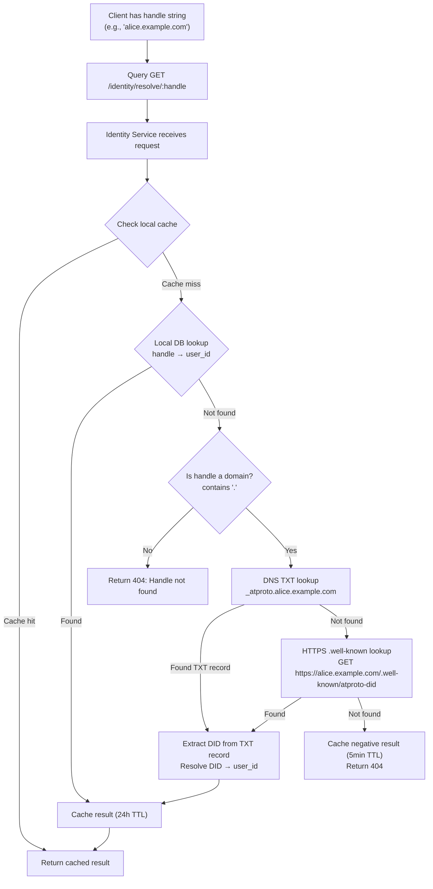
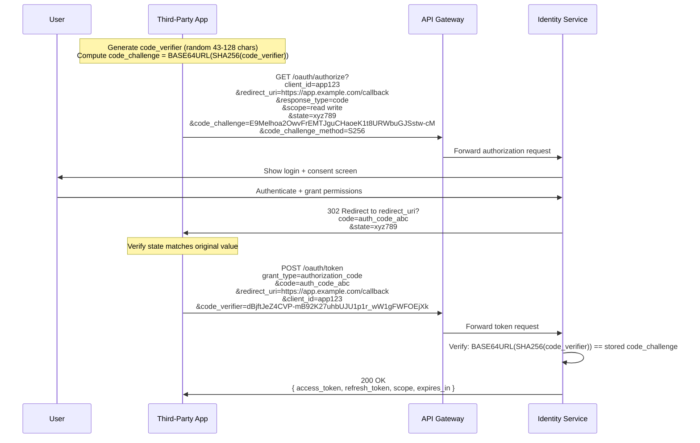
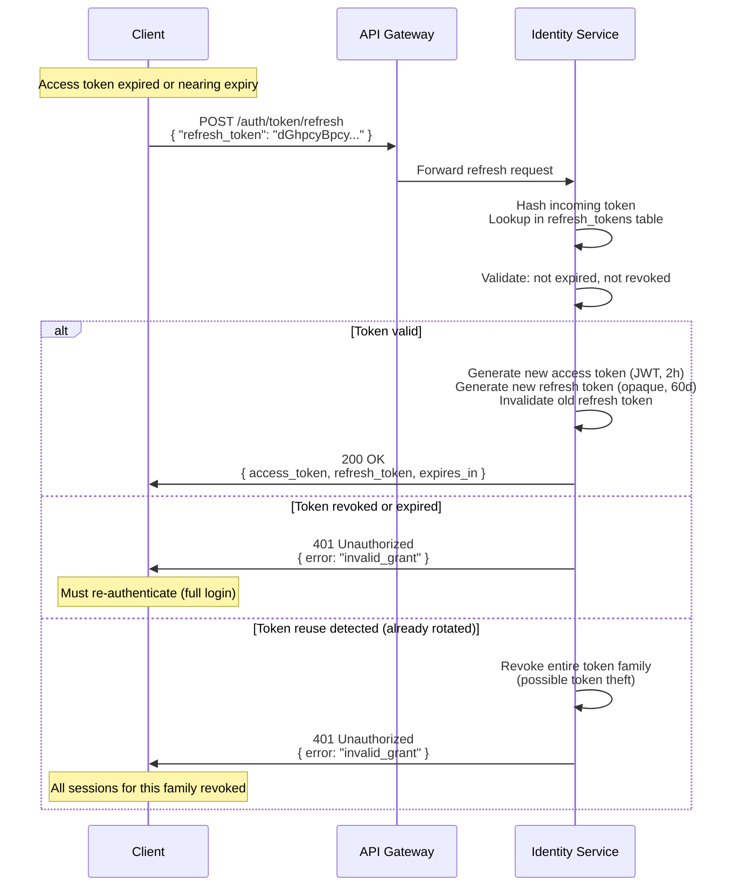

# 07 - Identity and Authentication

This document defines the identity model, authentication flows, token lifecycle, authorization model, and account lifecycle for the platform. The design synthesizes patterns from Bluesky (AT Protocol), Twitter/X, and Reddit, targeting a system that can operate in both centralized and federated modes.

---

## Table of Contents

1. [Identity Model](#1-identity-model)
2. [Handle Resolution](#2-handle-resolution)
3. [Authentication Flows](#3-authentication-flows)
4. [Token Lifecycle](#4-token-lifecycle)
5. [Authorization Model](#5-authorization-model)
6. [Account Lifecycle](#6-account-lifecycle)

---

## 1. Identity Model

Every user in the system is represented by four layers of identity. Each layer serves a distinct purpose and has different mutability and uniqueness constraints.

| Layer | Format | Mutable | Unique | System Use |
|---|---|---|---|---|
| Internal ID (Snowflake) | 64-bit integer | No | Yes (globally) | Foreign keys, event payloads, all internal references |
| Handle | `@alice` or `alice.example.com` | Yes | Yes (at any point in time) | Human-readable addressing, mentions, URLs |
| DID | `did:plc:u5cwb2mwiv2bfq53cjufe6yn` | No (rotatable keys) | Yes (globally) | Federated identity, cryptographic verification |
| Display Name | UTF-8 string | Yes | No | Cosmetic, user-facing display only |

### 1.1 Internal ID (Snowflake)

The internal ID is the canonical, immutable identifier for every user account. It is a 64-bit integer generated using a Snowflake-style scheme that encodes a timestamp, worker ID, and sequence number.

**Properties:**
- System-generated at account creation. Never changes, even if the user changes their handle.
- Used in all internal references: database foreign keys, event payloads, cache keys, queue messages.
- Exposed in API responses as a string (to avoid JavaScript integer precision issues with 64-bit values).
- Roughly sortable by creation time due to the embedded timestamp component.

**Snowflake bit layout (64-bit):**

```
 1 bit unused | 41 bits timestamp (ms since epoch) | 10 bits worker ID | 12 bits sequence
 0             | 00000000000000000000000000000000000000000 | 0000000000  | 000000000000
```

- 41-bit timestamp: ~69 years of millisecond-precision timestamps from a custom epoch.
- 10-bit worker ID: supports up to 1024 ID-generating workers.
- 12-bit sequence: up to 4096 IDs per millisecond per worker.

**Example:** `"1234567890123456789"`

cf. Twitter Snowflake IDs, Reddit internal IDs (base-36 encoded Snowflake-style).

### 1.2 Handle

The handle is the human-readable username that other users see and use to mention or find an account. Handles are mutable -- users can change them -- but must be unique at any given time.

**Formats supported:**
- Simple handle: `@alice`, `@bob_jones`, `@startup2024`
- Domain-verified handle: `alice.example.com` (proves domain ownership)

**Constraints:**
- 3-32 characters for simple handles.
- Alphanumeric plus hyphens and underscores. Must start with a letter.
- Case-insensitive for uniqueness checks (stored lowercase).
- Previously used handles are released after a grace period following a change (7 days) or account deletion (30 days).

**Handle changes do not break references.** All internal systems reference users by Snowflake ID. Handles are resolved to IDs at the API boundary and stored as IDs internally. If `@alice` changes to `@alice_v2`, all her existing posts, followers, and interactions remain intact.

cf. Bluesky handles (`alice.bsky.social`, custom domain verification), Twitter `@username`, Reddit `u/username`.

### 1.3 DID (Decentralized Identifier)

In federated mode, each user also has a DID -- a persistent, cryptographically verifiable identifier that is independent of any single server.

**Format:** `did:plc:u5cwb2mwiv2bfq53cjufe6yn`

**Properties:**
- Generated at account creation (federated mode) or on-demand (centralized mode, optional).
- Supports key rotation: if a user's signing key is compromised, the DID document can be updated to use a new key without changing the DID itself.
- Supports account migration: the DID document can be updated to point to a different server, enabling users to move between hosting providers.
- The DID document contains: signing key (public), rotation keys, service endpoints (PDS URL).

**DID Document example:**

```json
{
  "id": "did:plc:u5cwb2mwiv2bfq53cjufe6yn",
  "alsoKnownAs": ["at://alice.example.com"],
  "verificationMethod": [
    {
      "id": "#atproto",
      "type": "Multikey",
      "controller": "did:plc:u5cwb2mwiv2bfq53cjufe6yn",
      "publicKeyMultibase": "zQ3shunBKsXixLxkfMOPHOBx..."
    }
  ],
  "service": [
    {
      "id": "#atproto_pds",
      "type": "AtprotoPersonalDataServer",
      "serviceEndpoint": "https://pds.example.com"
    }
  ]
}
```

In centralized mode, the internal Snowflake ID serves the same canonical-identifier purpose, and DID generation is optional.

cf. Bluesky DID:PLC method, W3C DID Core specification.

### 1.4 Display Name

The display name is a purely cosmetic, user-facing string. It has no system significance -- it is not used for lookups, references, or uniqueness constraints.

**Constraints:**
- 0-64 characters (can be empty).
- UTF-8, including emoji and non-Latin scripts.
- Not unique. Multiple users can have the same display name.
- Moderation filters may apply (no slurs, impersonation rules enforced separately).

---

## 2. Handle Resolution

Handle resolution is the process of converting a human-readable handle into an internal user ID (and optionally a DID). This is required whenever a client references a user by handle rather than by ID.

### 2.1 Resolution Flow



### 2.2 Resolution Methods

**Method 1: Local database lookup**

The primary and fastest resolution method. The Identity Service queries its database for the handle.

```
GET /identity/resolve/alice
```

```sql
SELECT user_id, did, handle, display_name
FROM users
WHERE handle = lower('alice')
  AND deleted_at IS NULL;
```

**Method 2: DNS TXT record (federated/custom domain handles)**

For domain-based handles, the platform checks for a DNS TXT record at `_atproto.<handle>`.

```
dig TXT _atproto.alice.example.com
```

Expected record value: `did=did:plc:u5cwb2mwiv2bfq53cjufe6yn`

**Method 3: HTTPS .well-known (fallback for federated handles)**

If no DNS TXT record is found, the platform attempts an HTTPS request.

```
GET https://alice.example.com/.well-known/atproto-did
```

Expected response body: `did:plc:u5cwb2mwiv2bfq53cjufe6yn` (plain text)

### 2.3 Resolution Response

```json
{
  "user_id": "1234567890123456789",
  "handle": "alice.example.com",
  "did": "did:plc:u5cwb2mwiv2bfq53cjufe6yn",
  "display_name": "Alice"
}
```

### 2.4 Caching

| Outcome | TTL | Rationale |
|---|---|---|
| Successful resolution | 24 hours | Handles change infrequently |
| Failed resolution (404) | 5 minutes | Allow quick retry after handle creation |
| DNS/HTTPS resolution | 1 hour | External records may update independently |

Cache is invalidated immediately on handle change events (`handle.changed` event in the internal event bus).

cf. Bluesky `com.atproto.identity.resolveHandle`, Twitter user lookup by username (`GET /2/users/by/username/:username`).

---

## 3. Authentication Flows

The platform supports two primary authentication flows: password-based login for first-party clients, and OAuth 2.0 with PKCE for third-party applications. An optional DPoP enhancement is available for high-security deployments.

### 3.1 Password-Based Login

Used by the platform's own web and mobile clients. Simple request/response flow that returns session tokens.

**Endpoint:** `POST /auth/session`

**Request:**

```json
{
  "handle_or_email": "alice",
  "password": "correct-horse-battery-staple"
}
```

**Flow:**

1. Client sends handle/email and password to Identity Service.
2. Identity Service resolves handle to user record.
3. Validates password against stored hash (bcrypt or argon2id).
4. On success: generates JWT access token (2h expiry) and opaque refresh token (60d expiry).
5. Records session metadata (IP, user agent, creation time).
6. Returns tokens and basic user info.

**Response (200 OK):**

```json
{
  "access_token": "eyJhbGciOiJFUzI1NiIs...",
  "refresh_token": "dGhpcyBpcyBhIHJlZnJlc2ggdG9rZW4...",
  "token_type": "Bearer",
  "expires_in": 7200,
  "user": {
    "user_id": "1234567890123456789",
    "handle": "alice",
    "did": "did:plc:u5cwb2mwiv2bfq53cjufe6yn",
    "display_name": "Alice"
  }
}
```

**Error Response (401 Unauthorized):**

```json
{
  "error": "AuthenticationRequired",
  "message": "Invalid handle/email or password"
}
```

The error message is deliberately vague (does not reveal whether the handle exists) to prevent user enumeration.

**Rate Limiting:** 10 failed attempts per handle per 15-minute window. After the limit, the account is temporarily locked (15-minute cooldown). After 50 cumulative failures in 24 hours, account is locked and requires email verification to unlock.

cf. Bluesky `com.atproto.server.createSession`, Reddit `POST /api/v1/access_token` (password grant).

### 3.2 OAuth 2.0 with PKCE (Third-Party Apps)

Used by third-party applications to obtain delegated access to a user's account. Implements the Authorization Code flow with PKCE (Proof Key for Code Exchange) as defined in RFC 7636.

**Why PKCE?** The authorization code alone is vulnerable to interception attacks (especially on mobile). PKCE adds a client-generated secret (`code_verifier`) that is hashed into a `code_challenge` sent with the authorization request. Only the client that generated the original verifier can exchange the authorization code for tokens.



**Step-by-step:**

1. **App generates PKCE pair:**
   - `code_verifier`: cryptographically random string, 43-128 characters, unreserved URI characters.
   - `code_challenge`: `BASE64URL(SHA256(code_verifier))`.

2. **App redirects user to authorization endpoint:**
   ```
   GET /oauth/authorize
     ?client_id=app123
     &redirect_uri=https://app.example.com/callback
     &response_type=code
     &scope=read write
     &state=xyz789
     &code_challenge=E9Melhoa2OwvFrEMTJguCHaoeK1t8URWbuGJSstw-cM
     &code_challenge_method=S256
   ```
   The `state` parameter is an opaque value used to prevent CSRF attacks.

3. **User authenticates and grants permissions:** The Identity Service presents a login form (if not already authenticated) and a consent screen showing the requested scopes.

4. **Platform redirects back with authorization code:**
   ```
   302 Location: https://app.example.com/callback?code=auth_code_abc&state=xyz789
   ```

5. **App exchanges code for tokens:**
   ```
   POST /oauth/token
   Content-Type: application/x-www-form-urlencoded

   grant_type=authorization_code
   &code=auth_code_abc
   &redirect_uri=https://app.example.com/callback
   &client_id=app123
   &code_verifier=dBjftJeZ4CVP-mB92K27uhbUJU1p1r_wW1gFWFOEjXk
   ```

6. **Identity Service validates and returns tokens:**
   - Verifies `BASE64URL(SHA256(code_verifier))` matches the stored `code_challenge`.
   - Verifies authorization code is valid, not expired (10-minute window), and not already used.
   - Verifies `redirect_uri` matches the one registered for `client_id`.
   - Returns tokens scoped to the granted permissions.

**Token response:**

```json
{
  "access_token": "eyJhbGciOiJFUzI1NiIs...",
  "refresh_token": "dGhpcyBpcyBhIHJlZnJlc2ggdG9rZW4...",
  "token_type": "Bearer",
  "expires_in": 7200,
  "scope": "read write"
}
```

cf. Twitter OAuth 2.0 with PKCE, Reddit OAuth2 Authorization Code flow.

### 3.3 OAuth 2.0 with DPoP (Enhanced Security)

DPoP (Demonstrating Proof-of-Possession, RFC 9449) is an optional enhancement layered on top of the PKCE flow. It binds tokens to a specific client key pair, so that stolen tokens cannot be used by a different client.

**How it works:**

1. The third-party app generates an asymmetric key pair (e.g., ES256) at installation or first launch.
2. For every request to the authorization and token endpoints, the app creates a DPoP proof: a signed JWT containing the HTTP method, target URL, and a unique identifier.
3. The Identity Service validates the DPoP proof and binds issued tokens to the app's public key.
4. On subsequent API calls, the app includes both the access token and a fresh DPoP proof. The API Gateway verifies that the token is bound to the key that signed the proof.

**DPoP Proof JWT structure:**

```json
{
  "typ": "dpop+jwt",
  "alg": "ES256",
  "jwk": {
    "kty": "EC",
    "crv": "P-256",
    "x": "l8tFrhx-34tV3hRICRDY9zCa2sGMMkaCWAfqkNTly-c",
    "y": "9VE4jf_Ok_o64zbTTlcuNJajHmt6b9TdOC17WAHvjcE"
  }
}
.
{
  "jti": "unique-id-123",
  "htm": "POST",
  "htu": "https://api.example.com/oauth/token",
  "iat": 1709312400
}
```

**When to use DPoP:** High-security deployments, applications handling sensitive user data, or when the threat model includes token theft via compromised intermediaries.

cf. Bluesky OAuth 2.0 with DPoP (required for AT Protocol OAuth).

---

## 4. Token Lifecycle

### 4.1 Access Token (JWT)

The access token is a JSON Web Token (JWT) used to authenticate API requests. It is self-contained -- any service can verify it using the issuer's public key without a database lookup.

**JWT structure:**

```
eyJhbGciOiJFUzI1NiIsInR5cCI6IkpXVCJ9.eyJzdWIiOiIxMjM0NTY3ODkwMTIzNDU2Nzg5IiwiaXNzIjoiaHR0cHM6Ly9hdXRoLmV4YW1wbGUuY29tIiwiYXVkIjoiaHR0cHM6Ly9hcGkuZXhhbXBsZS5jb20iLCJleHAiOjE3MDkzMTk2MDAsImlhdCI6MTcwOTMxMjQwMCwic2NvcGUiOiJyZWFkIHdyaXRlIn0.signature
```

**Decoded header:**

```json
{
  "alg": "ES256",
  "typ": "JWT"
}
```

**Decoded payload:**

```json
{
  "sub": "1234567890123456789",
  "iss": "https://auth.example.com",
  "aud": "https://api.example.com",
  "exp": 1709319600,
  "iat": 1709312400,
  "scope": "read write",
  "client_id": "app123"
}
```

**Payload claims:**

| Claim | Type | Description |
|---|---|---|
| `sub` | string | User's Snowflake ID (subject) |
| `iss` | string | Token issuer URL (Identity Service) |
| `aud` | string | Intended audience (API Gateway or specific service) |
| `exp` | integer | Expiration time (Unix timestamp). Typically `iat + 7200` (2 hours) |
| `iat` | integer | Issued-at time (Unix timestamp) |
| `scope` | string | Space-separated list of granted scopes |
| `client_id` | string | OAuth client ID (absent for first-party sessions) |

**Signature algorithm:** ES256 (ECDSA using P-256 curve and SHA-256). Chosen for compact signatures and strong security. The Identity Service holds the private key; all other services verify with the published public key (available at `GET /oauth/.well-known/jwks.json`).

**Verification (performed by API Gateway on every request):**

1. Decode the JWT header and payload.
2. Verify the signature against the Identity Service's public key.
3. Check `exp` > current time.
4. Check `iss` matches expected issuer.
5. Check `aud` includes the current service.
6. Extract `sub` (user ID) and `scope` for downstream authorization.

No database lookup is needed for access token verification. This makes it fast and scalable.

### 4.2 Refresh Token

The refresh token is an opaque string (not a JWT) stored in the Identity Service's database. It is used to obtain new access tokens without requiring the user to re-authenticate.

**Properties:**

| Property | Value |
|---|---|
| Format | Opaque, cryptographically random string (256-bit) |
| Storage | Identity Service database (hashed with SHA-256) |
| Lifetime | 60 days from issuance |
| Usage | One-time use with rotation |

**One-time use with rotation:** Each time a refresh token is used, the Identity Service issues a new refresh token and invalidates the old one. This limits the window of exposure if a refresh token is intercepted.

**Refresh token database record:**

```sql
CREATE TABLE refresh_tokens (
    token_hash    BYTEA PRIMARY KEY,       -- SHA-256 hash of the token
    user_id       BIGINT NOT NULL,
    client_id     VARCHAR(255),             -- NULL for first-party sessions
    scope         TEXT,
    created_at    TIMESTAMPTZ NOT NULL,
    expires_at    TIMESTAMPTZ NOT NULL,
    revoked_at    TIMESTAMPTZ,
    replaced_by   BYTEA,                    -- hash of the replacement token
    ip_address    INET,
    user_agent    TEXT
);
```

### 4.3 Token Refresh Flow



**Refresh request:**

```
POST /auth/token/refresh
Content-Type: application/json

{
  "refresh_token": "dGhpcyBpcyBhIHJlZnJlc2ggdG9rZW4..."
}
```

**Refresh response (200 OK):**

```json
{
  "access_token": "eyJhbGciOiJFUzI1NiIs...",
  "refresh_token": "bmV3IHJlZnJlc2ggdG9rZW4...",
  "token_type": "Bearer",
  "expires_in": 7200
}
```

**Token reuse detection:** If a refresh token that has already been rotated (replaced) is presented again, this indicates potential token theft. The Identity Service revokes the entire token family (the current valid token and all descendants) as a precaution. The legitimate user will need to re-authenticate.

### 4.4 Session Revocation

**Revoke current session:**

```
DELETE /auth/session
Authorization: Bearer <access_token>
```

- Revokes the refresh token associated with this session.
- The access token remains technically valid until expiry (stateless JWT), but is short-lived (2h max).
- For immediate access token invalidation, add the token's `jti` to a short-lived revocation list (checked by API Gateway). This is optional and trades some performance for security.

**Revoke all sessions:**

```
DELETE /auth/sessions/all
Authorization: Bearer <access_token>
```

- Revokes all refresh tokens for the user.
- Forces re-authentication on all devices.
- Used for password changes, suspected account compromise, or user-initiated "log out everywhere."

**Revocation checking strategy:**

| Check Type | When | Cost |
|---|---|---|
| Refresh token revocation | On token refresh | DB lookup (already needed for refresh) |
| Access token revocation list | On every API request (optional) | Redis/cache lookup (fast but adds latency) |
| Token expiry | On every API request | Local computation (zero network cost) |

The default configuration relies on short access token expiry (2 hours) rather than active access token revocation. This provides a good balance of security and performance. Active revocation can be enabled for high-security deployments.

cf. Bluesky `com.atproto.server.refreshSession` / `deleteSession`, Twitter token revocation, Reddit `POST /api/v1/revoke_token`.

---

## 5. Authorization Model

Authorization determines what an authenticated user is allowed to do. The platform uses a combination of token scopes (for third-party apps) and role-based access control (for platform features).

### 5.1 Scopes (Third-Party Apps)

Scopes limit what a third-party application can do on behalf of a user. They are requested during the OAuth flow and displayed to the user on the consent screen.

| Scope | Permissions |
|---|---|
| `read` | Read public profiles, posts, communities, and feeds |
| `write` | Create, edit, and delete own posts and comments |
| `follow` | Manage follow, block, and mute relationships |
| `vote` | Cast votes (upvote/downvote) and likes |
| `moderate` | Perform moderator actions (label, remove, ban) -- requires moderator role |
| `admin` | Administrative actions (manage accounts, global config) -- requires admin role |

**Scope behavior:**
- Scopes are space-separated in OAuth requests: `scope=read write follow`.
- An app can only request scopes that its registered client is approved for.
- A token's effective permissions are the intersection of the granted scopes and the user's actual permissions. For example, a token with `moderate` scope held by a non-moderator user cannot perform moderator actions.
- First-party sessions (password login) have implicit full scope.

### 5.2 Roles

Roles determine what actions a user can perform on the platform itself.

| Role | Scope | Assigned By | Capabilities |
|---|---|---|---|
| User | Global | Automatic (registration) | Create content, interact (vote, follow, block, mute), manage own account and data |
| Moderator | Per-community | Community creator or existing moderators | Label content, remove posts/comments, ban/mute members, manage community settings |
| Admin | Global | Platform operators | Manage all accounts, global moderation, system configuration, view platform metrics |

**Moderator permissions are scoped to specific communities.** A user who is a moderator of `community/cooking` cannot moderate `community/gaming`. Moderator membership is stored as a relation:

```sql
CREATE TABLE community_moderators (
    community_id  BIGINT NOT NULL,
    user_id       BIGINT NOT NULL,
    role          VARCHAR(50) NOT NULL DEFAULT 'moderator',  -- 'moderator' or 'admin'
    granted_by    BIGINT NOT NULL,
    granted_at    TIMESTAMPTZ NOT NULL DEFAULT now(),
    PRIMARY KEY (community_id, user_id)
);
```

### 5.3 Permission Check Flow

Permission checks happen at two layers:

**Layer 1: API Gateway (every request)**
1. Extract JWT from `Authorization: Bearer <token>` header.
2. Verify signature, expiry, and issuer.
3. Extract `sub` (user ID) and `scope`.
4. Reject if token is expired or invalid.
5. Pass user ID and scopes downstream to the target service.

**Layer 2: Service-level (per endpoint)**
1. Receive user ID and scopes from the gateway.
2. Check if the requested action is covered by the token's scopes.
3. For role-gated actions, query the user's roles:
   - Admin endpoints: check `admins` table.
   - Moderator endpoints: check `community_moderators` for the specific community.
4. Return `403 Forbidden` if the user lacks the required permission.

**Example permission matrix:**

| Action | Required Scope | Required Role | Community-Scoped |
|---|---|---|---|
| Read public post | `read` | None | No |
| Create post | `write` | User | No |
| Vote on post | `vote` | User | No |
| Follow user | `follow` | User | No |
| Remove post from community | `moderate` | Moderator | Yes |
| Ban user from community | `moderate` | Moderator | Yes |
| Suspend account globally | `admin` | Admin | No |
| View platform metrics | `admin` | Admin | No |

---

## 6. Account Lifecycle

### 6.1 Registration

**Endpoint:** `POST /identity/account`

**Request:**

```json
{
  "handle": "alice",
  "email": "alice@example.com",
  "password": "correct-horse-battery-staple",
  "invite_code": "invite-abc123"
}
```

The `invite_code` field is optional and only required when the platform is in invite-only mode.

**Registration flow:**

1. **Validate input:**
   - Handle: unique, valid format (3-32 chars, alphanumeric + hyphens/underscores, starts with letter).
   - Email: valid format, not already associated with an account.
   - Password: minimum 8 characters, checked against breached password lists (optional).
   - Invite code: valid and not already consumed (if invite-only mode is active).

2. **Generate identifiers:**
   - Snowflake user ID.
   - DID (if federated mode is enabled).

3. **Hash password:** Using argon2id with recommended parameters (`m=65536, t=3, p=4`).

4. **Create user record:**

   ```sql
   INSERT INTO users (user_id, handle, email, password_hash, display_name, did, created_at)
   VALUES ($1, $2, $3, $4, '', $5, now());
   ```

5. **Generate session tokens:** Same as login flow -- returns access token + refresh token.

6. **Emit event:** `user.created` event to the event bus for downstream services (profile creation, welcome notifications, analytics).

**Response (201 Created):**

```json
{
  "access_token": "eyJhbGciOiJFUzI1NiIs...",
  "refresh_token": "dGhpcyBpcyBhIHJlZnJlc2ggdG9rZW4...",
  "token_type": "Bearer",
  "expires_in": 7200,
  "user": {
    "user_id": "1234567890123456789",
    "handle": "alice",
    "did": "did:plc:u5cwb2mwiv2bfq53cjufe6yn",
    "display_name": ""
  }
}
```

cf. Bluesky `com.atproto.server.createAccount`, Twitter account creation (no public API), Reddit `POST /api/register`.

### 6.2 Handle Change

**Endpoint:** `PUT /identity/handle`

**Request:**

```json
{
  "new_handle": "alice_v2"
}
```

**Flow:**

1. Validate new handle format and uniqueness.
2. Record old handle in `handle_history` table (for audit and redirect support).
3. Update `users.handle` to new value.
4. Set old handle to be released after a 7-day grace period.
5. Invalidate handle resolution caches.
6. Emit `handle.changed` event.

**No downstream breakage:** All internal references use Snowflake IDs. The handle change is transparent to followers, posts, and other relationships.

### 6.3 Account Deletion

**Endpoint:** `DELETE /identity/account`

**Request:**

```json
{
  "password": "correct-horse-battery-staple"
}
```

Password confirmation is required to prevent accidental or unauthorized deletion.

**Deletion flow:**

1. **Validate password.**
2. **Soft-delete the account:**
   - Set `deleted_at` timestamp on the user record.
   - Set `handle` to a tombstone value (e.g., `deleted-1234567890123456789`).
   - Revoke all sessions (refresh tokens).
3. **Emit `user.deleted` event:**
   - Post Service: tombstones all posts and comments by this user (replaces content with "[deleted]").
   - Community Service: removes user from moderator roles.
   - Graph Service: removes follow/block/mute relationships.
   - Feed Service: removes user's content from feeds.
4. **Handle release:** The original handle becomes available for registration after a 30-day grace period.
5. **Data purge:** User data is physically deleted from all databases after the retention period (configurable, default 90 days), in compliance with data protection regulations.

### 6.4 Account Migration (Federated Mode)

Account migration allows a user to move their data from one hosting server (PDS) to another while retaining their identity (DID) and social graph.

**Migration flow:**

1. **User initiates migration** on the source server, specifying the destination server.
2. **Source server exports repository:** All user records (posts, likes, follows, profile) are exported as a signed CAR (Content Addressable aRchive) file.
3. **Destination server imports repository:** Validates signatures, imports all records, creates local user account.
4. **DID document update:** The DID document's `service` endpoint is updated to point to the destination server.
5. **Source server retains redirect:** The source server keeps a tombstone/redirect record so that requests for this user are forwarded to the new server.
6. **Followers are notified:** The Graph Service detects the DID endpoint change and updates cached PDS references for this user.

**What migrates:**
- All user-created content (posts, comments, likes, follows, blocks, mutes).
- Profile information (handle, display name, avatar, bio).
- Identity (DID, signing keys).

**What does not migrate:**
- Other users' interactions with the migrated user's content (comments on their posts by others, votes by others).
- Moderation roles (must be re-granted by community moderators on the new server).
- Notification history.

cf. Bluesky PDS-to-PDS migration. Not applicable to Twitter or Reddit (centralized architectures without migration support).

---

## Appendix: API Endpoint Reference

| Method | Endpoint | Description | Auth Required |
|---|---|---|---|
| `POST` | `/auth/session` | Password-based login | No |
| `POST` | `/auth/token/refresh` | Refresh access token | Refresh token |
| `DELETE` | `/auth/session` | Revoke current session | Bearer token |
| `DELETE` | `/auth/sessions/all` | Revoke all user sessions | Bearer token |
| `GET` | `/oauth/authorize` | OAuth authorization endpoint | No (redirects to login) |
| `POST` | `/oauth/token` | Exchange auth code for tokens | Client credentials |
| `GET` | `/oauth/.well-known/jwks.json` | Public key set for JWT verification | No |
| `GET` | `/identity/resolve/:handle` | Resolve handle to user ID | No |
| `POST` | `/identity/account` | Register new account | No |
| `PUT` | `/identity/handle` | Change handle | Bearer token |
| `DELETE` | `/identity/account` | Delete account | Bearer token + password |
