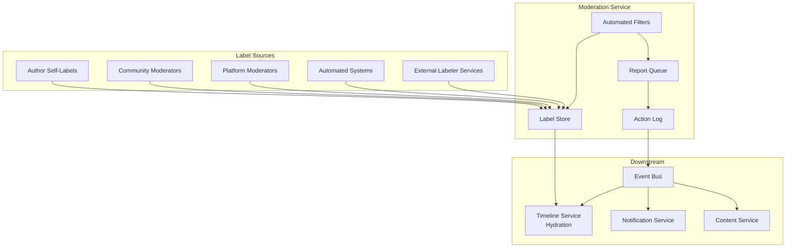
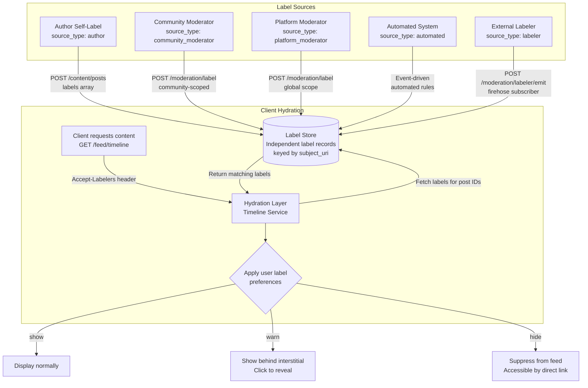
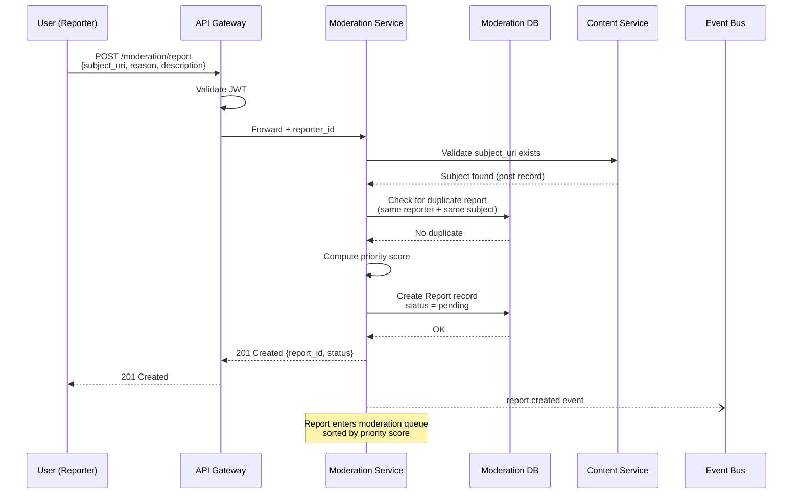
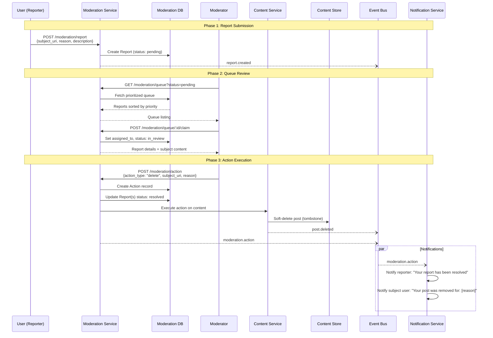
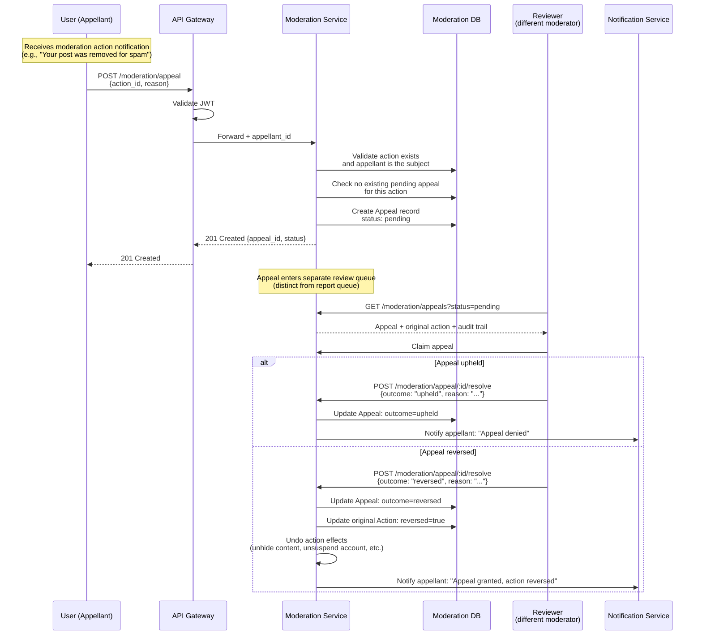

# Moderation Systems

This document defines the moderation architecture, labeling system, reporting flow, moderation actions, community-level moderation, queue management, and appeals process for the platform. The design synthesizes patterns from three production systems: **Bluesky** (AT Protocol), **Twitter/X**, and **Reddit**.

Moderation is structured around a core principle: **separate labeling from enforcement**. Labels are metadata. Reports are signals. Actions are decisions. These three concerns are handled by independent subsystems that communicate through the Event Bus.

Read the [Architecture Overview](./01-architecture-overview.md) and [Data Models](./02-data-models.md) first. This document references entities, services, and flows defined there.

---

## Table of Contents

1. [Moderation Architecture Overview](#1-moderation-architecture-overview)
2. [Labeling System](#2-labeling-system)
3. [Reporting Flow](#3-reporting-flow)
4. [Moderation Actions](#4-moderation-actions)
5. [Community-Level Moderation](#5-community-level-moderation)
6. [Moderation Queue Management](#6-moderation-queue-management)
7. [Appeals Process](#7-appeals-process)

---

## 1. Moderation Architecture Overview

The Moderation Service handles three distinct concerns:

| Concern | What It Does | Who Triggers It | Output |
|---------|-------------|-----------------|--------|
| **Labeling** | Attaches metadata to content or accounts | Authors, moderators, automated systems, external labelers | Label records |
| **Reporting** | Captures user-submitted reports of policy violations | Any authenticated user | Report records in a moderation queue |
| **Action** | Executes moderation decisions against content or accounts | Platform moderators, community moderators, admins | Action records, state changes on content/accounts |

Labels are independent entities, not embedded in content records. A post does not "know" it has been labeled NSFW -- the Label record references the post by URI, and clients query labels separately during hydration. This separation means moderation decisions can be applied, changed, or revoked without modifying the content record itself.

cf. Bluesky's architecture, where labeling and content are completely independent systems. A labeler service can label any content on the network without the content author's PDS being involved.

### Three Moderation Models

The platform combines three moderation models observed in production systems:

| Model | Origin | How It Works | Scope |
|-------|--------|-------------|-------|
| **Centralized** | Twitter/X | A platform-wide Trust & Safety team makes all moderation decisions. Rules are global and uniform. | Platform-wide |
| **Community-based** | Reddit | Each community has its own moderators with per-community rules. AutoModerator provides rule-based automation. | Per-community |
| **Decentralized** | Bluesky | Anyone can run a labeling service. Users choose which labelers to subscribe to. Labels are optional and client-interpreted. | User-configurable |

The generic platform supports all three simultaneously: global platform moderators enforce platform-wide rules, community-level moderators enforce community-specific rules, and independent labeler services provide optional metadata that clients can choose to act on.

### Moderation Service in the Architecture

The Moderation Service participates in both the write path (receiving reports, executing actions) and the read path (providing labels during content hydration).

**Write path involvement:**
- Consumes `post.created` events from the Event Bus to run automated content checks (keyword filters, spam detection, known-bad hash matching)
- Receives report submissions via `POST /moderation/report`
- Executes moderation actions via `POST /moderation/action`
- Emits `label.applied`, `label.removed`, `moderation.action` events to the Event Bus

**Read path involvement:**
- The Timeline Service queries the Moderation Service for labels on posts during hydration (step 12 of the [Read Timeline flow](./04-operation-flows.md#reading-the-home-timeline))
- Labels are included in the hydrated post response so that clients can apply display preferences



**Reading the diagram:**

- Five label sources feed into the Label Store independently
- The Report Queue feeds into moderator review, which produces Action Log entries
- Automated Filters can both apply labels directly and create reports for human review
- The Action Log emits events to the Event Bus, which triggers downstream effects (notifications, content state changes, feed updates)

---

## 2. Labeling System

### Label as a First-Class Entity

Labels are independent records that reference their subject by URI. They are not embedded in the content record and do not modify the content record when applied or removed. See the Label entity definition in [Data Models, Section 2.8](./02-data-models.md#28-label--tag).

**Label record:**

```json
{
  "id": "1234567890123467",
  "type": "social.label",
  "author_id": "1234567890123456",
  "created_at": "2026-03-01T12:30:00Z",
  "updated_at": null,
  "deleted": false,
  "metadata": {},
  "source_id": "1234567890123456",
  "source_type": "moderator",
  "subject_uri": "platform://1234567890123457/posts/1234567890123458",
  "value": "nsfw",
  "negated": false
}
```

The envelope fields (`id`, `type`, `author_id`, `created_at`, `updated_at`, `deleted`, `metadata`) follow the Universal Record Abstraction from [Data Models, Section 1](./02-data-models.md#1-universal-record-abstraction). The entity-specific fields are:

| Field | Type | Description |
|-------|------|-------------|
| `source_id` | `int64` (Snowflake) | Who applied the label: a moderator, a labeler service, an automated system, or the content author. |
| `source_type` | `enum` | `"author"`, `"community_moderator"`, `"platform_moderator"`, `"automated"`, `"labeler"`. Identifies the category of the label source. |
| `subject_uri` | `string` (Platform URI) | What the label is applied to. Can reference a post, a user account, or a community. |
| `value` | `string` | The label name from a controlled vocabulary. See label values table below. |
| `negated` | `boolean` | If `true`, this label explicitly removes a previously applied label. The negation record is retained for audit history. |

### Label Values

The platform maintains a controlled vocabulary of label values. Labels outside this vocabulary are rejected.

| Value | Category | Description | Typical Client Behavior |
|-------|----------|-------------|------------------------|
| `nsfw` | Content warning | General not-safe-for-work content | Blur behind interstitial |
| `sexual` | Content warning | Sexually explicit content | Blur behind age-gated interstitial |
| `nudity` | Content warning | Non-sexual nudity (art, medical) | Blur behind interstitial |
| `violence` | Content warning | Graphic violence or injury | Blur behind interstitial |
| `gore` | Content warning | Extreme graphic violence | Hide entirely or blur with strong warning |
| `spam` | Classification | Unsolicited commercial or bot content | Move to spam folder or suppress from feeds |
| `misinformation` | Classification | Content identified as factually false or misleading | Show inline warning context |
| `content-warning` | Content warning | Generic content warning (author-applied) | Show behind click-through |
| `spoiler` | Content warning | Contains spoilers for media | Collapse behind "show spoiler" toggle |
| `impersonation` | Account | Account impersonating another person or entity | Show warning banner on profile |
| `harassment` | Classification | Targeted harassment of an individual | Suppress from feeds, flag for review |
| `self-harm` | Content warning | Content depicting or encouraging self-harm | Blur behind resource warning with crisis hotline info |

**Extensibility:** New label values are added to the controlled vocabulary via platform configuration. Community moderators cannot define custom label values -- they apply labels from the platform vocabulary within their community scope.

### Label Sources

Labels can originate from five sources. Each source type has different authority, scope, and trust levels.

**1. Author self-labels**

Content creators apply labels to their own content at creation time. Self-labels are set in the post's `labels` array field (see [Data Models, Section 2.2](./02-data-models.md#22-post--status)) AND stored as separate Label records for consistent querying.

```json
// Post creation with self-labels
{
  "text": "CW: discussion of violence in fiction",
  "labels": ["content-warning", "violence"],
  "community_id": null
}
```

When the Content Service processes this post, it creates Label records with `source_type: "author"` for each self-label. Self-labels cannot be `spam`, `misinformation`, or `impersonation` -- these values are reserved for moderator and automated sources.

**2. Community moderator labels**

Applied by users with the Moderator role within a specific community (see [Identity and Auth, Section 5.2](./07-identity-and-auth.md#52-roles)). Community moderator labels are scoped -- they only affect how content appears within that community's feed.

```json
{
  "source_type": "community_moderator",
  "subject_uri": "platform://1234567890123457/posts/1234567890123458",
  "value": "nsfw",
  "community_id": "1234567890123470"
}
```

A community moderator label for `nsfw` on a post in `/community/art` does not affect that post's appearance in other contexts (the author's profile feed, search results, or other communities where it may be cross-posted).

**3. Platform moderator labels**

Applied by platform-level Trust & Safety staff with the Admin role. Platform moderator labels are global -- they affect the content everywhere on the platform.

```json
{
  "source_type": "platform_moderator",
  "subject_uri": "platform://1234567890123457/posts/1234567890123458",
  "value": "misinformation"
}
```

Platform moderator labels take precedence over all other label sources. If a platform moderator labels content as `spam`, no community moderator or author self-label can override that.

**4. Automated labels**

Applied by the Moderation Service's automated filters (see [Section 5, AutoModerator](#automod-automated-community-moderation)). These labels are applied when content matches predefined rules:

- **Keyword matching:** Content containing specific terms or patterns is automatically labeled
- **Rate-based spam detection:** Accounts posting at abnormally high rates are labeled `spam`
- **Known-bad hash matching:** Media blobs matching a database of known-bad content hashes (CSAM, known spam images) are labeled and escalated immediately
- **Machine learning classifiers:** Image classification models that detect NSFW content, violence, etc.

Automated labels have `source_type: "automated"` and include an additional `metadata.rule_id` field identifying which rule triggered the label.

**5. External labeler services**

Independent services that subscribe to the platform's public firehose (via the Event Bus), analyze content, and publish labels back to the platform. This is the decentralized labeling model from Bluesky's AT Protocol.

**Labeler registration:**

External labelers register with the platform via `POST /moderation/labelers`:

```json
// Request
{
  "name": "Academic Fact-Check Service",
  "description": "Labels misinformation based on peer-reviewed research",
  "endpoint": "https://factcheck.example.org/labels",
  "label_values": ["misinformation"],
  "public_key": "-----BEGIN PUBLIC KEY-----\nMIIBI..."
}

// Response 201
{
  "labeler_id": "1234567890123471",
  "name": "Academic Fact-Check Service",
  "status": "active",
  "subscriber_count": 0,
  "created_at": "2026-03-01T10:00:00Z"
}
```

External labeler labels are NOT enforced by default. They are available for clients to subscribe to. Users choose which labelers to trust through their account preferences.

### Client-Side Label Interpretation

Labels are metadata, not enforcement. Clients decide how to display labeled content based on the user's label preferences.

**Label preference model:**

Each user has a label preferences object stored in their profile settings:

```json
{
  "global_preferences": {
    "nsfw": "warn",
    "sexual": "hide",
    "violence": "warn",
    "gore": "hide",
    "spam": "hide",
    "misinformation": "warn",
    "content-warning": "warn",
    "spoiler": "warn"
  },
  "labeler_subscriptions": [
    {
      "labeler_id": "1234567890123471",
      "trusted": true,
      "preferences": {
        "misinformation": "warn"
      }
    }
  ]
}
```

**Display behaviors:**

| Preference | Client Behavior |
|-----------|----------------|
| `show` | Display content normally, no indication of label |
| `warn` | Display content behind a click-through interstitial ("This content has been labeled [value]. Show anyway?") |
| `hide` | Suppress content entirely from feeds and search results; accessible only by direct link |

**Preference resolution order:**

When multiple labels apply to the same content (e.g., a post labeled `nsfw` by the author and `misinformation` by a labeler), the client applies the most restrictive preference. If `nsfw` is set to `warn` and `misinformation` is set to `hide`, the content is hidden.

When the same label value comes from multiple sources, the precedence order is:

1. Platform moderator (highest authority)
2. Automated system
3. Community moderator (within community context)
4. External labeler (if user subscribes to that labeler)
5. Author self-label (lowest authority, but always trusted for content warnings)

**API: Declaring labeler subscriptions**

Clients declare which labelers they subscribe to via a request header on feed and content endpoints:

```
GET /feed/timeline
Authorization: Bearer <access_token>
Accept-Labelers: 1234567890123471, 1234567890123472
```

The `Accept-Labelers` header (cf. Bluesky's `atproto-accept-labelers` header) tells the Moderation Service which external labeler labels to include in the hydrated response. Labels from platform moderators, automated systems, and author self-labels are always included regardless of this header.

### Label Application and Interpretation (Diagram)



### Label Negation

A label can be explicitly removed by creating a new Label record with `negated: true`. The negation record references the same `subject_uri` and `value` as the original label.

```json
// Original label
{
  "id": "1234567890123467",
  "source_id": "1234567890123456",
  "source_type": "platform_moderator",
  "subject_uri": "platform://1234567890123457/posts/1234567890123458",
  "value": "misinformation",
  "negated": false,
  "created_at": "2026-03-01T12:30:00Z"
}

// Negation (after review determined the label was incorrect)
{
  "id": "1234567890123480",
  "source_id": "1234567890123460",
  "source_type": "platform_moderator",
  "subject_uri": "platform://1234567890123457/posts/1234567890123458",
  "value": "misinformation",
  "negated": true,
  "created_at": "2026-03-01T14:00:00Z"
}
```

**Resolution logic:** When querying labels for a subject, the Moderation Service returns the net result: if the most recent label record for a given `(subject_uri, value, source_type)` combination has `negated: true`, that label is considered inactive. Both the original and negation records are retained in the Label Store for audit purposes.

cf. Bluesky's `com.atproto.label.defs#label` negation model.

---

## 3. Reporting Flow

### Report Record

A report captures a user's claim that content or an account violates platform or community rules.

```json
{
  "id": "1234567890123466",
  "type": "social.moderation.report",
  "author_id": "1234567890123456",
  "created_at": "2026-03-01T12:25:00Z",
  "updated_at": null,
  "deleted": false,
  "metadata": {},
  "reporter_id": "1234567890123456",
  "subject_uri": "platform://1234567890123457/posts/1234567890123458",
  "subject_type": "post",
  "reason": "spam",
  "description": "Bot account promoting crypto scams. Same message posted 50+ times across communities.",
  "status": "pending",
  "priority": 3,
  "assigned_to": null,
  "community_id": "1234567890123470",
  "resolution": null,
  "resolved_at": null,
  "resolved_by": null
}
```

| Field | Type | Description |
|-------|------|-------------|
| `reporter_id` | `int64` (Snowflake) | The user who submitted the report. Same as `author_id` in the envelope. |
| `subject_uri` | `string` (Platform URI) | The content or account being reported. |
| `subject_type` | `enum` | `"post"`, `"comment"`, `"user"`, `"community"`. Inferred from the URI but stored explicitly for efficient queue filtering. |
| `reason` | `enum` | Reason code from the controlled vocabulary (see below). |
| `description` | `string` (max 1000 chars) | Free-text description from the reporter providing context. |
| `status` | `enum` | `"pending"`, `"in_review"`, `"resolved"`, `"dismissed"`. |
| `priority` | `int` (1-5) | Computed priority score. 1 = highest priority, 5 = lowest. |
| `assigned_to` | `int64` (Snowflake), nullable | The moderator who claimed this report from the queue. |
| `community_id` | `int64` (Snowflake), nullable | If the reported content is in a community, the community ID. Determines which moderator queue receives the report. |
| `resolution` | `string`, nullable | Description of the action taken (or reason for dismissal). |
| `resolved_at` | `string` (ISO-8601), nullable | Timestamp of resolution. |
| `resolved_by` | `int64` (Snowflake), nullable | The moderator who resolved the report. |

### Reason Codes

| Reason Code | Severity Tier | Description |
|-------------|---------------|-------------|
| `self_harm` | 1 (Critical) | Content depicting or encouraging self-harm or suicide |
| `csam` | 1 (Critical) | Child sexual abuse material |
| `violence` | 2 (High) | Threats of violence or graphic violent content |
| `hate_speech` | 2 (High) | Content targeting individuals or groups based on protected characteristics |
| `harassment` | 2 (High) | Targeted harassment, bullying, or intimidation |
| `sexual_content` | 3 (Medium) | Non-consensual sexual content, unlabeled sexual content |
| `impersonation` | 3 (Medium) | Account impersonating another person, brand, or entity |
| `misinformation` | 3 (Medium) | Demonstrably false information presented as fact |
| `copyright` | 4 (Low) | Intellectual property infringement claims |
| `spam` | 4 (Low) | Unsolicited commercial content, bot behavior |
| `other` | 5 (Lowest) | Catch-all for reports that don't fit other categories |

cf. Twitter's report categories (hateful conduct, abuse, spam, impersonation), Reddit's report options (per-community rules + site-wide rules), Bluesky's `com.atproto.moderation.createReport` reason types.

### Report Lifecycle

```
User submits report
        |
        v
    [Pending] ---------> Queue prioritization
        |                 (severity + volume + reporter trust + content reach)
        v
   [In Review] --------> Moderator claims report
        |
        +-------> [Action Taken] -----> [Resolved]
        |                                    |
        +-------> [Dismissed] ------> [Resolved]
                  (no violation found)
```

**Status transitions:**

| From | To | Trigger | Side Effects |
|------|----|---------|-------------|
| — | `pending` | User submits report | Report enters queue, priority computed |
| `pending` | `in_review` | Moderator claims report | `assigned_to` set, other moderators see it as claimed |
| `in_review` | `resolved` (with action) | Moderator takes action | Action record created, subject modified, reporter notified |
| `in_review` | `resolved` (dismissed) | Moderator dismisses | No action on subject, reporter optionally notified |
| `in_review` | `pending` | Moderator unclaims | `assigned_to` cleared, report returns to queue |

### Report Submission Flow

**Endpoint:** `POST /moderation/report` (see [API Catalog](./03-api-endpoint-catalog.md#post-moderationreport--report-content))



### Queue Prioritization

Reports are not processed first-in-first-out. The Moderation Service computes a priority score that determines queue ordering.

**Priority score computation:**

```
priority = base_severity
         - volume_boost
         - trust_boost
         - reach_boost
```

Lower scores = higher priority (processed first). Score components:

| Factor | Calculation | Weight | Rationale |
|--------|------------|--------|-----------|
| **Base severity** | From reason code severity tier (1-5) | Primary | Self-harm and CSAM reports are always reviewed first |
| **Volume boost** | `-1` for every 5 additional reports on the same subject (cap: `-2`) | Secondary | Multiple independent reports on the same content indicate a real problem |
| **Reporter trust score** | `-1` if reporter's historical accuracy > 80% | Tertiary | Reporters whose reports are consistently upheld get priority |
| **Content reach** | `-1` if subject post has > 1000 engagements | Tertiary | High-visibility content has more potential for harm |

**Reporter trust score:**

The platform tracks each reporter's report outcomes:

```sql
SELECT
    reporter_id,
    COUNT(*) FILTER (WHERE resolution = 'action_taken') AS upheld,
    COUNT(*) FILTER (WHERE resolution = 'dismissed') AS dismissed,
    COUNT(*) AS total
FROM reports
WHERE reporter_id = :reporter_id
  AND resolved_at IS NOT NULL
GROUP BY reporter_id;
```

Trust score = `upheld / total`. Reporters with scores above 80% get a priority boost. Reporters with scores below 20% (consistently filing false reports) may have their reports deprioritized or their reporting privileges rate-limited.

---

## 4. Moderation Actions

When a moderator reviews a report and determines a violation occurred, they execute a moderation action. Actions are recorded as independent entities for auditability.

### Action Types

| Action | Target | Effect | Reversible | Scope |
|--------|--------|--------|------------|-------|
| **Label** | Content or Account | Applies a metadata label (see [Section 2](#2-labeling-system)) | Yes (negation record) | Global or community |
| **Hide** | Content | Removes from feeds and search results; still accessible by direct link | Yes (unhide) | Global |
| **Delete** | Content | Soft-deletes content -- replaces text with tombstone, clears media refs | No (content text is cleared permanently) | Global |
| **Warn** | Account | Sends a warning notification to the user | N/A (notification is permanent) | Global |
| **Restrict** | Account | Limits account capabilities: rate-limited posting, no DMs, no community creation | Yes (unrestrict) | Global |
| **Suspend** | Account | Temporarily disables account access for a specified duration | Yes (auto-expires or manual unsuspend) | Global |
| **Ban** | Account | Permanently disables account access | Appealable (see [Section 7](#7-appeals-process)) | Global |
| **Community Ban** | Account (scoped) | Removes user from a specific community and prevents rejoining | Yes (community moderator can reverse) | Per-community |

### Action Record

```json
{
  "id": "1234567890123468",
  "type": "social.moderation.action",
  "author_id": "1234567890123456",
  "created_at": "2026-03-01T12:35:00Z",
  "updated_at": null,
  "deleted": false,
  "metadata": {},
  "moderator_id": "1234567890123456",
  "action_type": "delete",
  "subject_uri": "platform://1234567890123457/posts/1234567890123458",
  "subject_type": "post",
  "report_ids": ["1234567890123466"],
  "reason": "Confirmed spam content. Account is a bot promoting cryptocurrency scams.",
  "duration_hours": null,
  "reversed": false,
  "reversed_by": null,
  "reversed_at": null,
  "reversed_reason": null
}
```

| Field | Type | Description |
|-------|------|-------------|
| `moderator_id` | `int64` (Snowflake) | The moderator who executed the action. Same as `author_id`. |
| `action_type` | `enum` | `"label"`, `"hide"`, `"delete"`, `"warn"`, `"restrict"`, `"suspend"`, `"ban"`, `"community_ban"`. |
| `subject_uri` | `string` (Platform URI) | The content or account the action targets. |
| `subject_type` | `enum` | `"post"`, `"comment"`, `"user"`, `"community"`. |
| `report_ids` | `array<int64>` | Report IDs that this action resolves. An action can resolve multiple reports on the same subject. |
| `reason` | `string` (max 2000 chars) | Moderator's explanation of the action. Required for audit trail. |
| `duration_hours` | `int`, nullable | For time-limited actions (suspend, restrict). Null for permanent actions. |
| `reversed` | `boolean` | Whether this action has been reversed (by appeal or moderator decision). |
| `reversed_by` | `int64`, nullable | The moderator or admin who reversed the action. |
| `reversed_at` | `string` (ISO-8601), nullable | When the action was reversed. |
| `reversed_reason` | `string`, nullable | Explanation for the reversal. |

### Action Execution

Each action type triggers specific downstream effects:

**Label:**

```json
// POST /moderation/action
{
  "action_type": "label",
  "subject_uri": "platform://1234567890123457/posts/1234567890123458",
  "report_ids": ["1234567890123466"],
  "reason": "Content contains graphic violence without content warning",
  "label_value": "violence"
}
```

Side effects: Creates a Label record. Emits `label.applied` event. No modification to the content record itself.

**Hide:**

```json
{
  "action_type": "hide",
  "subject_uri": "platform://1234567890123457/posts/1234567890123458",
  "report_ids": ["1234567890123466"],
  "reason": "Borderline content - hidden from feeds pending further review"
}
```

Side effects: Sets a `hidden` flag on the content record's metadata. Timeline Service removes post from all timeline caches. Search Index removes post from search results. Post remains accessible via direct link (`GET /content/posts/:id`) with a notice that it has been hidden.

**Delete:**

```json
{
  "action_type": "delete",
  "subject_uri": "platform://1234567890123457/posts/1234567890123458",
  "report_ids": ["1234567890123466"],
  "reason": "Confirmed spam - crypto scam bot"
}
```

Side effects: Triggers the same soft-delete flow as user-initiated deletion (see [Operation Flows, Section 6](./04-operation-flows.md#deleting-a-post)). Content text is cleared, media references removed, tombstone record retained. Emits `post.deleted` event.

**Suspend:**

```json
{
  "action_type": "suspend",
  "subject_uri": "platform://1234567890123457",
  "subject_type": "user",
  "report_ids": ["1234567890123466"],
  "reason": "Repeated harassment after warning",
  "duration_hours": 168
}
```

Side effects: Sets `suspended_until` timestamp on the user account. Revokes all active sessions (refresh tokens). The API Gateway rejects all requests from this user until the suspension expires. Emits `user.suspended` event. Notification Service sends suspension notice to the user's email.

**Ban:**

```json
{
  "action_type": "ban",
  "subject_uri": "platform://1234567890123457",
  "subject_type": "user",
  "report_ids": ["1234567890123466"],
  "reason": "Persistent policy violations - account permanently banned"
}
```

Side effects: Sets `banned_at` timestamp on the user account. Revokes all sessions. All future authentication attempts are rejected. The user's content remains visible (with author shown as "[banned]") unless separately deleted. The user retains the ability to submit an appeal (see [Section 7](#7-appeals-process)). Emits `user.banned` event.

### Report-to-Action Flow (Diagram)



### Moderator Permission Boundaries

Not all moderators can execute all action types. Permissions are tiered:

| Action | Community Moderator | Platform Moderator | Admin |
|--------|:------------------:|:-----------------:|:-----:|
| Label (community scope) | Yes | Yes | Yes |
| Label (global scope) | No | Yes | Yes |
| Hide | No | Yes | Yes |
| Delete | Community content only | Yes | Yes |
| Warn | Community members only | Yes | Yes |
| Restrict | No | Yes | Yes |
| Suspend | No | Yes | Yes |
| Ban | No | No | Yes |
| Community Ban | Own community only | Any community | Any community |
| Reverse any action | Own actions only | Platform actions | All actions |

cf. Reddit's moderator hierarchy (subreddit mods < admins), Twitter's Trust & Safety (internal employees only), Bluesky's labeler model (labeler operators manage their own labels).

---

## 5. Community-Level Moderation

Communities (see [Data Models, Section 2.4](./02-data-models.md#24-community--space)) have their own moderation layer with designated moderators, community-specific rules, and automated moderation via AutoModerator.

### Community Moderator Role

Community moderators are assigned by the community creator or by existing moderators (see [Identity and Auth, Section 5.2](./07-identity-and-auth.md#52-roles)). Their authority is scoped strictly to their community.

**What community moderators CAN do:**

- Remove posts and comments from their community
- Ban users from their community (community ban, not platform ban)
- Mute users within their community (user's posts hidden from community feed)
- Apply labels to content within their community (community-scoped)
- Set and update community rules
- Configure AutoModerator rules for their community
- Pin posts to the community feed
- Lock threads (prevent new replies)

**What community moderators CANNOT do:**

- Suspend or ban user accounts globally
- Delete content from other communities
- Apply labels that affect content outside their community
- Access moderation tools for other communities (unless they are also a moderator there)
- View private information about users (email, IP address)
- Override platform moderator decisions

**Hierarchy:**

```
Admin (platform-level)
  |
  +-- Platform Moderator (platform-level, Trust & Safety)
        |
        +-- Community Moderator (community-scoped)
              |
              +-- User (no moderation authority)
```

Platform moderators can override any community moderator decision. Admins can override any decision by any moderator.

### Community Rules

Each community defines up to 15 rules (see `Community.rules` in [Data Models](./02-data-models.md#24-community--space)). These rules are displayed to users when they join the community and when they submit reports.

```json
{
  "community_id": "1234567890123470",
  "rules": [
    {
      "id": 1,
      "title": "No self-promotion",
      "description": "Posts promoting your own products, services, or channels are not allowed unless they are directly relevant to the community topic and approved by moderators."
    },
    {
      "id": 2,
      "title": "Use content warnings",
      "description": "Posts containing graphic images, spoilers, or sensitive topics must use the appropriate content warning labels."
    },
    {
      "id": 3,
      "title": "English only",
      "description": "All posts and comments must be in English to facilitate community discussion."
    }
  ]
}
```

When a user reports content within a community, the report form includes both platform-wide reason codes and community-specific rules. The moderator can see which rule the reporter believes was violated.

### AutoMod: Automated Community Moderation

AutoModerator is a rule-based automation system that community moderators configure to handle common moderation tasks without manual review. Inspired by Reddit's AutoModerator.

**Rule structure:**

```json
{
  "community_id": "1234567890123470",
  "rules": [
    {
      "id": "rule_001",
      "name": "Block new accounts",
      "enabled": true,
      "trigger": {
        "type": "post_created",
        "conditions": {
          "author_account_age_days": { "less_than": 7 }
        }
      },
      "action": {
        "type": "remove",
        "notify_author": true,
        "message": "Your account must be at least 7 days old to post in this community."
      }
    },
    {
      "id": "rule_002",
      "name": "Flag crypto spam",
      "enabled": true,
      "trigger": {
        "type": "post_created",
        "conditions": {
          "text_matches": "(?i)(buy\\s+crypto|free\\s+bitcoin|guaranteed\\s+returns|10x\\s+gains)"
        }
      },
      "action": {
        "type": "report",
        "reason": "spam",
        "auto_label": "spam"
      }
    },
    {
      "id": "rule_003",
      "name": "Rate limit posts",
      "enabled": true,
      "trigger": {
        "type": "post_created",
        "conditions": {
          "author_posts_in_community_last_hour": { "greater_than": 5 }
        }
      },
      "action": {
        "type": "remove",
        "notify_author": true,
        "message": "You are posting too frequently. Please wait before posting again."
      }
    },
    {
      "id": "rule_004",
      "name": "Require minimum karma",
      "enabled": true,
      "trigger": {
        "type": "post_created",
        "conditions": {
          "author_karma": { "less_than": 50 }
        }
      },
      "action": {
        "type": "hold_for_review",
        "queue": "automod"
      }
    }
  ]
}
```

**AutoModerator rule types:**

| Trigger | Available Conditions | Description |
|---------|---------------------|-------------|
| `post_created` | `text_matches` (regex), `author_account_age_days`, `author_karma`, `author_posts_in_community_last_hour`, `has_media`, `has_links` | Runs when a new post is created in the community |
| `comment_created` | Same as `post_created` | Runs when a new comment is created in the community |
| `user_joined` | `author_account_age_days`, `author_karma`, `author_ban_history_count` | Runs when a user joins the community |

**AutoModerator action types:**

| Action | Effect |
|--------|--------|
| `remove` | Immediately removes the content from the community feed. Creates an automated action record. |
| `report` | Creates a report in the community moderation queue for human review. |
| `hold_for_review` | Holds content in a separate review queue. Content is not visible until a moderator approves it. |
| `label` | Applies a label to the content (community-scoped). |
| `notify_author` | Sends a notification to the content author explaining why the action was taken. |
| `flair` | Automatically applies a community flair/tag to the content. |

AutoModerator rules execute synchronously during the content creation flow. When the Content Service emits a `post.created` event, the Moderation Service checks the post against all enabled AutoModerator rules for the target community before the post appears in the community feed.

cf. Reddit's AutoModerator (YAML-based rule configuration, regex matching, account age and karma thresholds).

---

## 6. Moderation Queue Management

### Queue API

Moderators access the moderation queue through dedicated endpoints:

**List queue items:**

```
GET /moderation/queue?status=pending&community_id=1234567890123470&sort=priority&limit=25
```

```json
// Response 200
{
  "data": [
    {
      "report": {
        "id": "1234567890123466",
        "reporter_id": "1234567890123456",
        "subject_uri": "platform://1234567890123457/posts/1234567890123458",
        "subject_type": "post",
        "reason": "spam",
        "description": "Bot account promoting crypto scams",
        "status": "pending",
        "priority": 2,
        "report_count": 7,
        "created_at": "2026-03-01T12:25:00Z"
      },
      "subject": {
        "id": "1234567890123458",
        "author": {
          "id": "1234567890123457",
          "handle": "crypto-bot-42",
          "account_age_days": 2,
          "posts_count": 347,
          "reports_received_count": 23
        },
        "text": "GET FREE BITCOIN NOW! Visit...",
        "created_at": "2026-03-01T12:20:00Z",
        "vote_count": -12,
        "report_count": 7
      },
      "existing_labels": [],
      "existing_actions": [],
      "related_reports": [
        { "id": "1234567890123475", "reason": "spam", "reporter_id": "1234567890123461" },
        { "id": "1234567890123476", "reason": "spam", "reporter_id": "1234567890123462" }
      ]
    }
  ],
  "cursor": "abc123",
  "has_more": true,
  "queue_stats": {
    "total_pending": 42,
    "total_in_review": 8,
    "oldest_pending_hours": 3.5
  }
}
```

Each queue item includes:
- The report record
- The full subject content (post text, author info, engagement metrics)
- Author context (account age, post count, past reports received)
- Existing labels and actions on the subject (to avoid duplicate work)
- Related reports from other users on the same subject
- Queue-level statistics

**Claim a report:**

```
POST /moderation/queue/:reportId/claim
```

```json
// Response 200
{
  "report_id": "1234567890123466",
  "status": "in_review",
  "assigned_to": "1234567890123456",
  "claimed_at": "2026-03-01T12:40:00Z"
}
```

Claiming a report sets `assigned_to` and changes status to `in_review`. Other moderators see the report as claimed and cannot act on it (prevents duplicate work). A claim expires after 30 minutes if no action is taken, returning the report to the queue.

**Unclaim a report:**

```
DELETE /moderation/queue/:reportId/claim
```

Returns the report to `pending` status and clears `assigned_to`.

### Queue Filtering

| Filter | Parameter | Values |
|--------|-----------|--------|
| Status | `status` | `pending`, `in_review`, `resolved`, `dismissed` |
| Community | `community_id` | Snowflake ID (for community moderators, this is auto-set to their community) |
| Reason | `reason` | Any reason code |
| Subject type | `subject_type` | `post`, `comment`, `user`, `community` |
| Priority | `priority_max` | 1-5 (show reports at or above this priority) |
| Date range | `created_after`, `created_before` | ISO-8601 timestamps |

### SLA Tracking

The Moderation Service tracks time-to-resolution against target SLAs by severity tier:

| Severity Tier | Reason Codes | Target Resolution Time | Escalation Threshold |
|---------------|-------------|----------------------|---------------------|
| 1 (Critical) | `self_harm`, `csam` | 1 hour | 30 minutes (auto-escalate to on-call admin) |
| 2 (High) | `violence`, `hate_speech`, `harassment` | 4 hours | 2 hours |
| 3 (Medium) | `sexual_content`, `impersonation`, `misinformation` | 12 hours | 8 hours |
| 4 (Low) | `copyright`, `spam` | 24 hours | 18 hours |
| 5 (Lowest) | `other` | 48 hours | 36 hours |

When a report exceeds its escalation threshold without being claimed, the Moderation Service emits a `report.escalated` event that triggers an alert to the on-call moderator or admin.

### Audit Trail

Every moderator action is logged in an immutable audit trail. Audit records cannot be modified or deleted.

```json
{
  "audit_id": "1234567890123490",
  "timestamp": "2026-03-01T12:35:00Z",
  "moderator_id": "1234567890123456",
  "moderator_handle": "mod_alice",
  "action": "delete",
  "subject_uri": "platform://1234567890123457/posts/1234567890123458",
  "report_ids": ["1234567890123466"],
  "reason": "Confirmed spam content",
  "previous_state": {
    "post_text": "GET FREE BITCOIN NOW! Visit...",
    "post_status": "active"
  },
  "new_state": {
    "post_text": "[deleted]",
    "post_status": "deleted"
  }
}
```

The audit trail captures the previous state and new state of the subject, enabling review of moderator decisions and supporting the appeals process.

---

## 7. Appeals Process

Users who receive moderation actions (hide, delete, restrict, suspend, ban) can appeal the decision. The appeals process ensures that a different moderator reviews the original decision.

### Appeal Record

```json
{
  "id": "1234567890123495",
  "type": "social.moderation.appeal",
  "author_id": "1234567890123457",
  "created_at": "2026-03-01T15:00:00Z",
  "updated_at": null,
  "deleted": false,
  "metadata": {},
  "appellant_id": "1234567890123457",
  "action_id": "1234567890123468",
  "reason": "The post was satire, not actual spam. I was parodying crypto promotion culture as commentary.",
  "status": "pending",
  "reviewer_id": null,
  "outcome": null,
  "outcome_reason": null,
  "resolved_at": null
}
```

| Field | Type | Description |
|-------|------|-------------|
| `appellant_id` | `int64` (Snowflake) | The user submitting the appeal. Must be the subject of the original action. |
| `action_id` | `int64` (Snowflake) | The moderation action being appealed. |
| `reason` | `string` (max 2000 chars) | The user's counter-argument explaining why the action was incorrect. |
| `status` | `enum` | `"pending"`, `"in_review"`, `"resolved"`. |
| `reviewer_id` | `int64`, nullable | The moderator reviewing the appeal. Must be different from the original moderator. |
| `outcome` | `enum`, nullable | `"upheld"` (original action stands), `"reversed"` (action undone). |
| `outcome_reason` | `string`, nullable | Explanation of the appeal outcome. |
| `resolved_at` | `string` (ISO-8601), nullable | Timestamp of resolution. |

### Appeal Flow



### Appeal Constraints

- **One appeal per action.** A user cannot submit multiple appeals for the same moderation action.
- **Different reviewer.** The appeal must be reviewed by a different moderator than the one who took the original action. The Moderation Service enforces this by excluding the original moderator's ID from the appeal assignment pool.
- **Time limit.** Appeals must be submitted within 30 days of the moderation action.
- **Banned users.** Users who are banned can still submit appeals through a dedicated `POST /moderation/appeal` endpoint that accepts a special appeal token sent via email at the time of the ban.
- **Community bans.** Appeals of community-level bans go to a different community moderator. If all community moderators were involved in the original decision, the appeal escalates to a platform moderator.
- **Appeal outcome is final.** There is no further appeal beyond the reviewer's decision. If the user believes the reviewer's decision is incorrect, they can submit a platform-level complaint to the Admin team, but this is outside the standard appeals flow.

### Appeal API

| Method | Path | Auth | Description |
|--------|------|------|-------------|
| `POST` | `/moderation/appeal` | Yes | Submit appeal |
| `GET` | `/moderation/appeals` | Yes (moderator) | List appeals queue |
| `POST` | `/moderation/appeals/:id/claim` | Yes (moderator) | Claim appeal for review |
| `POST` | `/moderation/appeals/:id/resolve` | Yes (moderator) | Resolve appeal |

---

## Appendix A: Moderation Event Reference

Events emitted by the Moderation Service to the Event Bus:

| Event | Payload | Consumers |
|-------|---------|-----------|
| `report.created` | `{ report_id, subject_uri, reason, priority }` | Moderation queue, alerting (for critical severity) |
| `report.escalated` | `{ report_id, subject_uri, reason, hours_pending }` | On-call admin alerting |
| `label.applied` | `{ label_id, subject_uri, value, source_type }` | Timeline Service (re-hydration), Search Index (re-index) |
| `label.removed` | `{ label_id, subject_uri, value }` | Timeline Service, Search Index |
| `moderation.action` | `{ action_id, action_type, subject_uri, moderator_id }` | Notification Service, Content Service, Identity Service |
| `moderation.appeal.resolved` | `{ appeal_id, action_id, outcome }` | Notification Service, Content Service (if reversed) |
| `user.suspended` | `{ user_id, duration_hours, reason }` | API Gateway (block requests), Notification Service |
| `user.banned` | `{ user_id, reason }` | API Gateway (block requests), Notification Service |

## Appendix B: Moderation API Endpoint Reference

| Method | Path | Auth | Description |
|--------|------|------|-------------|
| `POST` | `/moderation/report` | Yes | Submit report |
| `POST` | `/moderation/label` | Moderator | Apply label |
| `DELETE` | `/moderation/label/:id` | Moderator | Remove label |
| `GET` | `/moderation/queue` | Moderator | List moderation queue |
| `POST` | `/moderation/queue/:id/claim` | Moderator | Claim report |
| `DELETE` | `/moderation/queue/:id/claim` | Moderator | Unclaim report |
| `POST` | `/moderation/action` | Moderator | Execute moderation action |
| `POST` | `/moderation/appeal` | Yes | Submit appeal |
| `GET` | `/moderation/appeals` | Moderator | List appeals queue |
| `POST` | `/moderation/appeals/:id/claim` | Moderator | Claim appeal |
| `POST` | `/moderation/appeals/:id/resolve` | Moderator | Resolve appeal |
| `POST` | `/moderation/labelers` | Admin | Register external labeler |
| `GET` | `/moderation/labelers` | No | List registered labelers |
| `GET` | `/moderation/labelers/:id` | No | Get labeler details |
| `GET` | `/moderation/audit` | Admin | Query audit trail |

## Appendix C: Platform Provenance Summary

| Feature | Bluesky (AT Protocol) | Twitter/X | Reddit |
|---------|----------------------|-----------|--------|
| Label system | First-class labeler architecture with `com.atproto.label.defs`. Third-party labeling services. Client-side label interpretation via `atproto-accept-labelers` header. | Internal moderation labels (sensitive media, misleading info). Not exposed as independent entities. | Flair system (user and post flair). AutoModerator tags. Not client-configurable. |
| Reporting | `com.atproto.moderation.createReport` with typed reason codes. | Report flow with categories (hateful conduct, abuse, spam). | Report options combine site-wide rules and per-community rules. |
| Moderation actions | Ozone moderation tool. Label application, content takedown, account-level actions. | Trust & Safety team. Shadow banning, content removal, account suspension/ban. | Admin actions (suspend, ban) + community moderator actions (remove, community ban). |
| Community moderation | No direct equivalent. Feed generators and moderation lists provide partial coverage. | Limited community features. | Full community moderator system with AutoModerator, per-community rules, and mod queue. |
| Decentralized labeling | Core feature. Anyone can run a labeler. Users choose subscriptions. | Not supported. | Not supported. |
| Appeals | Not formalized in the protocol. Handled per-operator. | Appeal form for account-level actions. | Appeal process for site-wide bans. Community bans handled by community moderators. |
